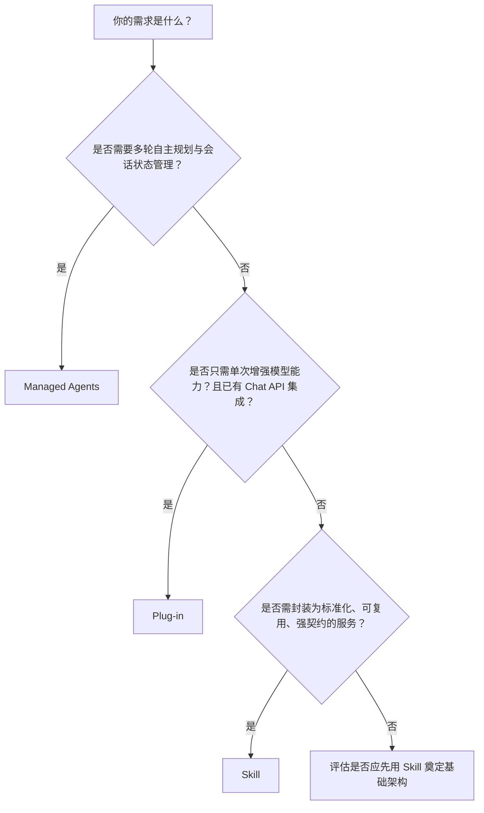

# 应用构建方式对比

在百炼平台中，开发者可通过多种范式构建具备智能能力的应用：**Managed Agents（托管智能体）**、**Plug-in（插件）** 和 **Skill（技能）**。三者均支持大模型驱动的工具调用与任务增强，但设计目标、抽象层级、运行边界与工程职责存在本质差异。本文旨在为技术选型提供清晰、可落地的对比分析，帮助开发者根据业务复杂度、运维诉求、集成深度与团队能力，选择最适配的构建方式。

---

## 关键维度对比

| 维度 | Managed Agents | Plug-in | Skill |
|------|----------------|---------|--------|
| **输入格式** | 字符串 `input`（如 `"查我上月订单"`），支持可选 `session_id`；不强制要求结构化 schema | 原始 `messages` 数组（含 `user`/`assistant` 角色消息），需显式传入 `tools` 配置；输入无预定义 schema | 严格结构化 JSON，必须符合 `input_schema`（JSON Schema 定义），字段名、类型、必填性均由 schema 约束 |
| **输出格式** | 异步流式响应（EventSource）或同步 JSON，含 `output` 字符串、`status`、`tool_calls` 历史及 `session_id`；支持 Webhook 事件推送 | 同步 JSON，返回标准 Chat Completion 格式（含 `choices[].message`、`tool_calls`、`finish_reason`）；需客户端自行解析并发起后续 tool 调用 | 同步 JSON（默认）或异步 `task_id`（启用 `execution_mode=async`）；输出严格遵循 `output_schema`，自动校验并序列化为结构化对象（如 `{ "order_list": [...], "total_count": 5 }`） |
| **支持模型** | 仅 `qwen-max`、`qwen-plus`、`qwen-turbo`（Agent 模式专用）；`qwen2-72b` 明确不支持 | 仅 `qwen-max`、`qwen-plus`、`qwen-turbo`（v20240910+ 版本）；其他模型即使配置 `tools` 也无实际调用行为 | 广泛支持：Qwen 系列（Qwen1.5/Qwen2/Qwen2.5/Qwen3）、Baichuan、GLM 等平台托管及开源模型；可显式指定任意兼容模型 ID |
| **API 端点** | `POST /v1/agents`（创建） `POST /v1/agents/{agent_id}/sessions`（执行） | `POST /v1/chat/completions`（复用标准 Chat API） 需在请求体中嵌入 `tools`、`tool_choice` 等参数 | `POST /v1/skills/{skill_id}/invoke`（HTTP RESTful） 端点独立、语义明确，与模型推理 API 完全解耦 |
| **计费方式** | 按 **Agent 会话（Session）** 计费： - 每次 `sessions` 调用计为 1 次会话（无论内部迭代次数） - 会话内 token 消耗按所用模型单独计费（含 input + output + tool response） | 按 **模型 [Token](../concepts/token.md)** 计费： - 与普通 Chat API 一致，`input_tokens` + `output_tokens` + `tool_response_tokens` 全部计入账单 - 插件调用本身不额外计费 | 按 **Skill 调用次数 + [Token](../concepts/token.md)** 双维度计费： - 每次 `invoke` 请求计为 1 次调用（含同步/异步） - 内部所有模型推理、RAG 检索、HTTP 节点等产生的 token 均计入总消耗 |
| **典型场景** | 客服对话机器人（多轮意图澄清+知识库+工单系统调用） 自动化工作流（如“审批请假→查余额→发通知”） 需要长期上下文维持与自主规划的交互式 Agent | 快速增强单次模型回复能力： 例如：用户问“杭州天气如何？”，模型自动调用天气插件并整合结果 搜索增强、实时数据填充、轻量工具集成 | 企业级业务能力封装： 如“订单履约状态查询”、“合同风险点识别”、“客户画像生成” 需强输入校验、结构化输出、跨系统编排、可观测性与权限管控 |

---

## 适用场景建议

### ✅ 优先选择 **Managed Agents**
- 你的应用核心是**多轮、有状态、需自主规划的任务执行**（如客服、运维助手、个人助理）；
- 你希望**零运维**：无需管理会话生命周期、工具调度逻辑、错误重试、超时熔断；
- 你需要开箱即用的**Webhook 事件流**用于监控、审计或触发下游系统；
- 团队以产品/业务逻辑为主，不希望深入模型底层交互协议。

> ⚠️ 注意：若需使用 `qwen2-72b` 或其他非 Qwen 系列模型，Managed Agents 不适用。

### ✅ 优先选择 **Plug-in**
- 你已在使用 `/v1/chat/completions` 接口，仅需**最小侵入式增强**现有对话能力；
- 场景简单、单次请求即可完成（如“翻译这句话”、“搜一下XX新闻”），**无需维护会话状态或复杂流程**；
- 你有能力且愿意**自行实现工具调用、错误处理、重试、结果聚合等客户端逻辑**；
- 你追求极致轻量与快速验证，例如 PoC 阶段快速接入一个天气 API。

> ⚠️ 注意：Plug-in 是纯客户端协同模式，平台不参与工具执行过程，所有可靠性保障由你负责。

### ✅ 优先选择 **Skill**
- 你构建的是**面向生产环境的、可复用、可治理的 AI 能力单元**（如 SaaS 功能模块、中台服务）；
- 你要求**强契约约束**：输入必须合法、输出必须结构化、失败必须可定位（schema 校验 + tracing）；
- 你需要**混合编排能力**：在一个 [skill](../guides/skill.md) 内组合 RAG、[函数调用](../concepts/function-calling.md)、HTTP 请求、条件分支、异步等待等；
- 你重视**可观测性、权限隔离与版本管理**（[skill](../guides/skill.md) 支持灰度发布、AB 测试、调用审计、资源配额绑定）。

> ⚠️ 注意：Skill 学习成本略高（需理解 YAML/JSON 定义、schema 设计、执行模式），但长期维护性与扩展性最优。

---

## 技术选型决策树（面向开发者）

**补充建议：**
- **演进路径推荐**：Plug-in（快速验证）→ Skill（沉淀能力）→ Managed Agents（升级为完整 Agent 应用）  
- **混合使用可行**：例如用 Skill 封装核心业务逻辑，其内部 HTTP 节点调用 Managed Agents 提供的客服子服务；或 Skill 的 RAG 节点后接 Plug-in 实现动态数据补充。  
- **模型灵活性是硬约束**：若必须用 `qwen2-72b` 或 GLM4，请直接排除 Managed Agents 和 Plug-in，选用 Skill。  
- **企业级交付必选 Skill**：涉及 SLA 承诺、审计合规、多租户隔离、成本分摊的场景，Skill 是唯一满足要求的方案。

---  
*本文档基于百炼平台 v202410 版本功能编写，具体行为请以控制台最新文档及 OpenAPI 实际响应为准。*

## 被对比主题页

- [managed agents](../guides/managed-agents.md)
- [plug in](../guides/plug-in.md)
- [skill](../guides/skill.md)

