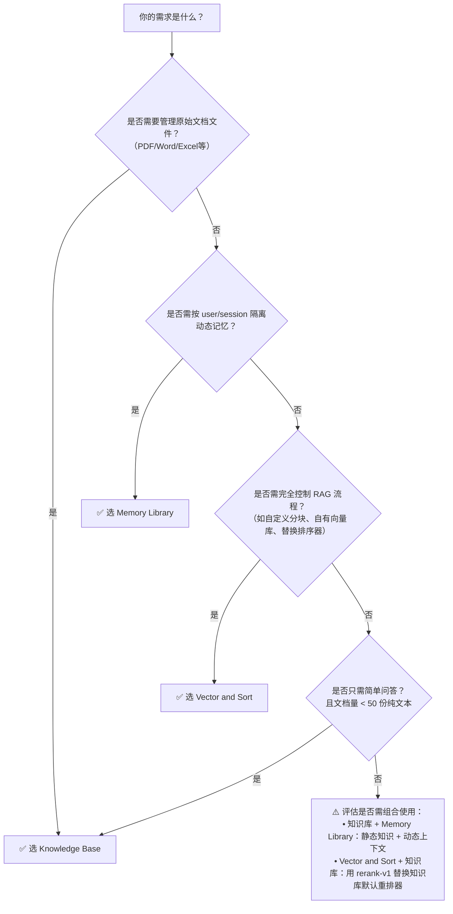

# 应用构建核心能力对比：Knowledge Base vs Memory Library vs Vector and Sort

## 背景与目的  
在百炼平台构建 LLM 应用时，开发者常需在不同层级实现“信息检索增强”能力：从静态知识管理、动态对话记忆，到原子级向量计算与排序。`Knowledge Base`（知识库）、`Memory Library`（记忆库）和 `Vector and Sort`（向量与排序）是三类定位清晰、能力正交的核心能力模块。本对比旨在帮助开发者**快速理解三者本质差异、技术边界与集成路径**，避免能力误用（如用记忆库替代知识库做客服问答）、规避计费陷阱，并基于场景特征（数据规模、更新频率、时效要求、结构化程度）做出合理技术选型。

---

## 关键维度对比表

| 维度 | Knowledge Base（知识库） | Memory Library（记忆库） | Vector and Sort（向量与排序） |
|------|---------------------------|---------------------------|------------------------------|
| **核心定位** | 面向**静态、领域化、企业级文档资产**的 RAG 服务，强调知识治理与端到端问答闭环 | 面向**动态、个性化、多轮对话上下文**的长期记忆管理，强调用户/会话粒度的状态持久化与上下文注入 | 面向**底层检索增强链路**的原子能力，提供向量化（embedding）与重排序（rerank）两类独立模型 API，供自定义 RAG 流程调用 |
| **输入格式** | 原始文件（PDF/Word/Excel/TXT/Markdown），由平台自动解析、分块、清洗；支持元数据标签上传 | 纯文本字符串（`content`，≤8192 字符），需开发者预处理；支持 `user_id`/`session_id`/`tag` 等结构化元数据 | 向量：单个或批量字符串（≤2048 字符/条，最多 128 条）；排序：`{ query: string, documents: string[] }` 对象（documents ≤50 条，每条 ≤512 字符） |
| **输出格式** | 结构化 JSON：含 `answer`（生成答案）、`retrieved_documents`（召回片段列表，含 `content`/`score`/`source`）、`usage`（token 消耗） | 写入无返回体（`upsert`）；检索返回 `memory_items` 数组（含 `id`/`content`/`score`/`metadata`）；上下文增强时自动拼接至 system [prompt](../guides/prompt.md) | 向量：`data: [{ embedding: [...], index: 0 }]`；排序：`results: [{ index: 0, relevance_score: 0.92 }]`（仅返回排序索引与分数，不返回原文） |
| **支持模型** | 默认绑定 `qwen-max`/`qwen-plus`/`qwen-turbo`；自定义 Qwen2 模型需启用 RAG 插件并完成向量模型对齐 | 仅支持百炼托管的 `qwen-max`/`qwen-plus`/`qwen-turbo`；**不支持第三方开源模型（如 Llama 3）直接接入** | `text-embedding-v1`、`multimodal-embedding-v1`、`rerank-v1` 等专用模型；**模型 ID 显式指定，与大模型解耦** |
| **API 端点** | `POST /v1/knowledge_base/query`（问答接口） `POST /v1/knowledge_bases`（管理接口） | `POST /v1/memory/upsert` `POST /v1/memory/retrieve` 集成于 `ChatCompletion` 请求的 `memory_config` 字段 | 向量：`POST https://dashscope.aliyuncs.com/api/v1/services/embeddings` 排序：`POST https://dashscope.aliyuncs.com/api/v1/services/rerank` |
| **计费方式** | **双重计费**： • 存储费：按知识库总文本容量（GB/月） • 调用费：按 `/query` 请求次数（含检索+生成） • 免费额度不覆盖 API 调用频次 | **双重计费**： • 存储费：按记忆条目数 + 向量索引容量（GB/月） • 调用费：按 `upsert` 和 `retrieve` 请求次数 • 上下文增强（`memory_config`）计入 `ChatCompletion` 调用费 | **按模型独立计费**： • 向量模型：按输入字符数计费（`text-embedding-v1`）或图片数量（`multimodal-embedding-v1`） • 排序模型：按 `query + documents` 总字符数计费 |
| **典型场景** | • 企业内部文档智能搜索（制度/手册/合同） • 客服知识库问答（FAQ+产品文档） • 合规报告自动生成（基于监管文件） | • 个性化助手（记住用户偏好/历史订单） • 多轮任务型对话（订餐/报销流程中状态暂存） • 用户画像动态更新（行为日志→记忆条目） | • 自建 RAG 系统（调用 `text-embedding-v1` 向量化私有数据 + `rerank-v1` 优化召回结果） • [多模态](../concepts/multi-modal.md)搜索（图像嵌入 + 文本嵌入联合检索） • 第三方系统集成（如 CRM 中嵌入语义搜索） |
| **数据时效性** | 更新后需 2–5 分钟生效；支持定时同步（Webhook） | 写入即生效（毫秒级）；TTL 过期自动失效 | 实时调用，无缓存延迟；结果完全取决于输入 |
| **权限与治理** | 支持细粒度 RBAC（知识库级读写权限）、操作审计日志、效果分析看板 | 支持 `user_id`/`session_id` 隔离；无跨用户共享机制；无内置审计日志 | 无数据存储，纯计算服务；无权限隔离概念（依赖 API Key 认证） |

---

## 适用场景建议（面向开发者）

| 场景特征 | 推荐方案 | 关键理由 |
|----------|----------|----------|
| **需要将 1000+ 份 PDF/Word 制度文档上线为可问答的知识中心，且要求支持关键词+语义混合检索、权限分级、效果追踪** | ✅ Knowledge Base | 唯一支持文档自动解析、多路召回、元数据过滤、企业级治理的全托管方案；记忆库无法处理原始文件，Vector and Sort 无文档管理能力。 |
| **开发一个电商导购助手，需记住用户本次会话中的浏览商品、加购意向、历史地址，并在后续消息中自动引用** | ✅ Memory Library | `user_id`/`session_id` 原生支持、TTL 控制生命周期、无缝注入 `ChatCompletion` 上下文；知识库数据全局共享且不可按会话隔离，Vector and Sort 无状态存储能力。 |
| **已有一套自研向量数据库（如 Milvus），希望用百炼的 `rerank-v1` 替换原有排序模型以提升相关性，同时保留自有索引与检索逻辑** | ✅ Vector and Sort | 提供开箱即用的高精度 rerank 模型，输入输出契约清晰，与基础设施解耦；知识库/记忆库均为黑盒服务，无法替换其内部排序组件。 |
| **需对用户上传的图片生成文本描述，并与商品库文本做跨模态相似度匹配** | ✅ Vector and Sort（`multimodal-embedding-v1`） | 唯一支持[多模态](../concepts/multi-modal.md)嵌入的能力；知识库仅支持文本文件解析，记忆库不支持图像输入。 |
| **小团队快速验证 RAG 效果，仅有几十个 Markdown 片段，无需长期运维，但要求最低成本试错** | ⚠️ Knowledge Base（小规模） 或 ✅ Vector and Sort（自建轻量流程） | 知识库免费额度覆盖基础存储，适合快速验证；若已有向量库，用 `Vector and Sort` 可避免知识库管理开销，但需自行实现分块、存储、检索逻辑。 |

---

## 技术选型决策树（开发者速查）

> **重要提醒**：  
> - **禁止混用模型能力**：`rerank-v1` 不可用于生成向量，`text-embedding-v1` 不可用于排序，否则触发 400/500 错误；  
> - **避免冗余存储**：同一份文档不应既存入知识库又写入记忆库，易导致一致性问题与额外计费；  
> - **性能权衡**：启用 `retrieval_mode=multi`（知识库）或 `rerank=true`（记忆库）可提升质量，但延迟增加 200–400ms，高并发场景需压测；  
> - **调试优先**：所有能力均提供控制台测试入口（知识库「测试问答」、记忆库「模拟检索」、Vector and Sort 「API Playground」），**务必先验证再集成**。

## 被对比主题页

- [knowledge base](../guides/knowledge-base.md)
- [memory library overview](../guides/memory-library-overview.md)
- [vector and sort](../api/vector-and-sort.md)

