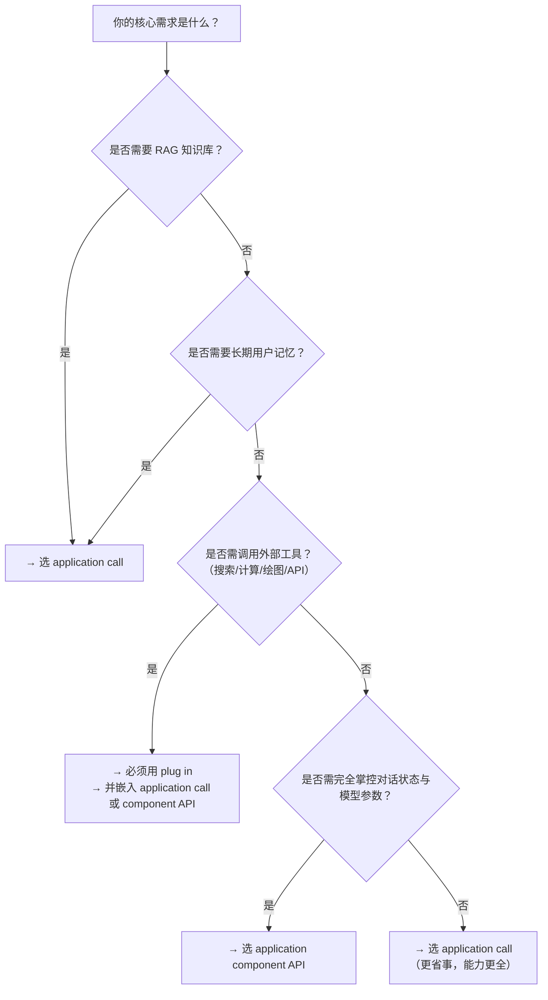

# 应用核心组件能力对比：应用调用、组件API与插件

## 概述

在百炼平台构建生产级 AI 应用时，开发者需在多种能力路径中进行技术选型：是直接调用已编排完成的智能体/工作流（`application call`），还是基于标准化模型接口自主构建对话逻辑（`application component API`），抑或通过插件机制动态扩展模型能力边界？三者定位不同、能力互补，但存在功能重叠与适用边界模糊地带。本文旨在从**输入输出规范、模型支持、协议特性、集成深度与典型工程场景**等维度进行系统性对比，帮助开发者依据业务目标、架构约束与团队能力，做出清晰、可落地的技术决策。

---

## 关键能力维度对比

| 维度 | `application call`（应用调用） | `application component API`（应用组件 API） | `plug in`（插件） |
|------|-------------------------------|---------------------------------------------|-------------------|
| **本质定位** | 调用**已发布、已编排**的完整应用单元（Agent/Workflow），面向“成品服务” | 调用**基础模型推理能力**，面向“可编程组件”，需自行管理上下文与流程 | 扩展**模型原生能力边界**的工具机制，面向“能力增强”，依赖模型调度 |
| **输入格式** | • DashScope：`prompt`（单轮）或 `messages`（多轮） • Responses API：`input`（string 或 message array，支持多模态结构化内容） • 支持 `image_list`/`file_list` 等多模态字段 | `input.messages`（严格 message 数组，含 `role`/`content`） • 仅支持文本输入 • 不支持图像、文件等原生多模态字段 | 非独立调用入口；作为**工具被嵌入**至 `application call` 或 `component API` 的 `tools` 字段中；输入由模型识别或业务透传（`biz_params`）提供 |
| **输出格式** | • 同步：完整 JSON 响应（含 `output.text`、`output.thoughts`、`output.rag_references` 等） • 流式：SSE 分块（含 `delta`/`finish_reason`/`usage`） • 支持增量输出控制（`incremental_output`） | • 同步：标准 JSON（含 `output.text`、`output.tool_calls`） • 流式：SSE（`delta` 中含 `tool_calls` 分片，需客户端拼接） • 无增量输出开关，服务端统一处理 | 无独立输出；插件执行结果以结构化 JSON 形式返回至调用方（如 Agent），由模型解析并整合进最终响应；输出字段需明确定义 |
| **支持模型** | • 智能体/工作流底层可配置任意百炼支持模型（含 `qwen-vl-plus`、`qwen-audio` 等） • 多模态能力通过应用配置启用，非 API 层直接暴露 | • 显式指定 `model` 参数：  `qwen-turbo` / `qwen-plus` / `qwen-max` • **不支持 `qwen-vl`、`qwen-audio` 等多模态模型**（文档明确标注） | • 插件本身无模型绑定，但**仅在启用插件能力的模型上生效**：  `qwen-turbo`、`qwen-plus`、`qwen-max`、`qwen-vl-plus`、`qwen-vl-max` • 模型需具备工具调用理解能力（如 `qwen-turbo` 对简单工具支持更稳定） |
| **API 端点** | • DashScope 原生：`POST /api/v1/apps/{APP_ID}/completion` • Responses（OpenAI 兼容）：`POST /api/v2/apps/agent/{APP_ID}/compatible-mode/v1/responses` | `POST /api/v1/apps/{app_id}/chat`（注意：此处 `{app_id}` 是组件级应用 ID，非智能体/工作流 ID） | **无独立端点**；必须集成于其他调用链中： • 在 `application call` 请求的 `biz_params.user_defined_params` 或 `tools` 中声明 • 在 `component API` 请求的 `tools` 字段中声明 |
| **计费方式** | • 按调用次数 + 模型 token 消耗计费 • RAG 检索、[长期记忆](../concepts/long-term-memory.md)、多模态解析等高级能力**不额外计费**，包含在应用调用费用中 | • 按模型 token 消耗计费（输入+输出） • 工具调用（`tool_calls`）本身**不产生额外费用**，但其触发的外部 API 调用需用户自行承担 | • 插件本身**不计费** • 官方插件（如 `calculator`、`code_interpreter`）免费使用 • 三方插件按云市场定价计费 • 自定义插件调用的外部服务费用由用户承担 |
| **核心高级能力** | ✅ RAG 检索（`rag_options`） ✅ [长期记忆](../concepts/long-term-memory.md)（`memory_id`） ✅ 思考过程（`enable_thinking`） ✅ 多模态输入（图像/文件） ✅ 工作流节点级错误恢复 | ✅ 多轮对话状态管理（`messages` 透传） ✅ 内置工具调用（`tools`） ❌ 无 RAG、无[长期记忆](../concepts/long-term-memory.md)、无思考过程、无多模态 | ✅ 动态能力扩展（搜索/计算/绘图/代码执行等） ✅ 多源集成（官方/三方/自定义） ✅ 模型自主规划调用时机与参数 ❌ 无法独立提供对话管理、RAG、记忆等应用层能力 |
| **典型场景** | • 客服机器人（需知识库检索+用户记忆+多轮对话） • 智能办公助手（上传合同 PDF → 提取条款 → 生成摘要 → 发送邮件） • 多模态内容分析（上传截图+提问 → VL 模型理解 → 输出结论） | • 轻量级问答 Bot（无复杂状态、无知识库） • 内部工具聚合门户（统一接入多个后端服务，由模型选择调用） • 实时对话增强（在已有聊天界面中嵌入模型回复能力） | • 需要实时信息的场景（如查天气、搜新闻、查 GitHub） • 需要精确计算或代码验证的场景（如公式求解、数据清洗脚本生成） • 需要生成外部内容的场景（如根据描述生成图片、生成二维码） |

---

## 适用场景建议（面向开发者）

| 场景特征 | 推荐方案 | 理由说明 |
|----------|----------|----------|
| **需要开箱即用的完整 AI 应用能力**（如知识库问答、带记忆的客服、多步骤工作流） | ✅ `application call` | 封装了 RAG、记忆、多模态、思考链等企业级能力，无需重复开发基础设施；一次部署，多端调用；适合追求交付效率与稳定性的业务线。 |
| **需要高度定制化对话逻辑与上下文管理**（如私有协议解析、特殊会话状态机、与现有系统强耦合） | ✅ `application component API` | 提供最底层的模型调用控制权，`messages` 完全可控，`parameters` 精细可调；适合算法/工程团队主导、对延迟与响应格式有严苛要求的场景。 |
| **模型当前能力无法覆盖业务需求**（如需联网搜索、执行 Python、生成图片、调用内部 ERP API） | ✅ `plug in`（必须配合 `application call` 或 `component API` 使用） | 插件是唯一能安全、标准化地将外部能力注入模型决策流的机制；避免自行封装 HTTP 调用带来的错误处理、超时、鉴权、结果解析等工程负担。 |
| **快速迁移 OpenAI 生态项目** | ✅ `application call`（Responses API） | 完全兼容 OpenAI SDK 与请求格式（`input`/`messages`/`stream`），只需替换 endpoint 与 API Key，5 分钟完成适配。 |
| **构建低代码/无代码应用**（如运营人员配置知识库+插件即可上线） | ✅ `application call` + `plug in`（控制台集成） | 控制台提供可视化插件市场、拖拽式工作流编排、RAG 知识库一键挂载，大幅降低非技术人员使用门槛。 |
| **需严格控制成本且模型调用量大**（如日均百万 token） | ⚠️ 优先评估 `application component API` | `application call` 因封装了更多中间层，同等输入下可能产生略高 token 开销（如记忆向量编码、RAG query 重写）；`component API` 更接近裸模型调用，成本更透明可控。 |

---

## 技术选型决策树（简版）

> 💡 **关键提醒**：三者并非互斥，而是**分层协作关系**：  
> - `plug in` 是能力原子；  
> - `application component API` 是模型能力基座；  
> - `application call` 是面向业务的完整解决方案。  
> 实际项目中，**组合使用是常态**——例如：用 `application call` 调用一个智能体应用，该智能体内部既配置了 RAG 知识库，又启用了 `quark_search` 和 `code_interpreter` 插件，底层模型为 `qwen-plus`。

---  
*最后更新：2024年6月*  
*适用平台版本：百炼 v3.2+*

## 被对比主题页

- [application call](../api/application-call.md)
- [application component api reference](../api/application-component-api-reference.md)
- [plug in](../guides/plug-in.md)

