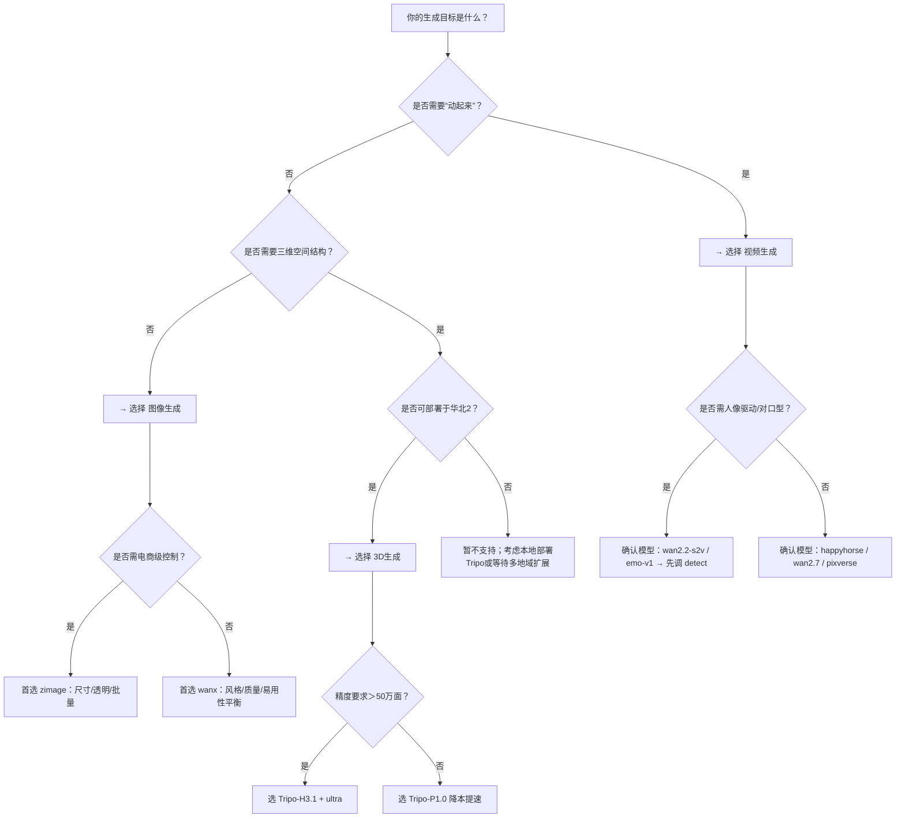

# 图像、视频与3D生成能力对比

本文档面向百炼平台开发者，旨在系统性对比图像生成、视频生成与3D生成三大模态生成能力的核心技术特征与工程实践差异，帮助技术团队在实际业务场景中快速完成模型选型、接口集成与架构设计。随着AIGC多模态能力持续演进，不同生成任务对输入表达力、输出精度、计算时延、资源约束及工作流复杂度提出差异化要求。本对比基于百炼平台当前（2024Q4）正式发布的API能力，覆盖调用协议、模型生态、计费逻辑与典型落地路径，不涉及未上线或灰度中的实验性功能。

## 关键维度对比

| 维度 | 图像生成（Image Generation） | 视频生成（Video Generation） | 3D生成（3D Generation） |
|------|------------------------------|------------------------------|--------------------------|
| **核心输入格式** | 文本提示词（`prompt`）、可选参考图（图生图/局部重绘）；支持分段提示（`::` 分隔） | 多模态组合： • 文本（文生视频） • 单图/首帧/首尾帧（图生视频） • 参考图集/参考视频（参考生视频） • 图+音频（数字人驱动） • 原视频+音频（对口型/编辑） | 三选一互斥： • 文本（`input.prompt`） • 单张公网图（`input.image`） • 四视角图组（`input.images`，前/左/后/右，空位需 `{}` 占位） |
| **核心输出格式** | JPEG/PNG 图像直链（`url`）或 Base64 编码（`b64_json`）；Z-Image 支持透明背景（PNG + `alpha=true`） | MP4 视频直链（`output.video_url`）；部分模型额外返回预览帧、关键帧序列或元数据JSON | GLB 格式 3D 模型直链： • `pbr_model_url`（含PBR材质，需 `pbr: true`） • `base_model_url`（无贴图，需 `texture: false && pbr: false`） • `rendered_image_url`（渲染预览图） |
| **统一API端点** | ✅ `/v1/images/generations`（所有图像模型共用） | ❌ **无统一端点**： • 主流模型：`/api/v1/services/aigc/video-generation/video-synthesis` • 部分旧版万相模型：`/api/v1/services/aigc/image2video/video-synthesis` • 数字人等专用模型使用独立路径（如 `/s2v`） | ❌ **专用端点**： `/api/v1/services/aigc/video-generation/3d-generation` （注意：路径含 `video-generation` 是历史命名，实际为3D专属） |
| **调用模式** | ✅ 同步调用（HTTP 200 返回即含结果） | ⚠️ **强制异步**： 1. `POST` 创建任务 → 返回 `task_id` 2. 轮询 `GET /api/v1/tasks/{task_id}` 查询状态 （`task_id` 有效期 24 小时） | ⚠️ **强制异步**： 同视频生成流程，`task_id` 有效期 24 小时，结果URL有效期仅 **2 小时** |
| **支持模型（代表）** | • 千问（Qwen-VL）：多模态理解强，通用文生图 • 万相（WanX）：12种艺术风格预设，支持抠图 • Z-Image：电商友好，精确尺寸+透明背景 • 可灵（Kling）：高动态构图，支持ControlNet（需权限） • Vidu-Image：单帧高质量初始化 | • HappyHorse 系列：All-in-One 文/图/参考生视频 • 万相 2.7+/3.0：统一模型，支持首尾帧/视频编辑/风格重绘 • PixVerse（爱诗）：超清、动作模仿、对口型 • EMO/LivePortrait/AnimateAnyone：人像驱动类（需前置检测） | • Tripo/Tripo-H3.1：高精度（≤200万面），支持 `ultra` 几何质量 • Tripo/Tripo-P1.0：快速生成（≤2万面），适合原型验证 |
| **地域约束** | ✅ 无硬性地域限制（但推荐与API Key同地域以降低延迟） | ⚠️ **强地域一致性要求**： 模型、Endpoint URL、API Key 必须同属一个地域（如华北2北京、新加坡） | ❗ **严格单地域锁定**： 仅支持 **华北2（北京）**；跨地域调用必报 `InvalidApiKey` 或 `UnsupportedRegion` |
| **计费方式** | ✅ 按次计费（每张图） • `n=1–4`：按实际生成张数计费 • `quality=hd`：部分模型（万相/Z-Image）额外加价 | ✅ 按秒/次计费（因模型而异）： • 文生/图生视频：按生成视频秒数计费（如 5s 视频 = 5 秒） • 数字人/对口型：按音频时长或视频时长计费 • 免费额度有限，高并发需关注RPS配额 | ✅ 按任务计费（非按面数/时长）： • 每次成功 `POST` 创建任务即计费1次 • 无论生成耗时、模型精度（H3.1/P1.0）或输出大小，单价固定 |
| **典型场景** | • 营销素材批量生成（电商主图、Banner） • 设计稿初稿与风格探索 • 社媒配图、AI头像、插画创作 • 图文内容增强（图文问答生成） | • 短视频内容生产（广告、教程、Vlog） • 数字人直播/客服/培训视频生成 • 产品演示动画（图→视频） • 影视分镜预演、AIGC短片制作 • 视频风格迁移与特效增强 | • 游戏/AR/VR资产快速建模（概念验证） • 电商3D商品展示（从商品图生成可旋转模型） • 工业设计草图转3D原型 • 教育可视化（分子结构、机械部件） • NFT 3D藏品生成 |

## 各方案适用场景建议

### ✅ 图像生成 —— 适合「轻量、高频、确定性输出」场景  
- **推荐选用当**：需要快速产出静态视觉内容，对实时性要求高（如CMS后台一键生成配图），或需集成至低延迟前端应用（如设计工具插件）。  
- **优先模型**：  
  - 通用需求 → `wanx`（风格丰富、HD质量稳定）  
  - 电商落地 → `zimage`（精准尺寸、透明背景、批量高效）  
  - 构图复杂 → `kling`（高动态范围，适合人物+场景组合）  
- **避坑提示**：避免用 `qwen-vl-plus` 生成需精细控制的电商图（缺乏尺寸/背景控制）；勿对 `kling` 强制设置 `response_format=b64_json`（不支持）。

### ✅ 视频生成 —— 适合「多模态协同、时间序列表达」场景  
- **推荐选用当**：内容需表达运动、时序变化或人机交互（如说话、动作、转场），且可接受分钟级生成延迟。  
- **选型策略**：  
  - 全能型起步 → `happyhorse-t2v` 或 `wan2.7-t2v`（API统一、文档完善、兼容性好）  
  - 数字人专项 → `wan2.2-s2v` 或 `emo-v1`（但**必须先调用对应 detect 接口**）  
  - 高清/动作需求 → `pixverse-v6-t2v`（明确支持超清与动作模仿）  
- **避坑提示**：务必校验地域一致性；轮询间隔 ≥15 秒，高频查询易触发 RPS 限流；图生视频务必确保首帧图分辨率 ≥400px 且公网可访问。

### ✅ 3D生成 —— 适合「空间结构建模、下游引擎集成」场景  
- **推荐选用当**：目标是获得可导入Unity/Unreal/Blender的GLB模型，用于渲染、交互或物理仿真，且业务可部署于华北2环境。  
- **选型策略**：  
  - 追求精度与细节 → `Tripo/Tripo-H3.1` + `geometry_quality=ultra` + `texture_quality=detailed`  
  - 快速验证/大批量草图 → `Tripo/Tripo-P1.0`（生成快、成本低、面数适中）  
- **避坑提示**：严格遵循输入互斥规则（`prompt`/`image`/`images` 三选一）；多图必须传满4项，缺失视角填 `{}`；下载结果URL后2小时内必须完成存储，过期不可恢复。

## 面向开发者的选型决策树

> **最后提醒**：所有生成服务均受内容安全策略约束，禁止生成暴力、色情、政治敏感及可识别真人肖像内容；违规请求将实时拦截并审计。请在生产环境集成前，务必通过沙箱环境完成合规性验证。

## 被对比主题页

- [image generation](../api/image-generation.md)
- [video generation api](../api/video-generation-api.md)
- [3d generation](../api/3d-generation.md)

