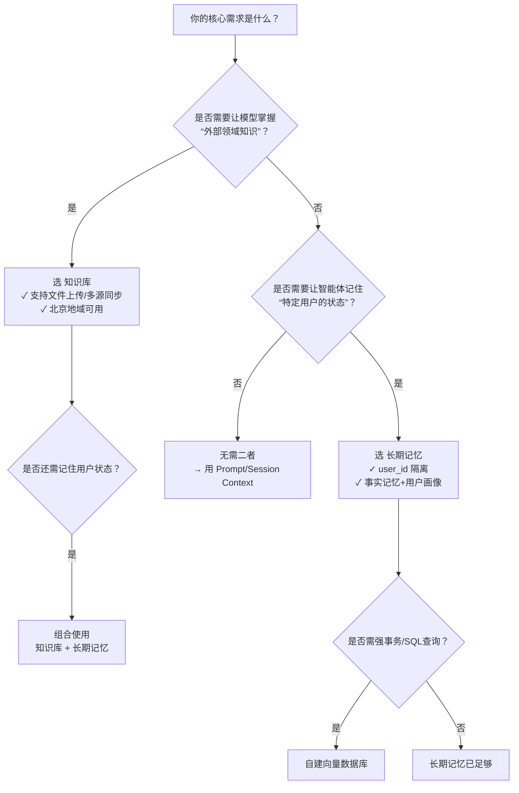

# 知识管理与长期记忆方案对比：知识库、Memory Library 与 Long-term Memory

## 背景与对比目的

在百炼平台构建智能应用时，开发者常需在两类核心能力间进行技术选型：  
- **面向领域知识的静态/半静态信息管理**（如产品文档、政策法规、客服话术）；  
- **面向用户交互的动态/个性化状态建模**（如对话历史摘要、用户偏好、任务承诺）。  

“知识库”、“Memory Library”与“Long-term Memory”虽名称相近、均涉及向量检索与上下文增强，但设计目标、数据生命周期、集成方式与计费模型存在本质差异。本文旨在为开发者提供清晰、可落地的技术对比，帮助其根据业务场景精准选择最适配的方案，避免功能误用、架构冗余或成本失控。

> ⚠️ 重要说明：  
> - “Memory Library” 是百炼控制台中对长期记忆能力的**统一产品化命名**，面向终端用户与低代码场景；  
> - “Long-term Memory” 是同一能力的**底层 API 接口层命名**，面向开发者直接调用；  
> - 二者**技术内核完全一致，属同一服务的不同抽象层级**，非并列方案。本对比中将二者合并为“长期记忆（Memory Library / Long-term Memory）”，与“知识库”进行正交对比。

---

## 关键维度对比表

| 维度 | 知识库（Knowledge Base） | 长期记忆（Memory Library / Long-term Memory） |
|------|--------------------------|-----------------------------------------------|
| **核心定位** | 面向**领域知识注入**的 RAG 基础设施，提升模型回答的**专业性、准确性与事实一致性** | 面向**用户状态建模**的跨会话记忆中间件，提升智能体的**连续性、个性化与意图理解深度** |
| **数据来源** | 主动上传的结构化/非结构化文件（PDF/Word/Excel/网页/图片等），支持 OSS/飞书/钉钉/语雀等连接器自动同步 | 被动提取自**实时对话消息流**（`messages`）或开发者主动提交的文本（`custom_content`），无文件级导入能力 |
| **输入格式** | 文件（支持格式：`.pdf`, `.docx`, `.xlsx`, `.pptx`, `.txt`, `.md`, `.html`, `.jpg`, `.png` 等）；支持元数据（metadata）与标签（tags）注入 | JSON 格式请求体： • `messages`: 对话消息数组（含 role/content/timestamp） • 或 `custom_content`: 纯文本（≤512 字符） • 必填 `user_id`，可选 `profile_schema_id` |
| **输出格式** | • 检索：返回原始文本切片（chunk）及元数据 • 问答：返回带引用溯源的自然语言回答 + 可配置的原始切片列表 | • `AddMemory`: 返回提取的事实记忆节点（`memory_nodes`）ID 列表 +（可选）用户画像生成状态 • `SearchMemory`: 返回语义匹配的记忆片段（含相似度分数、时间戳、来源上下文） • `GetUserProfile`: 返回结构化 JSON 用户画像对象 |
| **支持模型** | 严格依赖大模型协同： • 预置模型：Qwen 全系（QwQ/Long/Max/Plus/Turbo/Coder/Deep-Research）、Qwen-VL 系列、Llama3.1、Yi-Large、DeepSeek-R1 等 • 自定义模型：基于上述基础模型微调的版本 | **模型无关**（Model-Agnostic）： • 作为独立中间件运行，不绑定任何特定 LLM • 提取与检索逻辑由百炼统一向量模型与 Rerank 模型完成，对上层模型透明 |
| **API 端点** | • 检索：`POST /v1/knowledge_bases/{kb_id}/retrieve` • 问答：`POST /v1/knowledge_bases/{kb_id}/chat` • 管理：`/v1/knowledge_bases`（CRUD） • 地域限制：仅华北2（北京）可用 | • 统一入口：`https://dashscope.aliyuncs.com/api/v2/apps/memory/` • 关键接口：  `POST /add`（写入）  `POST /memory_nodes/search`（检索）  `GET /profile_schemas/{id}/user_profile`（查画像） • 全地域可用（无地域限制） |
| **计费方式** | **双轨制计费**： • 规格费用：按小时计费（标准版/旗舰版，含 RCU 并发配额） • 模型费用：按 [Token](../concepts/token.md) 计费（Rerank 费用取决于 TopK 总数，非最终返回数） • 多知识库叠加计费 | **按调用次数 + 版本分级计费**（2026年8月20日起生效）： • `AddMemory` / `SearchMemory` 接口均区分 `Pro`（高精度/Rerank）与 `Lite`（低成本/低延迟）版本 • 免费试用期至 2026-08-20；免费额度：10,000 条记忆长期有效 |
| **典型场景** | • 客服机器人基于产品手册自动答疑 • 合规助手实时检索最新监管文件 • 研究助理从论文库中提取实验数据 • 多源知识融合的行业知识图谱构建 | • 智能导购记住用户历史偏好与未完成订单 • 健康助手持续追踪用户每日饮水/服药承诺 • HR 助理自动归纳面试者关键技能与职业诉求 • 教育助手根据学习轨迹动态调整教学策略 |
| **数据生命周期** | • 文件级持久化存储，无自动过期机制 • 切片有效期与源文件绑定，手动更新/删除才变更 • 支持定时增量同步（分钟级~日级） | • 事实记忆与用户画像**默认永不过期** • 每条记忆规则可独立配置过期时间（7/30/180天/永不过期） • 删除操作不可逆，无回收站 |
| **权限与隔离** | • 以「知识库」为单位隔离，支持多知识库路由与权重配置 • 不支持按 `user_id` 隔离，所有用户共享同一知识库内容 | • 以 `user_id` 为强隔离维度，天然支持多租户 • 支持创建多个自定义记忆库（最多50个），用于业务场景隔离（如电商/客服/内部办公） |
| **高级能力** | • 混合检索（向量+关键词） • Query 改写与 Rerank 排序 • 多轮对话上下文补全 • 视觉理解（保留 PDF/图片版面） • 标签/元数据精准过滤 | • 双模式提取：事实记忆（动态事件） + 用户画像（结构化属性） • 查询改写（`enable_rewrite`）与意图判别（`enable_judge`） • 异步画像提取（约3秒延迟） • OpenClaw [插件](../concepts/plugin.md)零代码集成（`autoCapture`/`autoRecall`） |

---

## 适用场景建议（面向开发者）

| 业务需求 | 推荐方案 | 关键理由 | 注意事项 |
|----------|----------|----------|----------|
| **需要让模型“知道”某个领域的权威信息**（如法律条文、医疗指南、企业制度） | ✅ 知识库 | 原生支持海量文件解析、多源同步、混合检索与生产级问答控制（拒答/溯源/防泄漏），专为知识可信性设计 | 必须部署在北京地域；需关注 Rerank TopK 对成本的影响 |
| **需要让智能体“记住”某个用户的个性化状态**（如“张三喜欢咖啡、过敏花生、正在申请房贷”） | ✅ 长期记忆 | `user_id` 级隔离、自动提取、结构化画像、跨会话持久化，是构建有记忆的 Agent 的唯一官方方案 | 用户画像需提前定义 `profile_schema`；`AddMemory` 后需等待约3秒再查画像 |
| **需同时满足以上两类需求**（如：客服机器人既要懂产品手册，又要记清每位客户的历史投诉） | ✅ **组合使用** | 知识库处理“世界知识”，长期记忆处理“用户知识”，二者互补无耦合。可在工作流中先调知识库检索，再调长期记忆召回，拼接为完整上下文 | 控制台工作流中可并行接入两个节点；API 调用需自行编排顺序与上下文组装 |
| **临时性、单次性上下文增强**（如：本次对话中用户上传了一份合同，仅本次会话需参考） | ❌ 两者均不适用 → ✅ 使用 **Prompt 中直接传入文本** 或 **Session Context** | 知识库需预上传建索引，长期记忆需持久化，均过度设计。轻量场景应优先利用模型原生上下文窗口 | 百炼工作流支持 `context` 变量注入，SDK 支持 `system`/`user` 消息直接携带 |
| **需对记忆内容做复杂 SQL 查询或事务操作** | ❌ 两者均不适用 → ✅ 使用 **自有数据库 + 自定义向量检索** | 知识库与长期记忆均为托管型语义检索服务，不开放底层存储与 SQL 接口 | 如需强一致性或复杂关联查询，建议将记忆数据同步至自有 PostgreSQL + pgvector |

---

## 技术选型决策树（开发者速查）

> 💡 **最佳实践提示**：  
> - **避免混用误区**：不要将用户聊天记录批量上传到知识库——这违背知识库“静态/半静态领域知识”的设计初衷，且无法实现 `user_id` 隔离；  
> - **成本优化技巧**：长期记忆 `SearchMemory` 默认 `plan_version=Pro`（启用 Rerank），若对精度要求不高，可显式设为 `Lite` 降低成本；知识库中谨慎增大 `TopK`，因 Rerank 费用与 TopK 成正比；  
> - **调试建议**：知识库使用控制台“调试界面”实时验证检索效果；长期记忆优先使用控制台「记忆检索」页调试 `min_score` 与 `top_k`，再集成到代码。

---  
*最后更新：2025年4月 | 百炼平台技术文档组*

## 被对比主题页

- [knowledge base](../guides/knowledge-base.md)
- [memory library overview](../guides/memory-library-overview.md)
- [long term memory new](../api/long-term-memory-new.md)

