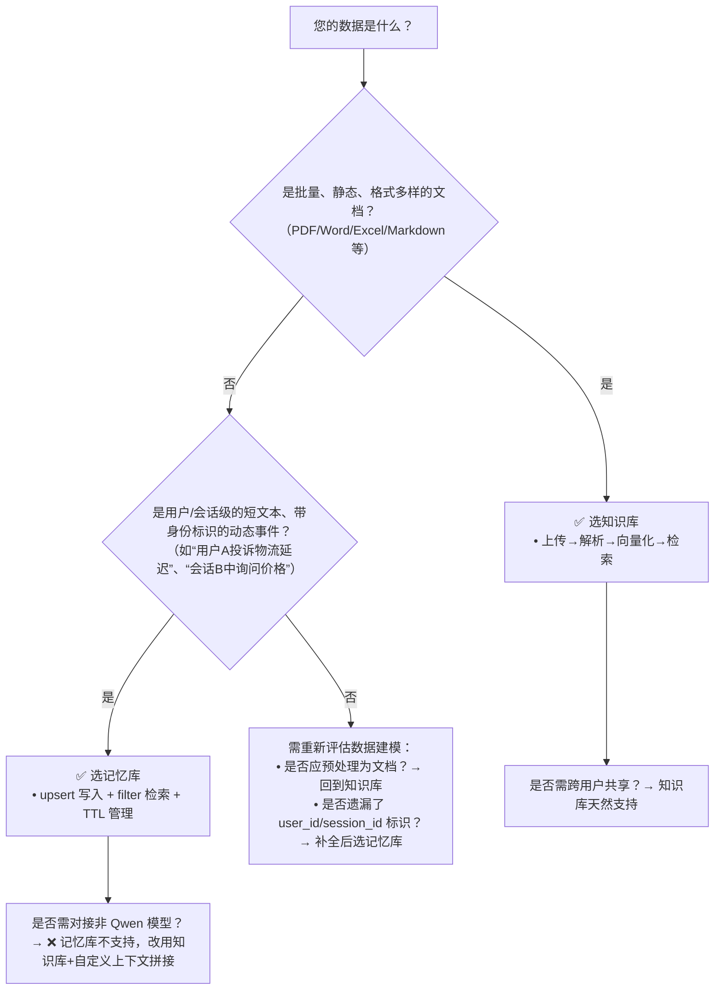

# 知识库与记忆库功能对比

在百炼平台的智能应用开发实践中，**知识库（Knowledge Base）** 与 **记忆库（Memory Library）** 是两类常被混淆但定位迥异的核心能力。二者均依托向量检索技术增强大模型输出质量，但设计目标、数据生命周期、集成方式与适用边界存在本质差异。本文旨在为开发者提供清晰、可落地的技术选型参考：帮助您根据业务场景的数据特性（静态/动态、全局/个性化、长期/会话级）、系统架构约束（是否需多轮上下文保持、是否依赖私有文档结构化处理）及运维需求（更新频率、一致性要求、配额管理），准确选择并组合使用这两项能力。

---

## 关键维度对比

| 维度 | 知识库（Knowledge Base） | 记忆库（Memory Library） |
|------|--------------------------|---------------------------|
| **核心定位** | 面向**领域知识注入**的 RAG 基础设施，用于提升模型在特定垂直领域的事实准确性与专业性 | 面向**多轮对话上下文管理**的长期记忆服务，用于维持用户/会话级个性化状态与历史线索 |
| **输入格式** | 支持批量上传结构化/非结构化文档（PDF、Word、Excel、PPT、TXT、Markdown 等），自动解析文本+元信息（需显式启用） | 接收单条或批量 `upsert` 请求，`content` 为纯字符串（≤8192 字符），支持结构化 `metadata`（如 `user_id`, `session_id`, `tag`） |
| **输出格式** | 检索返回带 `chunk_id`、`score`、`source`（文件名/页码等，需启用元信息提取）的文档片段列表；可直接注入 LLM 提示词或供应用后处理 | 检索返回带 `memory_id`、`score`、`content`、`metadata` 及 `created_at` 的记忆条目列表；默认不包含原始二进制上下文（如图片、表格渲染结果） |
| **支持模型** | **不绑定具体模型**：可与百炼平台所有支持 RAG 的 LLM 协同（Qwen/Qwen2/Qwen3 系列、GLM、Llama 等），由调用方在 LLM 请求中指定 | **严格限定模型**：仅支持百炼托管的 Qwen 系列模型（`qwen-max`、`qwen-plus`、`qwen-turbo`），其他模型无法原生触发记忆注入 |
| **API 端点** | `/knowledge_bases`（CRUD 知识库） `/knowledge_bases/{kb_id}/files`（上传/解析） `/knowledge_bases/{kb_id}/retrieve`（独立检索） LLM 请求中通过 `retrieval.knowledge_base_id` 自动注入 | `/v1/memories`（`upsert` 写入） `/v1/memories/retrieve`（独立检索） LLM 请求中通过 `extra_parameters.memory.enable: true` 自动注入 |
| **计费方式** | 按**知识库实例数 + 文档处理量（token） + 检索调用量（次）** 计费；向量化与存储占用计入资源包配额 | 按**记忆条目数（条） + 写入/检索调用量（次）** 计费；免费版含 10 万条基础配额，超限返回 `429` |
| **数据生命周期** | **静态为主，人工驱动更新**：文档上传后生成向量索引；支持增量同步，但需主动触发；无自动过期机制 | **动态可变，支持 TTL**：每条记忆可设置 `ttl_seconds`（60 秒–1 年），到期自动清理；写入即生效，无需重建索引 |
| **检索能力** | 多路召回（关键词 + 向量混合）、RRF 重排序、支持 `filter`（按文件路径、自定义标签等） | 双路召回（关键词 + 向量）、支持多维 `filter`（`user_id`/`session_id`/`tag` 等），但无重排序策略 |
| **典型场景** | 客服知识问答（产品手册/FAQ）、技术文档助手（API 文档/SDK 教程）、企业内部知识中枢（制度/流程/项目归档） | 个性化客服（记住用户偏好/历史投诉）、智能导购（跟踪浏览/加购行为）、AI 助手（记住用户习惯/待办事项）、B2B SaaS 对话机器人（维护客户专属上下文） |

---

## 适用场景建议

### ✅ 优先选用 **知识库** 当：
- 您拥有大量**已沉淀的、相对稳定的私有文档资产**（如 PDF 技术白皮书、Word 制度文件、Markdown API 文档），需让大模型“读懂”这些材料；
- 业务诉求是**提升模型在通用问答中的专业性与事实准确性**，而非记住某位用户的上一句话；
- 需要**跨用户、跨会话共享同一份权威知识源**（例如所有客服机器人共用同一套产品知识库）；
- 要求支持**复杂文档结构解析**（如保留 PPT 图表标题、Excel 表头、PDF 页码）和**细粒度分块控制**（按章节/段落切分）。

### ✅ 优先选用 **记忆库** 当：
- 您的应用是**强交互、多轮对话型**（如客服聊天窗口、AI 助手 App），需在单次会话甚至跨会话中**持续感知用户身份与上下文**；
- 数据具有**高度个性化、时效性强、且来源分散**（如用户留言、操作日志、实时反馈），无法提前整理成规范文档；
- 需要**自动清理陈旧信息**（例如 7 天未活跃用户的记忆自动过期），降低存储成本与噪声干扰；
- 开发栈已深度绑定百炼托管的 Qwen 系列模型，且接受其作为唯一推理底座。

### ⚠️ 注意：二者可协同，但不可替代
- **典型协同模式**：  
  用户提问 → 先用**记忆库**检索该用户的历史偏好（如“上次说过敏体质”）→ 再用**知识库**检索最新药品说明书 → 将两部分上下文共同注入 LLM 提示词 → 生成个性化、准确的回答。  
- **不可替代性警示**：  
  - 不要用记忆库存储 1000 页 PDF —— 违反其设计容量与文本长度限制（单条 ≤8192 字符）；  
  - 不要用知识库记录每位用户的实时订单状态 —— 缺乏 `user_id` 隔离与 TTL 机制，易引发数据混杂与泄露风险。

---

## 技术选型决策树（面向开发者）

> **最后提醒**：  
> - 知识库适合构建「组织的智慧」，记忆库适合构建「用户的体验」；  
> - 控制台操作便捷性：知识库提供完整可视化工作流（上传→配置→发布→测试），记忆库以 API/SDK 集成为主，控制台仅作配额与监控；  
> - SDK 封装程度：`dashscope` Python SDK 对知识库提供 `KnowledgeBase` 高阶类，对记忆库提供 `MemoryClient`，均推荐使用以简化错误处理与重试逻辑。

## 被对比主题页

- [knowledge base](../guides/knowledge-base.md)
- [memory library overview](../guides/memory-library-overview.md)

