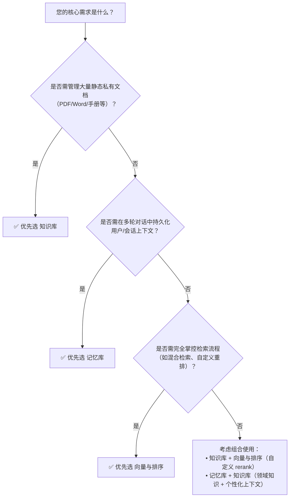

# 知识检索方案对比

在构建基于大模型的智能应用（如客服助手、技术文档问答、个性化对话系统）时，高效、准确、可控的知识检索能力是 RAG（[检索增强生成](../concepts/rag.md)）落地的核心环节。百炼平台当前提供三类互补但定位差异显著的检索能力：**知识库（Knowledge Base）** 面向静态领域知识的结构化管理与语义问答；**记忆库（Memory Library）** 聚焦多轮对话中动态上下文的长期记忆与个性化召回；**向量与排序（Vector and Sort）** 则作为底层原子能力，提供可灵活编排的嵌入生成与结果重排服务。

本文旨在为开发者提供清晰的技术选型参考，从输入输出、集成方式、能力边界和成本模型等维度，系统对比这三类方案，帮助您根据实际业务场景（如是否需私有文档注入、是否依赖会话状态、是否需自定义检索流程）快速决策最优路径。

## 方案核心能力对比

| 维度 | 知识库（Knowledge Base） | 记忆库（Memory Library） | 向量与排序（Vector and Sort） |
|------|--------------------------|---------------------------|-------------------------------|
| **核心定位** | 静态私有知识的托管式 RAG 服务（文档级） | 动态用户/会话上下文的长期记忆管理（条目级） | 底层原子能力：向量化（embedding） + 重排序（rerank） |
| **输入格式** | 自然语言查询（`query: string`），支持上传 PDF/Word/Excel/TXT/Markdown 等原始文档构建索引 | 查询文本（`query: string`）或会话上下文（通过 `chat` 请求自动注入）；写入时支持带元数据（`user_id`, `session_id`, `tag`）的文本片段 | 向量模型：单字符串或字符串数组；Rerank 模型：`{ query: string, documents: string[] }` 对象 |
| **输出格式** | `retrieved_documents`: 带 `score` 和 `content` 的文本片段列表；QA 模式下额外返回 `answer` 字段 | 检索模式：返回匹配的记忆条目（含元数据与内容）；对话模式：自动拼接为 `system` 或 `user` 上下文注入 LLM 输入 | 向量模型：`embedding` 数组（float32）；Rerank 模型：按 `relevance_score` 降序排列的 `results` 列表（含 `index`, `relevance_score`） |
| **支持模型** | 检索本身不绑定特定模型；检索结果可作为 `input_documents` 输入至所有支持该参数的百炼大模型（Qwen-Max/Plus/Turbo 等） | 仅支持接入百炼托管的 Qwen 系列文本模型（qwen-max, qwen-plus 等）；**不支持第三方模型直连** | 向量模型：`text-embedding-v1`, `multimodal-embedding-v1` 等；Rerank 模型：`rerank-v1` 等；**模型 ID 必须严格匹配对应 endpoint** |
| **API 端点** | `POST /v1/knowledge_bases/{knowledge_id}/query`（检索/问答） `POST /v1/knowledge_bases`（创建） | `POST /v1/memories`（创建 memory_id） `POST /v1/memories/{memory_id}/items`（写入） `GET /v1/memories/{memory_id}/search`（检索） `chat` 请求中通过 `parameters.memory` 启用 | `POST /api/v1/services/embeddings`（向量） `POST /api/v1/services/rerank`（重排） ⚠️ **两个 endpoint 完全独立，不可混用** |
| **计费方式** | 按向量化 token 数 + 检索调用次数计费；免费额度覆盖前 100 万 tokens；超出后按 [知识库计费说明](../../raw/application-user-guide/knowledge-base.md) 扣费 | 按写入条目数 + 检索调用次数计费；无免费额度；具体单价见 [记忆库计费说明](../../raw/application-user-guide/memory-library-overview.md) | 按调用次数计费：向量调用（per input item）、rerank 调用（per request）；无 token 用量计费；详情见 [向量与排序计费说明](../../raw/model-api-reference/vector-and-sort.md) |
| **典型场景** | - 内部技术文档智能问答 - 客服知识库自助查询 - 法规/产品手册精准检索 - 多文档跨源联合检索（需统一构建知识库） | - 多轮对话中用户偏好/历史订单/设备信息持久化 - Bot 个性化应答（如“上次你说喜欢咖啡”） - 会话状态跨请求恢复（如购物车、表单填写进度） - 用户画像实时更新与召回 | - 自建 RAG 流程中的向量生成（替代本地 embedding 模型） - 对第三方检索结果（如 Elasticsearch 返回）进行相关性重排 - 构建混合检索系统（BM25 + Vector + Rerank） - 多模态图文相似度计算 |

## 适用场景建议（面向开发者）

### ✅ 选择「知识库」当：
- 您拥有大量**静态、结构清晰的私有文档**（如 PDF 手册、Word 规范、Markdown API 文档），且需要开箱即用的上传→解析→切片→向量化→检索全流程；
- 核心诉求是**提升问答准确性与领域专业性**，而非记录用户行为；
- 需要与百炼大模型深度协同（如启用 QA 模式直接返回答案），且接受其默认的检索策略（hybrid + RRF 重排序）；
- 团队希望**最小化工程投入**，优先使用控制台可视化管理，而非从零搭建检索 pipeline。

> ⚠️ 注意：知识库索引非实时更新，新增文档需手动重建或配置定时同步；不适用于高频写入、低延迟更新的场景。

### ✅ 选择「记忆库」当：
- 您的应用本质是**多轮对话型**（如客服 Bot、个人助理），需在会话生命周期外持久化存储**用户级或会话级上下文**；
- 需要基于 `user_id`、`session_id` 等维度进行**精准过滤与隔离**，保障数据隐私与业务逻辑清晰；
- 希望将记忆能力**无缝嵌入现有 chat 工作流**（只需在 `chat` 请求中声明 `memory_id`），避免改造检索逻辑；
- 数据具有强时效性或个性化特征（如用户偏好、临时决策），不适合归入通用知识库。

> ⚠️ 注意：记忆库不处理原始文档解析，仅存储已清洗的文本条目；不支持对原始文件（如 PDF）直接检索。

### ✅ 选择「向量与排序」当：
- 您正在**自研 RAG 系统**，需要灵活控制检索各环节（例如：用 Elasticsearch 做关键词初筛 + 百炼 rerank 做精排）；
- 当前使用的 embedding 模型效果不佳，需替换为百炼更优的 `text-embedding-v1` 或支持多模态的向量模型；
- 已有候选文档集合（如数据库查询结果、网页爬取内容），需对其进行**高精度相关性打分与重排序**；
- 需要**细粒度调试与监控**每个检索子模块（如单独压测 rerank 延迟、分析 embedding 质量），而非使用黑盒封装服务。

> ⚠️ 注意：此方案为原子能力，**不提供文档解析、索引构建、元数据管理等上层功能**，需自行实现完整 pipeline。

## 技术选型决策树（简版）

> 💡 **最佳实践提示**：生产级 RAG 应用常采用组合策略。例如：用**知识库**承载企业标准文档，用**记忆库**记录用户交互历史，再通过**向量与排序**对两者融合后的候选集进行最终重排，实现精度、个性与可控性的统一。

## 被对比主题页

- [knowledge base](../guides/knowledge-base.md)
- [memory library overview](../guides/memory-library-overview.md)
- [vector and sort](../api/vector-and-sort.md)

