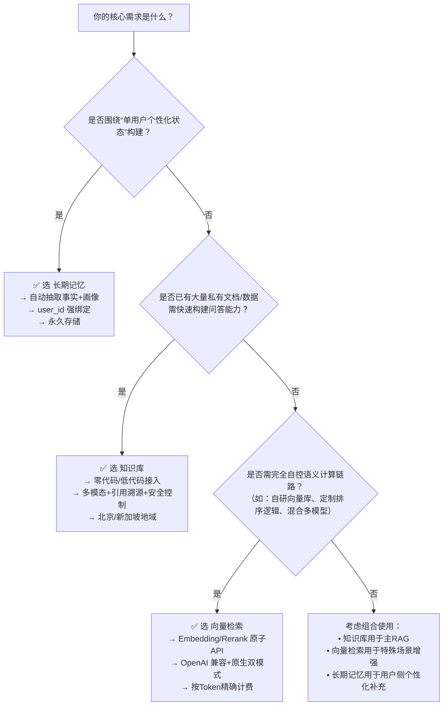

# [长期记忆](../concepts/memory.md)、知识库与向量检索能力对比

本页面面向百炼平台开发者，旨在清晰区分三种核心语义增强能力的技术定位、能力边界与适用场景。[长期记忆](../concepts/memory.md)（Long Term Memory）、知识库（Knowledge Base）和向量检索（Vector & Sort）虽均涉及“语义存储—检索—利用”链条，但在设计目标、数据生命周期、结构化程度、集成方式及商业化模型上存在本质差异。正确选型可显著降低开发复杂度、避免重复建设，并优化成本与效果平衡。

---

## 关键维度对比

| 维度 | [长期记忆](../concepts/memory.md)（Long Term Memory New） | 知识库（Knowledge Base） | 向量检索（Vector & Sort） |
|------|-------------------------------|--------------------------|---------------------------|
| **核心定位** | **智能体状态持久化与个性化建模**：自动从对话中提取结构化事实与用户画像，服务于单用户长周期上下文延续 | **RAG 场景的私域知识注入**：为大模型提供外部、静态/半静态、多源异构知识支撑，提升领域回答准确性与可靠性 | **底层语义计算基础设施**：提供向量化（Embedding）、重排序（Rerank）等原子能力，供上层能力（如知识库、长期记忆）或自建系统调用 |
| **输入格式** | 对话消息数组（`messages`）或自定义文本（`custom_content`），支持 `profile_schema` 触发画像提取；输入需含 `user_id` | 文档文件（PDF/DOCX/TXT/图片/音视频等）、结构化数据（CSV/JSON）、或通过数据连接器同步的第三方内容（OSS/飞书/钉钉等） | 原始文本、图像 URL、视频 URL 或多模态组合（`contents` 数组）；无业务实体绑定要求 |
| **输出格式** | - 事实记忆搜索：返回 `MemoryNode` 列表（含 `id`, `content`, `score`, `source` 等） - 用户画像：返回结构化 JSON（字段名与模板定义一致） - 全量列表：分页 `MemoryNode` 数组 | - 检索结果：带引用溯源的文本切片（`chunks`），含 `content`, `score`, `source_file`, `page_number`, `tags` 等元信息 - 问答结果：生成式回复 + 可配置的引用标记（如 `[1][2]`） | - 向量：`embedding` 数组（float/base64）或异步任务 ID - Rerank：按相关性排序的 `documents` 列表（含 `index`, `relevance_score`） |
| **支持模型** | **不直接暴露模型选择**：底层使用专有抽取模型（`plan_version="Pro"`/`"Lite"` 控制是否启用 Rerank）；开发者无需指定模型 | 支持多种预置与自定义模型： - 问答/路由：`qwen-plus`, `qwen3.7-plus`, `deepseek-r1` 等 - Rerank：`qwen3-rerank`, `gte-rerank-v2`（已计划下线） - 向量化：`text-embedding-v4`, `qwen3.7-text-embedding`（由知识库内部调用） | 显式模型选择： - 文本向量：`qwen3.7-text-embedding`, `text-embedding-v4`, `text-embedding-v3` 等 - 多模态向量：`qwen3-vl-embedding`, `tongyi-embedding-vision-plus` - Rerank：`qwen3-rerank`, `qwen3.7-text-rerank`, `qwen3-vl-rerank` |
| **API 端点（典型）** | - 写入：`POST /v1/long-term-memory-new/add` - 事实搜索：`POST /v1/long-term-memory-new/memory_nodes/search` - 获取画像：`GET /v1/long-term-memory-new/profile_schemas/{id}/user_profile` | - 控制台/工作流集成为主 - API 调用路径（需 Workspace 配置）：  `POST /v1/knowledge_base/query`（检索）  `POST /v1/knowledge_base/answer`（问答） | - 向量（同步）：`POST /compatible-api/v1/embeddings`（OpenAI 兼容）或 `/api/v1/services/embeddings/text-embedding/text-embedding`（原生） - Rerank：`POST /compatible-api/v1/reranks`（`qwen3-rerank`）或 `/api/v1/services/rerank/text-rerank/text-rerank`（其他） |
| **计费方式** | **按调用次数计费（2026年8月20日起）**： - `Add` / `Search` 接口独立计费 - `plan_version="Pro"`（启用 Rerank）费用高于 `"Lite"` - 无存储费用（长期保留） | **分层计费模型**： - **规格费**：标准版（0.03元/小时）或旗舰版（RCU 计费） - **模型费**：向量化、Rerank、路由、问答生成均按 Token 单独计费 - **注意**：Rerank 费用 = 初步召回总切片数 × 平均 Token 数 × 单价（非最终返回数） | **纯按调用计费**： - 向量：按输入 Token 数计费（不同模型单价不同） - Rerank：按 `(query_token + sum(doc_token))` 计费 - 批处理任务按总 Token 量计费；无规格费、无存储费 |
| **数据生命周期** | **永久保留（除非主动删除）**：无自动过期机制；`DeleteMemory` / `DeleteProfileSchema` 为不可逆操作 | **与知识库生命周期绑定**：知识库删除则所有索引、文档、元数据一并清除；支持定时同步更新，但历史版本不保留 | **无状态、无存储**：纯计算服务；向量/Rerank 结果不落库，需应用自行缓存或存储 |
| **结构化程度** | **高结构化**： - 事实记忆：自动抽取为原子化、可链接的 `MemoryNode` - 用户画像：严格遵循预定义 Schema 的 JSON 对象 | **半结构化**： - 文档解析后生成切片（chunk）+ 提取的 Meta 信息（`date`, `author`, `tags`） - 支持标签/字段过滤，但原始语义仍依赖向量/关键词混合检索 | **无结构化**：仅输出数值向量或排序索引；结构化需上层系统自行设计 schema 与存储逻辑 |
| **典型场景** | - 智能体记住用户偏好（“我不吃香菜”） - 自动构建用户健康档案（“每日9点喝水提醒”） - 跨会话维持个性化上下文（“上次聊到的项目预算”） | - 客服机器人基于产品手册回答问题 - 法律助手检索最新法规条文 - 企业内搜：融合制度文档、会议纪要、知识图谱 | - 构建自有 RAG 系统（调用 embedding + rerank） - 多模态搜索（图文混合查询） - 聚类分析、相似文档去重、语义排序中间件 |

---

## 各方案适用场景建议

### ✅ 选择「长期记忆」当：
- 你的应用是**以用户为中心的智能体（Agent）**，需跨多轮对话持续理解并记忆个体状态；
- 你需要**自动化地从自然对话中提炼结构化事实与属性**（如习惯、约束、偏好、身份信息），而非人工整理知识；
- 你关注**单用户长周期行为建模**，且对数据持久性要求高（默认永续）；
- 你接受其**强耦合于百炼 Agent 生态**，不追求完全自控的底层向量流程。

> ⚠️ 注意：不适用于通用知识问答、文档检索或需要批量导入/管理非对话数据的场景。

### ✅ 选择「知识库」当：
- 你拥有**大量静态或半静态的私有文档、数据、多媒体资源**，希望快速赋能大模型回答专业问题；
- 你需要**开箱即用的 RAG 流程**（上传→索引→检索→生成），且接受百炼托管的检索策略（混合检索、Query 改写、Rerank）；
- 你重视**多模态支持、引用溯源、防泄漏、拒答控制等生产级特性**；
- 你愿意为**易用性与完整性支付规格费+模型费**，并接受地域限制（北京/新加坡）。

> ⚠️ 注意：不适合需要完全自定义向量模型、细粒度控制 embedding pipeline 或构建非 RAG 架构（如语义聚类、推荐系统）的场景。

### ✅ 选择「向量检索（Vector & Sort）」当：
- 你是**高级开发者或算法工程师**，需构建**自研语义系统**（如专属 RAG、向量数据库前置处理、AI 应用中间件）；
- 你需要**最大灵活性**：自由组合 embedding 模型、Rerank 模型、自定义索引策略（如 FAISS/Milvus）；
- 你已有成熟的数据管道，仅需百炼提供**高性能、多模态、合规的语义计算能力**作为底座；
- 你追求**成本透明可控**（按 Token 精确计费），且能承担 SDK 集成与运维成本。

> ⚠️ 注意：不提供知识存储、文档解析、权限管理、可视化调试等上层能力，需自行实现。

---

## 技术选型决策树（面向开发者）

> 💡 **组合实践提示**：  
> - 在智能体应用中，**长期记忆 + 知识库** 是黄金组合：前者记住“用户是谁”，后者回答“世界是什么”；  
> - 当知识库的默认 Rerank 效果不足时，可调用 `qwen3-rerank` API 对其初步召回结果进行**二次精排**；  
> - 若需将长期记忆节点导出为向量做聚类分析，可调用 `qwen3.7-text-embedding` 对 `MemoryNode.content` 进行向量化。

---  
*最后更新：2025年4月 | 百炼平台技术文档中心*

## 被对比主题页

- [long term memory new](../api/long-term-memory-new.md)
- [knowledge base](../guides/knowledge-base.md)
- [vector and sort](../api/vector-and-sort.md)

