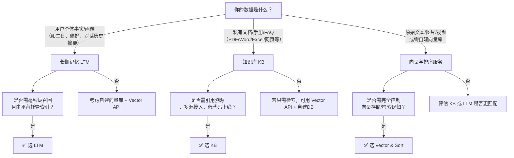

# [长期记忆](../concepts/memory.md)与向量存储方案对比

在构建具备上下文感知能力的智能体（Agent）或企业级 RAG 应用时，开发者需在多种语义持久化与检索能力间进行技术选型。百炼平台当前提供三类核心能力：**[长期记忆](../concepts/memory.md)（Long Term Memory, LTM）**、**向量与排序服务（Vector & Sort）** 和 **知识库（Knowledge Base）**。三者虽均涉及向量索引与语义检索，但在设计目标、数据生命周期、集成方式与适用边界上存在本质差异。

本文面向开发者，聚焦技术选型视角，系统对比这三类方案的关键维度，明确其定位差异与协同关系，避免因能力误用导致效果衰减、成本浪费或架构耦合风险。

## 关键维度对比表

| 维度 | [长期记忆](../concepts/memory.md)（LTM） | 向量与排序服务（Vector & Sort） | 知识库（Knowledge Base） |
|------|----------------|----------------------------------|---------------------------|
| **核心定位** | 结构化用户级记忆管理（事实+画像），服务于**多轮对话连续性** | 基础向量化与重排能力，作为**通用AI原语**供上层自建系统调用 | 企业级**端到端RAG基础设施**，开箱即用的知识服务管道 |
| **输入格式** | 自然语言文本片段（自动判别为 Fact/Profile）；支持显式结构化字段（如 `user_id`, `expires_at`） | 原始文本、图像、视频等多模态内容；支持批量字符串数组、Base64 编码文件、JSON content 对象 | 私有文档（PDF/Word/Excel/PPT/TXT/Markdown 等）；支持数据库/OSS/表格等结构化数据源 |
| **输出格式** | 检索结果为结构化 JSON（含 `id`, `content`, `type`, `score`, `metadata`）；注入后无显式返回向量 | 向量服务：浮点数组或 base64 编码向量；排序服务：带 `relevance_score` 的重排后文档列表 | 检索：匹配切片列表（含原文、ID、分数、来源）；问答：流式文本响应 + 引用溯源（SSE） |
| **支持模型** | 仅限标注 `ltm_enabled: true` 的专用模型： `qwen-max-20241017`、`qwen-plus-20241017` 及后续版本 | 全系列向量/排序模型： • 文本：`qwen3.7-text-embedding`, `text-embedding-v4`, `text-embedding-v3` 等 • 多模态：`qwen3-vl-embedding`, `tongyi-embedding-vision-plus-2026-03-06` • 排序：`qwen3-rerank`, `qwen3.7-text-rerank`, `qwen3-vl-rerank` | • 向量化：平台托管模型（默认 `text-embedding-v1`，可配置） • 问答：任意开通且具 `rag` 标识的 LLM（如 `qwen-max`, `qwen-plus`） |
| **API 端点** | • 主流程：嵌入在 `/v1/chat/completions` 请求的 `parameters.memory` 中 • 精细操作：`/v1/memory/fragments`, `/v1/memory/profiles` | • 同步向量：`/compatible-mode/v1/embeddings`（OpenAI 兼容）或 `/api/v1/services/embeddings/text` • 异步批处理：`/api/v1/batch/embeddings` • 排序：`/compatible-api/v1/reranks`（`qwen3-rerank`）或 `/api/v1/services/rerank/...` | • 管理：`/v1/knowledge_bases`（CRUD） • 检索：`/v1/knowledge_bases/{kb_id}/retrieve` • 问答：`/v1/knowledge_bases/{kb_id}/qa` |
| **计费方式** | 按**写入条数**计费（事实/画像分别计）；读取不额外计费；免费额度包含在应用配额内 | • 向量：按**输入 token 数**或**向量生成次数**计费（依模型而异） • 排序：按**重排请求次数 × 文档数**计费 • 批处理任务：按总 token 数计费，含任务调度开销 | 按**知识库容量（GB/月） + 问答调用次数**计费；索引构建、文档上传、检索均不单独计费 |
| **典型场景** | • 用户生日、地址、偏好设置等个性化事实存储与召回 • 对话中动态推断并沉淀用户画像（如“喜欢技术细节”“倾向简短回复”） • 构建具备身份认知的客服/助手Agent | • 自建向量数据库（如 Pinecone/Milvus）的数据预处理 • 多模态搜索系统（以图搜商品、视频关键帧检索） • RAG 流水线中的自定义重排模块 • A/B 测试不同 embedding 模型效果 | • 客服知识中心、内部员工手册问答、产品文档智能助手 • 法律/医疗/金融等强合规领域私有知识服务 • 需要引用溯源、多源融合、低代码快速上线的业务场景 |

## 各方案适用场景建议

### ✅ 选择 **长期记忆（LTM）** 当：
- 你的应用是**用户交互密集型 Agent**（如个人助理、销售陪练、教育导师），需在数百轮对话中稳定记住每个用户的**唯一性事实与行为特征**；
- 数据粒度为**离散、轻量、高动态性**的个体信息（如“张三讨厌咖啡”“李四常在晚8点提问”），而非静态文档集合；
- 要求**毫秒级低延迟召回**，且能接受平台统一管理生命周期（TTL、置信度过滤需主动控制）；
- 不愿自行维护向量数据库、切片逻辑或检索策略，但需要比基础 session 更持久的记忆能力。

> ⚠️ 注意：LTM **不适用于**存储文档、FAQ、产品手册等共享知识资产；也不支持跨用户聚合分析或复杂查询（如“找出所有北京用户中偏好简洁回复的人”）。

---

### ✅ 选择 **向量与排序服务（Vector & Sort）** 当：
- 你需要**完全自主掌控数据流与架构**：例如已使用 Milvus/Weaviate，仅需百炼提供高质量 embedding 或 rerank；
- 场景涉及**非文本模态**（图像/视频）或**混合模态联合表征**（如图文商品描述）；
- 需对**超大批量文本**（10万+ 行）进行离线向量化（如日志分析、全量用户评论处理）；
- 在 RAG 流水线中需**精细调控检索阶段**（如自定义 BM25 权重、多路召回融合逻辑、A/B 测试不同 rerank 模型）；
- 有严格合规要求，必须**自行存储原始向量与元数据**，不依赖平台托管索引。

> ⚠️ 注意：该服务**不提供索引存储、检索服务或问答能力**；你需自行搭建向量数据库、实现相似度计算、编写召回逻辑——它只提供“向量生产”与“排序打分”两个原子能力。

---

### ✅ 选择 **知识库（Knowledge Base）** 当：
- 你的核心需求是**快速交付一个可用的企业知识问答系统**，而非从零构建底层能力；
- 数据源为**大量私有文档**（PDF/Word/Excel 等），需自动解析、智能切片、混合检索与流式回答；
- 要求开箱即用的**引用溯源、多源接入、权限隔离、索引状态监控**等生产级特性；
- 团队缺乏向量数据库运维经验，或希望将工程重心放在业务逻辑与提示词优化上；
- 需要与现有系统（如 CRM、ERP、钉钉/企微）通过 API 或 MCP 协议深度集成。

> ⚠️ 注意：知识库**不适用于高频更新的用户级动态数据**（如实时聊天记录、用户点击行为）；其切片策略与索引重建周期决定了数据新鲜度上限（分钟级至小时级），无法满足亚秒级记忆写入-读取闭环。

## 技术选型决策树（面向开发者）

## 协同使用建议

三者并非互斥，而是可分层协作：

- **典型 RAG + Agent 架构示例**：  
  `用户提问`  
  → **知识库（KB）**：召回公司产品文档相关切片（静态知识）  
  → **长期记忆（LTM）**：注入本次对话中用户确认的偏好（如“请用中文回复”），并召回历史交互事实（如“上次咨询过价格”）  
  → **向量与排序服务**：对 KB 与 LTM 的混合结果做最终重排（`qwen3-rerank`）  
  → **LLM 问答**：综合所有上下文生成响应  

- **关键原则**：  
  - ✅ **数据分域**：KB 存组织知识，LTM 存用户记忆，Vector API 作能力底座；  
  - ✅ **避免冗余**：不将同一份 PDF 文档既上传 KB 又拆解为 LTM Fact；  
  - ✅ **成本透明**：LTM 按条计费，KB 按容量+调用计费，Vector 按 token/次计费——混合方案需叠加估算。

如需进一步评估具体业务场景的适配性，建议优先使用 [Playground](../../raw/application-user-guide/knowledge-base/playground.md) 快速验证 KB 流程，或调用 `/v1/chat/completions` 开启 `memory.write=true` 测试 LTM 写入效果。

## 被对比主题页

- [long term memory new](../api/long-term-memory-new.md)
- [vector and sort](../api/vector-and-sort.md)
- [knowledge base](../guides/knowledge-base.md)

