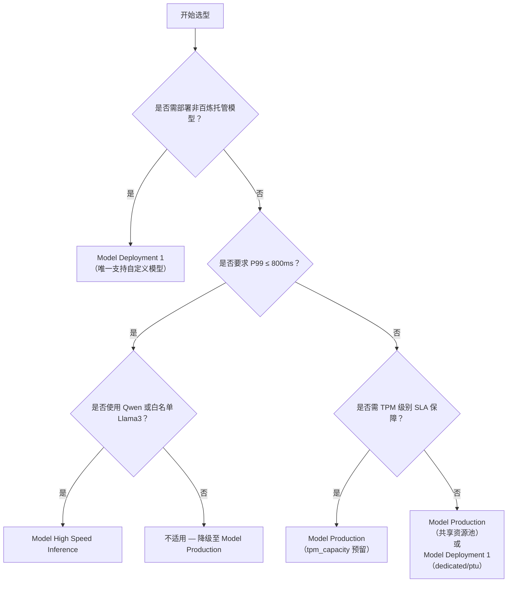

# [模型部署](../concepts/model-deployment.md)方式对比

为帮助开发者在百炼平台上高效、可靠地将模型投入生产，本文系统对比三种核心[模型部署](../concepts/model-deployment.md)能力：**Model Deployment 1（基础部署）**、**Model Production（生产级服务化）** 和 **Model High Speed Inference（高性能推理）**。三者定位互补，覆盖从快速验证、稳定服务到极致低延迟的全场景需求。本对比聚焦技术实现差异、资源语义、接口行为与成本模型，旨在为架构设计与技术选型提供客观、可落地的决策依据。

## 关键维度对比

| 维度 | Model Deployment 1 | Model Production | Model High Speed Inference |
|------|---------------------|-------------------|----------------------------|
| **输入格式** | 标准 OpenAI 兼容 JSON（`messages`, `model`, `temperature` 等），支持 `stream=true`（除 `token` 模式外） | DashScope 标准 JSON（`input`, `parameters`, `model`），**不支持 `stream=true`** | 同 Model Production 格式；**强制禁用流式响应**（`stream=true` 将被忽略或返回错误） |
| **输出格式** | OpenAI 兼容格式（含 `choices[0].message.content`, `usage`），支持完整 token 统计 | DashScope 原生格式（`output.text`, `usage.input_tokens`/`output_tokens`），结构更扁平 | 同 Model Production 格式；额外返回 `x-bailian-latency-ms` 等性能标头，无流式 chunk |
| **支持模型** | ✅ 平台预置模型 ✅ 用户导入的自定义模型（PyTorch/ONNX） ✅ “我的模型”中所有已发布版本（含微调模型） | ✅ 百炼托管的已发布模型版本 ❌ 不支持本地模型文件或 Hugging Face 路径（如 `hf://...`） ✅ 支持微调模型（需先发布） | ✅ Qwen1.5 / Qwen2 / Qwen2.5 / Qwen3 系列 ✅ 白名单开通的定制 Llama3 模型 ❌ 不支持微调模型直接部署（需权重合并至基础模型） |
| **API 端点** | `/v1/deployments/{id}/chat/completions`（专属 endpoint） 端点生命周期绑定 deployment 实例 | `/api/v1/services/{service_id}/completions`（统一 service endpoint） 支持多 deployment 复用同一 service ID | `/api/v1/services/{service_id}/completions`（同 Model Production） **必须显式声明模式**： • HTTP Header: `X-Bailian-Mode: high-speed` • SDK: `mode="high-speed"` |
| **计费方式** | • `dedicated`/`mu`/`dtu`: 按实例规格 × 运行时长（小时） • `ptu`: 按预购 PTU 单位 × 使用天数 • `token`: 按日 token 配额（万 tokens/天）+ 超额按量计费 | • 共享资源池：按 token 实际消耗计费（无保障） • `tpm_capacity` 预留：按预留 TPM × 使用小时计费（保障 SLA） • **不区分部署模式，统一 token 计费粒度** | • **独立计费项**：按 `tpm_reservation` × 使用小时 + Prime 常驻实例费 • 所有请求**不计入标准推理配额**，也不享受共享资源池折扣 • 无“按量 token”选项 |
| **典型场景** | • 快速原型验证（`dedicated` 单实例） • 成本敏感型批处理任务（`token` 模式） • 多模型 A/B 测试（配合模型路由） | • 中高流量 Web 应用后端（如客服机器人 API） • 需要明确 TPM SLA 的 SaaS 服务集成 • 自动扩缩容驱动的弹性业务（配合集群） | • 实时对话系统（P99 < 800ms 要求） • 搜索排序/推荐重排等毫秒级响应场景 • 高并发压测与稳定性保障环境 |

## 适用场景建议

### ✅ 选择 **Model Deployment 1** 当：
- 你需要**最小成本启动验证**：使用 `token` 模式按日配额起步，或 `dedicated` 单实例快速调试；
- 你部署的是**非百炼托管模型**（如自行训练的 PyTorch 模型、私有 ONNX 模型）；
- 你需要**精细的流量控制能力**：依赖模型路由实现灰度发布、多版本并行、动态权重切分；
- 你的应用**强依赖流式响应**（如实时打字效果），且对 P99 延迟无严苛要求（< 2s 可接受）。

### ✅ 选择 **Model Production** 当：
- 你已进入**生产环境交付阶段**，需通过 `tpm_capacity` 预留获得确定性吞吐保障（如承诺客户“1000 TPM 稳定可用”）；
- 你希望复用**统一的服务治理体系**：自动扩缩容、VPC 内网隔离（`endpoint_type=private`）、DDoS/WAF 防护开箱即用；
- 你的模型已在百炼完成调优并**正式发布为模型版本**，无需再管理底层文件；
- 你追求**运维简洁性**：避免实例生命周期管理，由平台统一调度共享资源池（无预留时）。

### ✅ 选择 **Model High Speed Inference** 当：
- 你的业务对**端到端延迟极度敏感**（P99 ≤ 800ms），且能接受牺牲流式能力换取确定性；
- 你使用的是**Qwen 系列主流模型**，且可接受白名单机制启用定制 Llama3；
- 你需要**消除冷启动抖动**：通过 Prime 模式保持实例常驻，首次请求即达最优性能；
- 你愿意为**SLA 付出溢价**：TPM 预留费用高于 Model Production 同等级别，但延迟稳定性显著提升。

## 技术选型决策树（面向开发者）

> **重要提醒**：  
> - **不要混用模式**：同一模型版本不可同时启用 Model Production 的 TPM 预留与 Model High Speed Inference 的 TPM Reservation，二者计费与调度完全隔离；  
> - **流式响应是关键分水岭**：若业务逻辑强依赖 `stream=true`（如前端逐字渲染），则 Model High Speed Inference 和 Model Production 均不可选；  
> - **配额申请前置**：`mu`/`dtu` 部署需提前工单申请算力配额；`tpm_capacity > 10000` 或 `tpm_reservation ≥ 5000` 同样需配额审批；  
> - **文档以最新版为准**：旧版 SDK 示例中可能包含已废弃参数（如 `instance_count` 在 PTU 模式下无效），请始终以 `/raw/` 路径下的最新用户指南与 API 参考为准。

## 被对比主题页

- [model deployment 1](../guides/model-deployment-1.md)
- [model production](../api/model-production.md)
- [model high speed inference](../guides/model-high-speed-inference.md)

