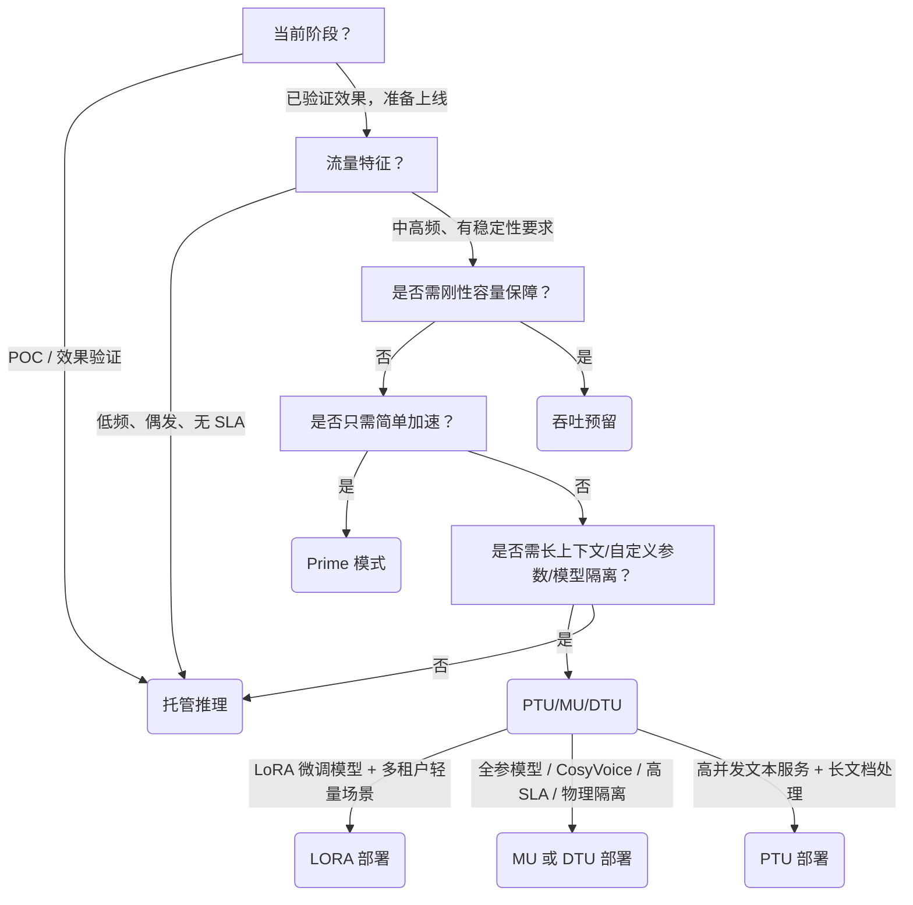

# 模型部署方式对比：托管推理、高并发、生产化部署

> **目的与背景**  
> 本文面向百炼平台开发者，系统对比三种主流模型服务交付形态：**托管推理（即标准按量 API）**、**高并发加速方案（Prime 模式 & 吞吐预留）** 和 **生产化部署（专属部署：PTU/DTU/MU/LORA）**。三者在资源隔离性、性能确定性、计费模型、运维深度及适用阶段上存在本质差异。本对比旨在帮助开发者根据业务 SLA 要求、流量特征、成本结构与生命周期阶段，做出技术选型决策——避免“用生产级方案验证效果”，也防止“用托管模式承载核心 SaaS 服务”。

---

## 关键维度对比表

| 维度 | 托管推理（标准 API） | 高并发加速方案 | 生产化部署（专属部署） |
|------|----------------------|----------------|--------------------------|
| **本质定位** | 公共资源共享的按需调用入口 | 在托管推理基础上叠加性能增强层（非独立部署） | 独立生命周期、专属资源池的生产级服务实例 |
| **输入格式** | 标准 OpenAI/DashScope 请求体（`messages`, `prompt`, `tools` 等） | 完全兼容托管推理格式，**无需修改请求结构** | 完全兼容托管推理格式；MU/PTU 支持扩展参数（如 `max_context_length`, `enable_thinking`） |
| **输出格式** | 标准流式/非流式响应（含 `content`, `delta`, `usage`） | 完全兼容；Prime 模式需额外解析 `delta.reasoning_content` 字段 | 完全兼容；MU 支持更细粒度 token 统计（如 `reasoning_tokens`） |
| **支持模型** | 所有已开通权限的预置模型、微调模型、导入模型 | **Prime 模式**：仅限特定优化别名（如 `qwen3.8-max-prime`） **吞吐预留**：覆盖主流系列（Qwen/GLM/DeepSeek/Kimi），但需控制台确认可用性 | **PTU**：限定千问/DeepSeek/GLM/千问VL等指定版本 **MU/DTU**：支持全部预置模型、LoRA/全参微调模型、OSS 导入模型（含 CosyVoice） **LORA**：仅支持 LoRA 微调模型 |
| **API 端点** | `https://{workspace_id}.cn-beijing.maas.aliyuncs.com/compatible-mode/v1/chat/completions` | **完全复用同一端点**，仅通过 `model` 参数区分（如 `"tpm-reserved-abc123"`） | 部署后生成独立 `model_code`（如 `"mu-qwen3-8b-xyz"`），调用同一域名，但逻辑为专属服务 |
| **资源隔离性** | ❌ 无隔离，共享公共资源池，受平台整体负载影响 | **Prime**：❌ 无隔离（弹性调度） **吞吐预留**：✅ 逻辑/物理隔离，规避公共限流 | ✅ **MU/DTU**：物理 GPU 隔离 ✅ **PTU**：专属吞吐通道隔离 ✅ **LORA**：多租户共享但配额硬限 |
| **性能确定性** | ⚠️ 波动大（P95 延迟不可控，TPS 随负载下降） | **Prime**：⚠️ 提升 1.5~2× TPS，但无容量承诺 **吞吐预留**：✅ 刚性 TPM 兑付（如 `input_tpm=10000` 即保障 10k 输入 token/分钟） | ✅ **MU/DTU**：毫秒级首 Token 延迟（PD 分离）、稳定 TPS ✅ **PTU**：长上下文（1M token）+ 前缀缓存折扣保障吞吐 |
| **计费方式** | ✅ 按实际输入/输出 token 计费（后付费） | **Prime**：✅ 同托管推理，按 token 计费 **吞吐预留**：✅ 预付费（预留容量内免费）+ 溢出部分按量计费 | **PTU**：✅ 预付费（kTPM/月） **MU/DTU**：✅ 按模型单元（MU）或输入/输出 TPM（DTU）计费 **LORA**：✅ 按 token 后付费（轻量场景） |
| **扩缩容能力** | ❌ 不可扩缩，依赖平台自动负载均衡 | ❌ Prime 无扩缩概念 ✅ 吞吐预留支持 TPM 叠加扩容（控制台操作） | ✅ **MU/DTU**：支持自助扩缩容（规格/数量） ✅ **PTU**：支持 TPM 动态调整（需停机重启） ❌ LORA：不支持自助扩缩容（需人工审核） |
| **典型场景** | 快速原型验证、低频内部工具、POC 测试、非关键链路调用 | **Prime**：AI 编程助手实时补全、对话机器人首响应加速 **吞吐预留**：SaaS 服务 SLA 保障（如 99.9% <500ms）、大促期间流量洪峰兜底 | **PTU**：高并发客服问答、长文档摘要服务 **MU/DTU**：金融风控推理、医疗影像分析、语音合成（CosyVoice） **LORA**：多租户轻量应用（如企业知识库插件） |

---

## 各方案适用场景建议

### ✅ 推荐选择「托管推理」当：
- 处于模型效果验证初期，需快速试错；
- 调用量极低（日均 < 1k token）且对延迟无敏感要求；
- 作为备用 fallback 链路，与生产部署并行使用；
- 开发调试阶段，追求零配置、免运维。

> ⚠️ 注意：严禁用于有明确 SLA 要求的线上业务（如用户界面直连、支付链路）。

### ✅ 推荐选择「高并发加速方案」当：
- **已使用托管推理，但遭遇性能瓶颈**，且不愿重构部署架构；
- 流量具备一定可预测性（如工作日 9–18 点稳定高峰），适合做吞吐预留；
- 需要**最小改造成本获得性能提升**（仅改 `model` 参数）；
- Prime 模式适用于对成本极度敏感、能接受轻微波动的实时交互场景；
- 吞吐预留适用于必须规避公共限流、需刚性容量承诺的 B2B 服务。

> ⚠️ 注意：吞吐预留 ≠ 部署，它是在托管推理之上购买的“性能保险”，不提供独立服务实例、不支持自定义参数（如 `max_context_length`）。

### ✅ 推荐选择「生产化部署」当：
- 进入正式上线阶段，需独立服务域名、独立监控告警、独立权限管控；
- 有明确的 SLO 要求（如 P99 延迟 < 800ms、可用性 ≥ 99.95%）；
- 需要长上下文（>128k token）、前缀缓存、PD 分离等高级推理能力；
- 部署 LoRA/全参微调模型或自定义 OSS 模型；
- 需要细粒度资源控制（如限制单请求最大 token 数、设置 QPS 限流）；
- 业务涉及合规审计，要求资源物理隔离（如金融、政务场景）。

> ⚠️ 注意：生产化部署需承担服务生命周期管理责任（如版本升级、故障排查、容量规划），推荐搭配百炼监控大盘与告警策略使用。

---

## 技术选型决策树（面向开发者）

> 💡 **一句话总结**：  
> **托管推理是“快捷键”，高并发方案是“性能插件”，生产化部署才是真正的“生产服务”**。  
> 请始终遵循：**先用托管推理验证效果 → 再用高并发方案缓解瓶颈 → 最终以生产化部署承载核心业务**。

---  
*最后更新：2025年4月*  
*适用百炼平台 v3.8+，华北2（北京）地域为主参考环境*

## 被对比主题页

- [model high speed inference](../guides/model-high-speed-inference.md)
- [model deployment index](../guides/model-deployment-index.md)
- [model production](../api/model-production.md)

