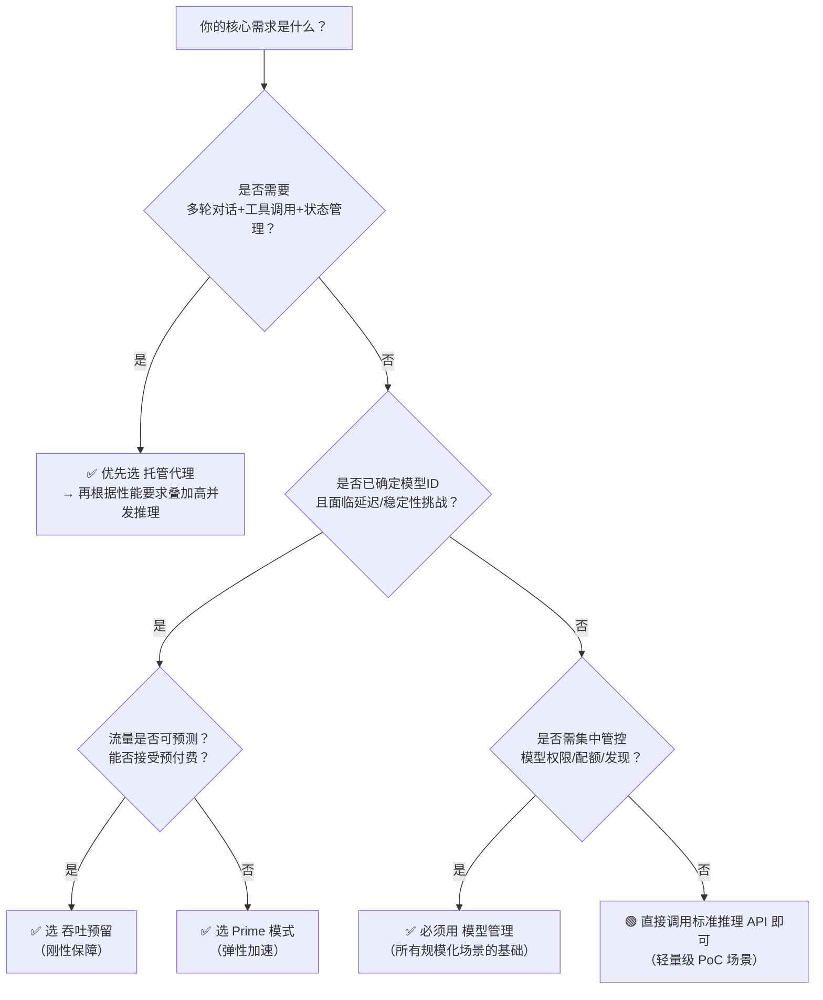

# 模型部署方式对比（托管代理、高并发推理、模型管理）

为帮助开发者在百炼平台上高效、稳定、可扩展地落地大模型应用，本文系统对比三种核心模型部署与运行能力：**托管代理（Managed Agents）**、**高并发推理（Model High-Speed Inference）** 和 **模型管理（Model Management）**。三者定位不同——托管代理聚焦 *智能体级抽象与编排*，高并发推理专注 *单次调用的性能与确定性保障*，模型管理则提供 *全生命周期的模型治理底座*。本对比旨在厘清技术边界、明确适用边界，辅助团队基于业务 SLA、工程成熟度与运维诉求做出理性选型。

## 关键维度对比

| 维度 | 托管代理（Managed Agents） | 高并发推理（High-Speed Inference） | 模型管理（Model Management） |
|------|-----------------------------|-------------------------------------|------------------------------|
| **本质定位** | 托管式智能体运行时（Agent-as-a-Service） | 推理服务性能增强机制（TPS/延迟优化） | 模型元数据、权限与配额的统一管控平台 |
| **输入格式** | JSON 对象，含 `input.query`、`tools` 数组、`session_id`、`context_id` 等结构化字段；支持文件上传（CLI） | 标准 OpenAI 兼容格式（`messages` / `prompt`），或百炼原生格式（`input`）；无 Agent 特有字段 | RESTful API 请求参数（如 `GET /api/v1/models?capabilities=TG&features=function-calling`）；无模型推理输入 |
| **输出格式** | 结构化 JSON，含 `output.text`、`output.tool_calls`、`session_id`、`trace_id`；支持流式响应（含 `reasoning_content` 分段） | 与基础模型一致（如 `choices[0].message.content`）；Prime 模式额外返回 `delta.reasoning_content` 字段 | JSON 响应体，含模型列表、权限状态、限流配置等元数据（如 `models[].model_info.context_window`, `limits[].tpm`） |
| **支持模型** | 仅限 `qwen-max`、`qwen-plus`、`qwen-turbo`（硬性限制，其他模型返回 400） | **Prime 模式**：特定加速 ID（如 `glm-5.2-fast-preview`, `wan3.0-video-prime`）； **吞吐预留**：覆盖 Qwen/GLM/DeepSeek/Kimi 等主流系列（按地域开通） | 全量已上线模型（文本/图像/视频/语音/3D），支持按 `providers`、`capabilities`、`features` 动态筛选（如 `TG`, `function-calling`, `web-search`） |
| **API 端点** | `POST https://dashscope.aliyuncs.com/api/v1/agents`（专属路径） | 复用标准推理端点（如 `POST https://{workspace_id}.cn-beijing.maas.aliyuncs.com/compatible-mode/v1/chat/completions`），仅通过 `model` 参数触发 | 独立管理端点： `GET /api/v1/models` `POST /api/v1/models/permissions` `POST /api/v1/models/limits` |
| **计费方式** | 按实际消耗 token 计费（含 [prompt](../guides/prompt.md) + completion + 工具输入/输出），**非按请求次数** | **Prime 模式**：同标准 API，按 token 计费； **吞吐预留**：预付费（kTPM/月），预留容量内免费，超额按量计费或返回 429 | **不直接产生推理费用**；仅涉及 API 调用本身（极低频，可忽略），费用主体仍为后续推理调用 |
| **典型场景** | 需多轮对话状态维护、工具链自动编排（天气/数据库/知识库）、[长期记忆](../concepts/memory.md)关联的智能助手、客服机器人、自动化工作流 | 对延迟敏感的实时交互（编程助手、实时翻译）、流量可预测的关键业务（金融风控提示、电商实时推荐）、需刚性容量保障的 SaaS 服务 | 模型选型评估、多业务线配额隔离（如 A 业务限 10k TPM，B 业务限 5k TPM）、灰度发布控制（授权部分模型给测试环境）、合规审计（查看所有已启用模型及权限） |
| **运维负担** | **最低**：平台全自动扩缩容、上下文隔离、工具安全网关、会话生命周期管理 | **中低**：无需部署模型，但需主动配置预留容量/选择 Prime ID；吞吐预留需管理实例状态（启停/续费） | **中**：需程序化调用 API 管理权限与限流，适合集成至 DevOps 流水线；不涉及模型运行时运维 |
| **扩展性** | 支持自定义工具注册，但模型固定；无法切换底层模型 | 可自由组合：同一模型既可用 Prime 加速，也可为其单独申请吞吐预留（二者正交） | 最高：支撑所有模型能力发现、动态授权、细粒度限流，是其他两种能力的前置依赖 |

## 各方案适用场景建议

- ✅ **选择「托管代理」当且仅当**：  
  你的业务核心是构建具备**多步推理、工具调用、状态记忆**的智能体（Agent），且对模型选择无强定制需求（接受限定于 Qwen 系列）。典型如：企业内部知识问答机器人（需检索+总结+生成报告）、自动化 IT 运维助手（需调用监控 API + 执行脚本）、销售话术生成器（需结合 CRM 数据+产品文档）。  
  ⚠️ *不适用*：需使用 GLM/Kimi/DeepSeek 等非 Qwen 模型；或仅需单次 [prompt](../guides/prompt.md)-to-response 的简单调用。

- ✅ **选择「高并发推理」当且仅当**：  
  你已明确选定基础模型，并面临**性能瓶颈或 SLA 压力**：  
  - 若流量波动大但可容忍短时排队 → 选用 **Prime 模式**（低成本、开箱即用）；  
  - 若流量高度可预测且绝不允许限流（如支付确认环节的 AI 审核）→ 选用 **吞吐预留**（高确定性、需预付费）。  
  ⚠️ *不适用*：尚未完成模型选型；或业务逻辑复杂到需要 Agent 编排层（此时应先用托管代理，再对其底层模型叠加高并发推理）。

- ✅ **必须使用「模型管理」当且仅当**：  
  你处于**规模化模型应用阶段**，需解决以下任一问题：  
  - 团队多人/多项目共用账号，需防止某业务突发流量拖垮全局；  
  - 需定期审计“哪些模型被启用？谁有微调权限？当前 TPM 使用率？”；  
  - 要为新上线模型做灰度（先授权给 10% 流量，再全量）；  
  - 需将模型能力发现集成进内部 AI 平台（如自动同步百炼最新支持的 `structured-outputs` 模型）。  
  ⚠️ *不适用*：单人快速验证原型（直接用控制台或 SDK 默认配置即可）。

## 技术选型决策树（面向开发者）

> **关键提醒**：三者非互斥关系，而是分层协作：  
> **模型管理** 是底座（决定“能用哪些模型、谁可以用、用多少”）→  
> 在其之上，**托管代理** 或 **标准推理 API** 是运行载体（决定“如何调用模型”）→  
> **高并发推理** 是性能插件（决定“调用得有多快多稳”）。  
> 实际生产环境常组合使用，例如：通过模型管理为 `qwen-plus` 开通推理权限并设置 TPM 配额 → 在托管代理中指定该模型 → 同时为其启用吞吐预留保障关键会话 SLA。

## 被对比主题页

- [managed agents](../guides/managed-agents.md)
- [model high speed inference](../guides/model-high-speed-inference.md)
- [model management](../api/model-management.md)

