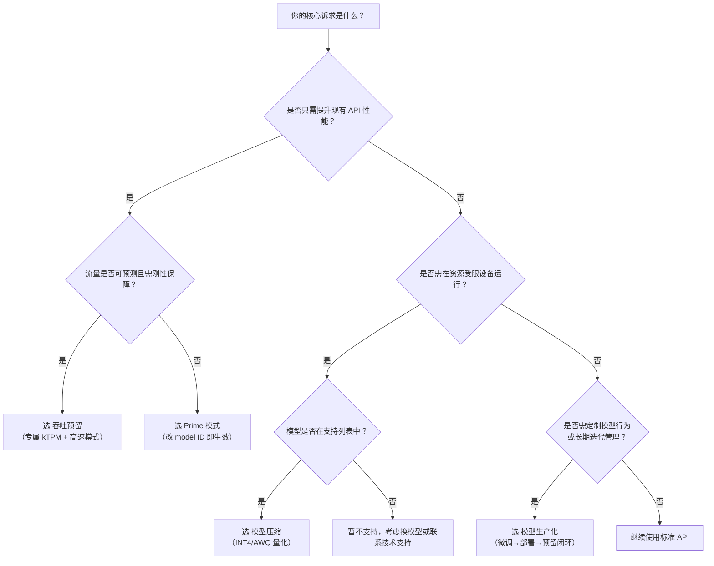

# 模型部署方式对比（高并发推理、模型压缩、模型生产化）

为帮助开发者在百炼平台上高效选型，本文系统对比三种核心模型部署能力：**高并发推理（Model High-Speed Inference）**、**模型压缩（Model Compression）** 和 **模型生产化（Model Production）**。三者定位不同——高并发推理聚焦 *运行时性能增强与容量保障*，模型压缩侧重 *模型轻量化与边缘适配*，模型生产化则覆盖 *从调优到服务上线的全生命周期工程化闭环*。本对比基于当前平台（2024 Q3）稳定功能，面向实际生产落地需求，旨在厘清技术边界、适用条件与集成成本，避免因能力错配导致延迟超标、资源浪费或交付延期。

## 关键维度对比

| 维度 | 高并发推理（Prime / 吞吐预留） | 模型压缩 | 模型生产化 |
|------|-------------------------------|-----------|-------------|
| **核心目标** | 提升标准 API 的吞吐量（TPS/QPS）与响应稳定性，不改变模型本身 | 减小模型体积、降低显存/内存占用、加速单次推理，牺牲少量精度换取效率 | 实现模型微调、私有化部署、服务编排与资源保障的一站式生产交付 |
| **输入格式** | 与标准 ChatCompletion API 完全一致（`messages`, `model`, `stream` 等） | 原始模型 ID + 压缩配置（`compression_type`, `calibration_dataset`）；输入为异步任务请求 | 多阶段输入：微调需 `training_file`（OSS URI）、部署需 `model_id` + `instance_type`、预留需 `throughput_reservation_id` |
| **输出格式** | 与标准 API 完全一致（含 `choices`, `usage`, `delta` 流式字段）；吞吐预留额外返回 `reserved_usage` 字段 | 异步任务结果：返回压缩后模型 ID（如 `qwen2-7b-chat-int4-20241001`），无直接推理输出 | 分阶段输出：微调返回 `fine_tuned_model_id`；部署返回 `endpoint` URL 与 `service_id`；预留返回 `reservation_id` 与配额详情 |
| **支持模型** | Prime：预置优化模型（如 `glm-5.3-prime`, `wan3.0-video-prime`）；吞吐预留：主流商用/开源模型（Qwen3.8-Max、GLM-5.3、DeepSeek-v4-Pro 等） | 严格限定：仅 `Qwen2-1.5B`/`7B`、`Qwen1.5-4B`（INT4/INT8）、`Phi-3-mini-4K`（AWQ） | 最广：支持 Qwen 系列（Qwen2/Qwen2.5/Qwen-VL/Qwen-Audio）、部分 DeepSeek 模型；**不支持闭源商用模型微调** |
| **API 端点** | 复用标准兼容模式域名： `https://{workspace_id}.cn-beijing.maas.aliyuncs.com/compatible-mode/v1` （仅 `model` 参数切换） | 异步任务端点： `POST /api/v1/compression_jobs`（创建） `GET /api/v1/compression_jobs/{id}`（查询） | 全新 RESTful 端点： `POST /api/v1/fine_tuning_jobs` `POST /api/v1/deployments` `POST /api/v1/throughput_reservations` |
| **计费方式** | Prime：按 token 计费（同标准 API）； 吞吐预留：预付费购买 kTPM（按天/8小时），预留内调用免费，溢出部分按 token 计费 | 按压缩任务计费：单次任务固定费用（含 GPU 小时消耗），成功/失败均计费；压缩后模型推理仍按标准 token 计费 | 分层计费：微调按 GPU 小时 + 数据量；部署按实例规格（GPU 小时）+ 请求量；吞吐预留按预购 kQPS/天 |
| **典型场景** | - AI 编程助手首 token <200ms - Agent 多步链式调用需稳定 50+ TPS - 客服对话系统要求 99.9% 请求 <1s | - 边缘设备（Jetson/PC）本地部署 - 移动端 SDK 集成需 <2GB 模型包 - 高并发但单请求预算敏感的 SaaS 插件 | - 企业知识库专属问答模型微调 - 将 LoRA 微调结果发布为独立 HTTPS 服务 - 为关键业务接口绑定 SLA 保障的 QPS 配额 |

## 各方案适用场景建议

### ✅ 推荐选择「高并发推理」当：
- 你已使用百炼标准 API，且业务出现**可复现的延迟抖动或限流告警**（如 P99 延迟 > 1.5s 或频繁 429）；
- 流量具备一定规律性（如工作日 9:00–18:00 高峰），能预估日均 TPM；
- 要求**零代码改造**：仅需替换 `model` 参数，无需重构客户端或重写 SDK；
- 对模型能力一致性有强要求（如必须保持原版 GLM-5.3 的 256K 上下文与工具调用能力）。

> ⚠️ 注意：Prime 模式适合快速验证性能提升，但无容量兜底；若 SLA 要求 ≥ 99.95%，务必选用吞吐预留并开启「高速模式」+「仅预留容量」策略。

### ✅ 推荐选择「模型压缩」当：
- 目标运行环境**资源受限**（GPU 显存 < 24GB、CPU 内存 < 16GB、移动端 APK 包体 < 1.5GB）；
- 可接受**精度小幅下降**（INT4 压缩后 Qwen2-7B 在 AlpacaEval 2.0 下约降 1.2 分）；
- 模型属于[明确支持列表](../../raw/model-user-guide/model-compression.md)，且校准数据集可准备（必须提供 OSS URI）；
- 你拥有模型所有权或授权，且**不依赖百炼托管的微调能力**（压缩仅作用于原始权重，不支持对微调后模型二次压缩）。

> ⚠️ 注意：压缩是离线操作，无法用于实时 A/B 测试；CPU 模式下 INT8 推理速度低于 CUDA 模式 40%，慎用于高并发场景。

### ✅ 推荐选择「模型生产化」当：
- 你需要**完全私有化控制模型行为**（如注入企业专属指令模板、屏蔽特定输出格式）；
- 业务存在**持续迭代需求**：需定期用新数据微调 → 验证效果 → 灰度发布 → 全量切换；
- 必须满足**合规审计要求**：模型权重不出域、训练日志可追溯、服务 endpoint 可独立管理；
- 需要**跨模型资源协同**：例如将微调后的 Qwen2-7B 与 GLM-5.3 组合为多专家路由服务，并分别为其预留 QPS。

> ⚠️ 注意：模型生产化是重资产流程，单次微调 + 部署 + 预留完整链路耗时通常 > 2 小时；若仅需临时测试，优先使用高并发推理或标准 API。

## 技术选型决策树（面向开发者）

**关键提醒**：
- **不要混用压缩模型与吞吐预留**：压缩后模型（如 `qwen2-7b-chat-int4-xxx`）不可直接用于吞吐预留创建，因其非平台预置模型；如需双重优化，应先用模型生产化完成微调与部署，再为该部署实例申请吞吐预留。
- **监控必须配套**：Prime 模式无专属监控视图，建议通过百炼控制台「API 调用分析」跟踪 `model` 维度的 P99 延迟；吞吐预留和模型生产化均提供细粒度用量看板，务必开启「超额降级统计」与「缓存命中率」监控。
- **地域强绑定**：所有能力（Prime 模型、压缩支持、部署实例规格）均按地域独立发布，选型前请确认控制台对应 Region 的可用性列表，避免跨地域调试失败。

> 文档更新日期：2024年10月  
> 平台版本：Bailian v2.4.0  
> 如遇参数变更，请以控制台实时提示及 [API 参考文档](https://help.aliyun.com/zh/bailian) 为准。

## 被对比主题页

- [model high speed inference](../guides/model-high-speed-inference.md)
- [model compression](../guides/model-compression.md)
- [model production](../api/model-production.md)

