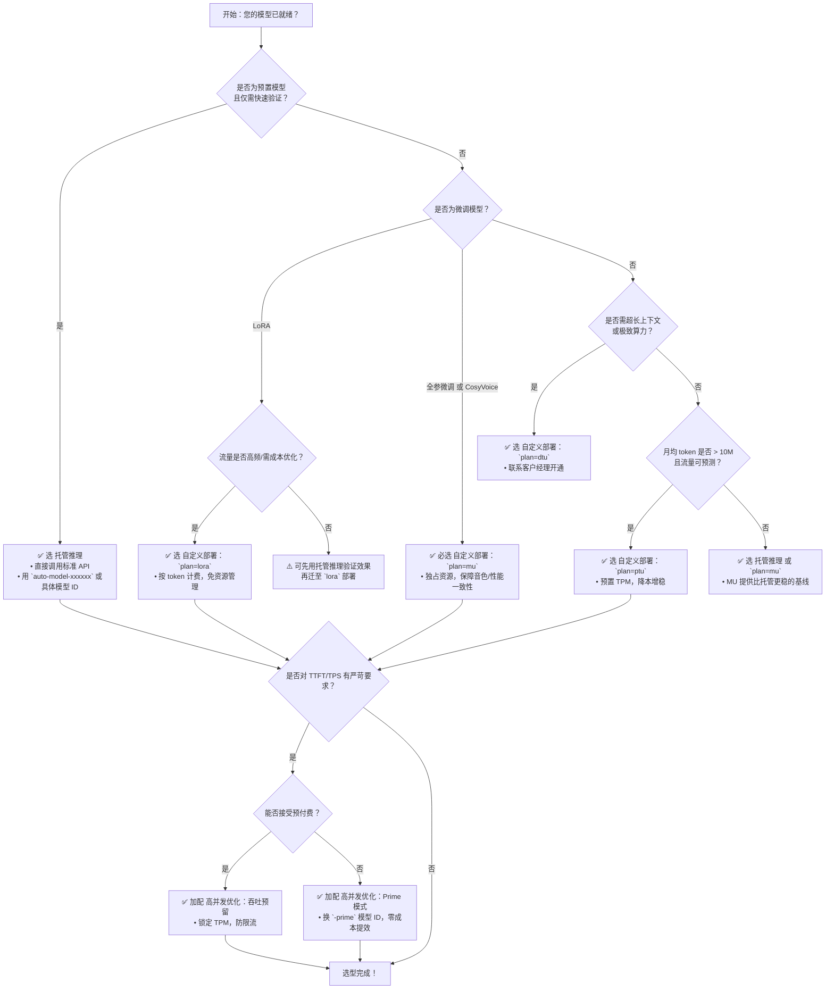

# 模型部署方式对比：托管推理、自定义部署与高并发优化

为帮助开发者在百炼平台上高效完成模型服务落地，本文系统对比三种核心部署范式：**托管推理（即“预置模型 + 标准 API”）**、**自定义部署（含 MU/DTU/PTU/Lora 等专属部署模式）** 与 **高并发优化（Prime 模式 & 吞吐预留）**。三者并非互斥层级，而是面向不同阶段、不同目标的协同能力组合——托管推理是默认起点，自定义部署实现资源与策略可控，高并发优化则在前两者基础上叠加性能保障。本对比聚焦技术选型关键维度，助您快速识别适用场景、规避常见误用（如将 LoRA 模型误配 MU 规格，或混淆 Prime 模型 ID 与吞吐预留 code），确保服务稳定性、成本效率与开发体验的统一。

## 关键维度对比表

| 维度 | 托管推理（标准 API） | 自定义部署 | 高并发优化 |
|------|----------------------|-------------|--------------|
| **本质定位** | 共享资源池上的开箱即用服务，无专属资源绑定 | 为模型分配独占或预置资源单元（MU/DTU/PTU）或共享 LoRA 实例，支持精细配置 | 在托管或自定义基础上叠加性能增强层（Prime）或容量保障层（吞吐预留），**不改变部署形态，仅提升调用质量** |
| **输入格式** | 标准 OpenAI 兼容 JSON（`messages`, `model`, `max_tokens` 等）；支持流式（`stream=true`） | 完全兼容托管推理输入格式；MU/DTU 模式额外支持 `enable_thinking`, `max_context_length` 等控制参数 | **完全兼容**：Prime 模式直接使用 `-prime` 或 `-fast-preview` 模型 ID；吞吐预留使用专属 `tpm-xxx` code，其余字段零变更 |
| **输出格式** | 标准 OpenAI 兼容响应（含 `choices[0].message.content`, `usage`）；流式返回 `delta` | 完全一致；PTU 部署额外返回 `cached_tokens` 字段（指示缓存命中 token 数） | 完全一致；Prime 模式流式响应中可能含 `delta.reasoning_content`（需按文档处理） |
| **支持模型** | 全量预置模型（Qwen/DeepSeek/GLM/Kimi/CosyVoice 等官方版本）及智能路由 `auto-model-xxxxxx` | ✅ 预置模型 ✅ LoRA 微调模型（`plan=lora`） ✅ 全参微调模型（`plan=mu`/`plan=dtu`） ❌ CosyVoice 语音模型不支持 `lora`（仅 `mu`） | ✅ Prime：限定后缀模型（如 `glm-5.2-fast-preview`, `qwen3.0-prime`） ✅ 吞吐预留：支持 Qwen/GLM/DeepSeek 等主流预置及 MU 部署模型（非所有模型均覆盖） |
| **API 端点** | `https://{workspace_id}.cn-beijing.maas.aliyuncs.com/compatible-mode/v1/chat/completions` | **完全相同**（同一域名、同一路径）；仅 `model` 参数值不同（如 `qwen3-8b-xxx`, `tpm-abc123`, `glm-5.2-fast-preview`） | **完全相同**；无需更换 endpoint，仅替换 `model` 字段值 |
| **计费方式** | 纯按量：按实际输入/输出 token 计费（单价见控制台） | • `mu`/`dtu`：按模型单元（MU）规格 × 运行时长计费（小时粒度） • `ptu`：按预置 TPM 容量 × 使用时长计费（分钟粒度） • `lora`：按实际 token 用量计费（同托管推理） | • Prime：**不额外计费**，按实际 token 用量计费（同托管推理） • 吞吐预留：预付费购买 TPM 容量（输入/输出分离），溢出部分按量计费（若启用自动溢出） |
| **典型场景** | 快速验证、低频 PoC、内部工具、流量不可预测的轻量应用 | • 生产级 SaaS 服务（需 SLA 保障） • 私有化微调模型上线（LoRA/MU） • 长上下文/高算力需求（DTU/MU） • 成本敏感且流量可预测（PTU） | • AI 编程助手、实时对话 Agent（Prime 降低首 token 延迟） • 大促/活动期间流量洪峰保障（吞吐预留防限流） • 对 TPS 稳定性要求严苛的金融/客服场景 |
| **扩缩容能力** | 不支持自助扩缩容；依赖平台共享池弹性 | ✅ 支持自助扩缩容（控制台/API）： • MU/DTU：调整 `capacity` 或 `deploy_spec` • PTU：调整 `ptu_capacity` • LoRA：需人工审核扩容 | • Prime：无扩缩容概念（性能提升固定） • 吞吐预留：支持自助调整 TPM 预留额度（分钟级生效） |
| **地域支持** | 华北2（北京）、新加坡（部分模型） | • MU/DTU/PTU：**仅华北2（北京）** • LoRA：华北2（北京） • 智能路由：北京 & 新加坡 | • Prime：以控制台实时列表为准（通常北京优先） • 吞吐预留：以控制台实时列表为准（北京为主） |

> **重要说明**：  
> - **“托管推理” ≠ “免费”**：其本质是共享资源池的按量服务，无预置成本，但无容量保障，高峰时段可能触发限流（429）。  
> - **“自定义部署” 是资源归属层**：决定模型运行在哪类资源上（共享 LoRA / 独占 MU / 预置 PTU），是稳定性和可控性的基础。  
> - **“高并发优化” 是性能增强层**：可叠加于托管推理（换 Prime 模型 ID）或自定义部署（为 MU/PTU 服务申请吞吐预留），提供确定性性能。  
> - **三者可组合使用**：例如，将 LoRA 微调模型以 `plan=lora` 部署（自定义部署），再为其启用吞吐预留（高并发优化）；或为 MU 部署的 Qwen3 模型启用 `glm-5.3-prime` 的 Prime 性能档位（需模型支持）。

## 各方案适用场景建议

### ✅ 推荐选择「托管推理」当：
- **快速启动与验证**：新业务线初期、A/B 测试、内部 Demo，无需关注运维与容量规划。
- **流量极低且不可预测**：日请求量 < 1k，峰值难以预估，追求最低起始成本。
- **使用智能路由**：希望平台自动匹配最优模型（如 `auto-model-xxxxxx`），简化客户端适配。
- **调用方无法修改 `model` 参数**：现有系统已固化调用逻辑，仅需最小改动接入。

### ✅ 推荐选择「自定义部署」当：
- **生产环境上线**：需要明确 SLA（如 P99 延迟 < 2s）、避免共享池抖动影响用户体验。
- **部署微调模型**：  
  &nbsp;&nbsp;→ LoRA 微调 → 选 `plan=lora`（成本最优，共享底座）；  
  &nbsp;&nbsp;→ 全参微调 或 CosyVoice 语音模型 → 选 `plan=mu`（必需独占资源）；  
  &nbsp;&nbsp;→ 超长上下文（>128K）或极致性能 → 选 `plan=dtu`（白名单开通，最高算力保障）。
- **流量可预测且成本敏感**：月均 token 用量 > 10M，通过 PTU 预置可显著降低单位 token 成本（相比纯按量）。
- **需精细控制推理行为**：如启用 `enable_thinking`、自定义 `max_context_length`、设置 `rpm_limit` 主动限流。

### ✅ 推荐选择「高并发优化」当：
- **对延迟极度敏感**：  
  &nbsp;&nbsp;→ 首 token 延迟（TTFT）要求 < 300ms → 优先尝试 **Prime 模式**（确认模型支持后缀）；  
  &nbsp;&nbsp;→ 整体吞吐（TPS）要求稳定 ≥ 50 QPS 且不可波动 → 为服务申请 **吞吐预留**（标准或高速模式）。
- **应对确定性流量高峰**：如电商大促、发布会直播、考试系统开放时段，需提前锁定容量，杜绝 429。
- **混合负载保障**：同一模型同时服务高优（VIP 用户）与普通用户，可通过吞吐预留为高优通道分配专属 TPM。
- **渐进式性能升级**：无需重构部署架构，仅通过切换 `model` 参数即可验证 Prime 效果或启用预留保障。

## 技术选型决策树（面向开发者）

**关键提醒**：
- **勿硬编码模型 ID**：所有模型标识（包括 Prime、吞吐预留 code、MU 部署 code）均可能随版本迭代下线，请务必通过控制台或 API 查询实时可用列表。
- **地域是硬约束**：MU/DTU/PTU/Lora 部署及大部分高并发优化能力**仅限华北2（北京）**，跨地域调用必失败。
- **计费不可逆**：自定义部署创建后无法更改 `plan`（如从 `mu` 改 `lora`），需下线重建。
- **CosyVoice 特殊性**：语音合成模型**强制要求 `plan=mu`**，不支持 LoRA 共享部署，设计架构时请前置确认。

通过本对比，开发者可清晰锚定各方案的技术边界与价值主张。建议：**以托管推理快速启动 → 用自定义部署构建生产基线 → 借高并发优化突破性能瓶颈**，三步走实现模型服务从可用到好用、从好用到稳用的演进。

## 被对比主题页

- [model deployment index](../guides/model-deployment-index.md)
- [model high speed inference](../guides/model-high-speed-inference.md)
- [model production](../api/model-production.md)

