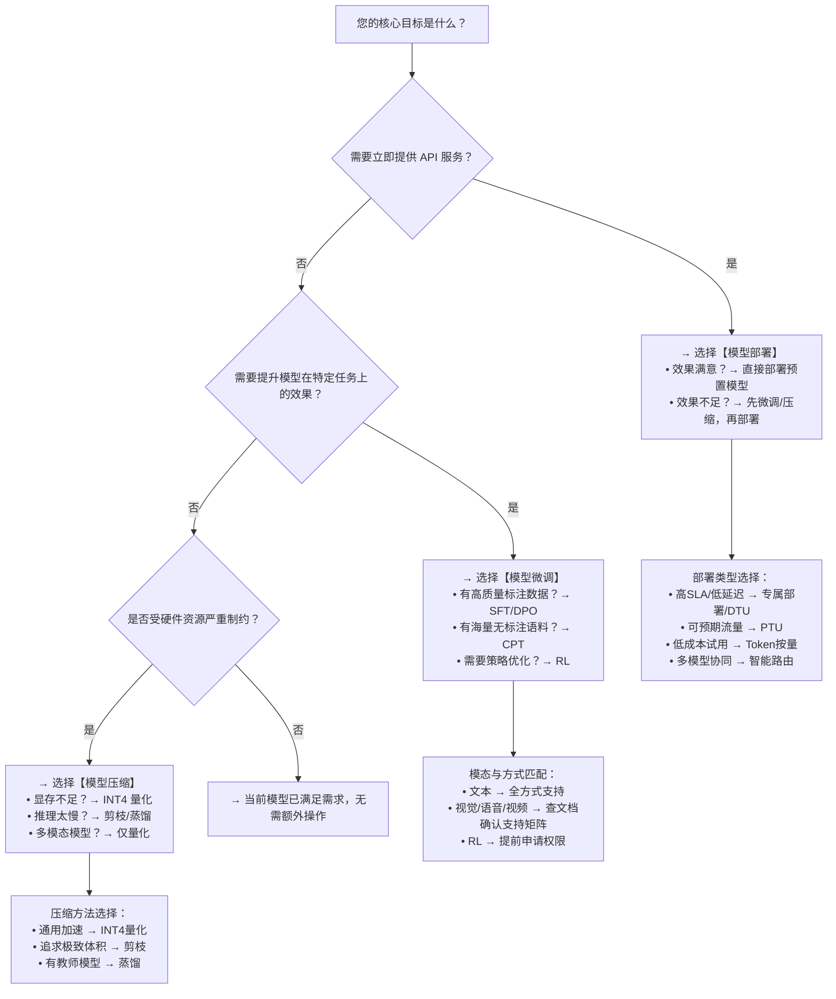

# 模型部署、微调与压缩技术路径对比

为帮助开发者在百炼平台上高效完成模型能力落地，本文系统对比**模型部署（Deployment）**、**模型微调（Fine-tuning）** 和**模型压缩（Compression）** 三大核心技术路径。三者定位不同：**部署解决“如何稳定提供服务”**，**微调解决“如何让模型更懂业务”**，**压缩解决“如何在资源受限时高效运行”**。本对比聚焦实际工程选型关键维度，涵盖输入输出、支持能力、接入方式、成本结构与适用边界，旨在为生产环境下的技术决策提供清晰、可操作的参考依据。

## 关键维度对比表

| 维度 | 模型部署 | 模型微调 | 模型压缩 |
|------|----------|----------|----------|
| **核心目标** | 将已训练模型以 API 形式稳定、可扩展地对外提供推理服务 | 通过增量训练注入领域知识/任务指令/人类偏好，提升模型在特定场景下的准确性、安全性与对齐度 | 在可控精度损失下减小模型体积、降低显存占用、提升推理吞吐，适配边缘或高并发场景 |
| **输入格式** | 已注册并校验通过的 `model_id`（如 `qwen2-7b-instruct`）；部分类型需提供实例规格（`instance_type`）、PTU 数量等配置参数 | 原始模型 ID + 标准化训练数据（文本：`.jsonl`；图像/视频：`.zip` 包含 `data.jsonl` 与媒体文件；语音：音频文件集）+ 超参配置（学习率、轮次、LoRA 参数等） | 已发布且可调用的 `model_id` + 压缩方法（`quantization`/`pruning`/`distillation`）+ 方法专属参数（如 `target_dtype=int4`、`sparsity_ratio=0.3`） |
| **输出格式** | 部署成功后生成唯一 `deployment_id`；所有调用统一使用标准 AIGC 接口 endpoint（`/api/v1/services/aigc/...`），通过 Header 中 `X-DashScope-Deployment-Id` 路由到对应实例 | 训练完成后生成新模型 ID（如 `ft-qwen3-8b-20240520-123456`），该模型可直接用于**部署**或**评估**；不产生独立 API endpoint，需另行部署才能被调用 | 压缩任务成功后生成新模型 ID（如 `qwen2-7b-instruct-int4`），该模型为轻量化推理专用版本，**可直接部署**（支持所有部署类型），但**不可再微调** |
| **支持模型范围** | 全量已注册模型（含自定义导入模型），无架构限制；专属部署/DTU 支持私有微调权重 | 严格按模态与训练方式限定： • 文本生成：Qwen3/Qwen2.5/千问-Plus-Character 等数十个预置模型（CPT/SFT/DPO/RL） • 视觉理解：仅 `qwen3-vl-8b-instruct` 等少数 VL 模型（SFT/DPO） • 图像/视频：万相、千问图像、万相视频（仅 SFT-LoRA） • 语音：CosyVoice（仅 efficient_sft） • RL：仅指定模型（如 `qwen3.5-9b`），需权限开通 | 限定于百炼托管的 Transformer 架构模型： • 支持：Qwen2/Qwen2.5/Qwen-VL/Llama-3-8B-Instruct • 不支持：自定义 checkpoint、非 Transformer 模型（RNN/CNN）、Llama-2（已过时） • 多模态模型（Qwen-VL）仅支持量化，不支持剪枝/蒸馏 |
| **API 端点** | 统一推理端点： `https://dashscope.aliyuncs.com/api/v1/services/aigc/text-generation/generation` （通过 `X-DashScope-Deployment-Id` 区分实例） | 训练任务管理端点： `POST /api/v1/fine-tunes`（创建） `GET /api/v1/fine-tunes/{fine_tune_id}`（查询） **无直接推理端点**；产出模型需另行部署后调用 | 压缩任务管理端点： `POST /v1/models/compress`（提交） `GET /v1/jobs/{job_id}`（轮询状态） **无直接推理端点**；产出模型需另行部署后调用 |
| **计费方式** | 按部署类型差异化计费： • **专属部署**：按实例规格（如 `ecs.gn7i-c16g1.4xlarge`）和运行时长计费（小时级） • **PTU 预置吞吐**：按预购 PTU 数量（如 `100 PTU`）和购买时长（月/年）计费 • **DTU 独占算力**：按 GPU 卡粒度（如 `A10`）和使用时长计费 • **Token 按量**：按实际输入+输出 token 总数计费（0.0001 元/1k tokens） • **智能路由**：按所路由的底层部署实例实际消耗计费 | 按训练方式与资源类型计费： • **SFT/CPT/DPO（文本）**：按 Token 消耗计费（基于训练数据量与超参估算） • **图像/视频/语音**：按训练步数/轮次/音频秒数等模态专属单位计费 • **RL（强化学习）**：强制使用 **MTU（Model Training Unit）** 计费，按 `mtu_spec_code`（如 `MTU4`）与 `mtu_capacity`（如 `24`）组合计费，**不支持 Token 计费** |
| **典型场景** | • 客服对话机器人（需低延迟、高 SLA） • 内容审核 API（需资源隔离与合规审计） • A/B 测试多模型策略（通过智能路由动态切换） • 快速验证模型效果（Token 按量部署） | • 金融合同条款解析（SFT 注入法律术语与格式） • 医疗问答助手（DPO 对齐医生偏好与安全要求） • 企业知识库问答（CPT 在私有语料上继续预训练） • 个性化语音播报（CosyVoice 音色微调） • 游戏 NPC 对话策略优化（RL 结合 Reward 函数） | • 移动端离线摘要（INT4 量化 + 边缘部署） • 高并发客服后台（Pruning 后模型 + PTU 部署提升 QPS） • 成本敏感型 SaaS 应用（INT4 模型 + DTU 独占 A10 卡） • 多模态终端设备（Qwen-VL INT4 量化版部署） |

## 各方案适用场景建议

### ✅ 推荐选择「模型部署」当：
- 您已拥有一个经过充分验证、满足业务需求的模型（无论是百炼预置模型还是您自己微调/压缩后的模型），当前核心诉求是**快速上线、稳定服务、弹性扩缩**；
- 场景对延迟（<500ms）、可用性（99.95% SLA）、资源隔离（如金融/政务场景）或长上下文处理（>32K tokens）有明确要求；
- 您需要统一管理多个模型的服务入口（如通过智能路由实现灰度发布或故障自动转移）；
- **避坑提示**：若仅需临时测试或日均调用量 <100 次，优先选用 `Token 按量部署`；若需流式响应，避免使用 `Token 按量` 类型。

### ✅ 推荐选择「模型微调」当：
- 百炼预置模型在您的垂直领域（如电力巡检报告生成、跨境电商多语言客服）表现不佳，通用能力无法满足准确率、专业性或安全合规要求；
- 您拥有高质量、标注规范的领域数据（≥500 条高质量 SFT 数据即可初见成效），且能接受数小时至数天的训练周期；
- 您需要深度定制模型行为：例如让模型严格遵循内部 SOP 流程（SFT）、拒绝回答敏感问题（DPO 对齐安全偏好）、或从用户反馈中持续优化（RL）；
- **避坑提示**：视觉/语音/视频微调**仅支持 API 方式**；RL 训练需提前申请权限并配置云服务授权；所有微调任务**必须在华北2（北京）地域执行**。

### ✅ 推荐选择「模型压缩」当：
- 您已确认模型效果达标，但面临**硬件资源瓶颈**：如需在 A10 卡上部署 7B 模型却显存不足，或希望在边缘设备（Jetson Orin）运行 Qwen-VL；
- 您追求极致推理性价比：在同等 QPS 下，INT4 量化模型可将 GPU 显存占用降低约 60%，单位 token 成本显著下降；
- 您计划将模型集成至资源受限的客户端（App、IoT 设备）或构建高密度微服务集群；
- **避坑提示**：压缩后模型**不可再微调**；INT4 模型不兼容 T4 显卡；多模态模型仅支持量化；务必在压缩后进行**端到端输入兼容性验证**（尤其涉及自定义 tokenizer 的模型）。

## 面向开发者的选型决策树

> **重要协同原则**：三者非互斥，而是典型流水线：  
> **微调 → 部署**（提升效果后上线）  
> **压缩 → 部署**（轻量化后降本增效）  
> **微调 → 压缩 → 部署**（效果与性能双优解，推荐用于生产核心服务）  
> 所有产出模型（微调结果、压缩结果）均可作为 `model_id` 输入至部署流程，构成百炼平台“训-推-优”一体化闭环。

## 被对比主题页

- [model deployment index](../guides/model-deployment-index.md)
- [fine tuning](../guides/fine-tuning.md)
- [model compression](../guides/model-compression.md)

