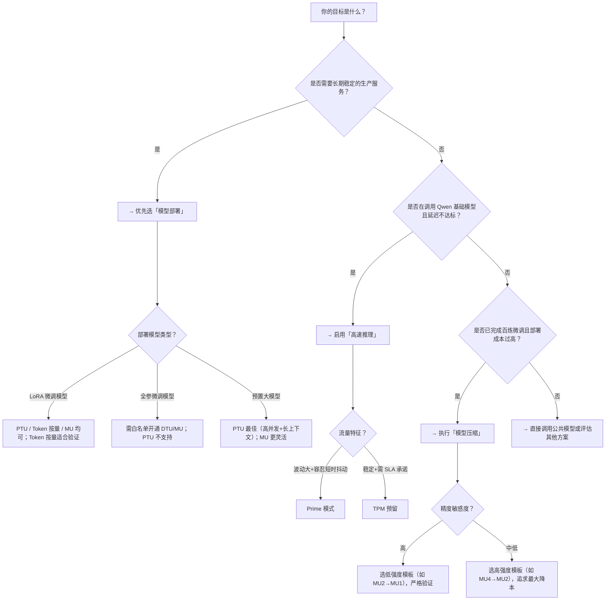

# [模型部署](../concepts/model-deployment.md)、高速推理与压缩方案对比

为帮助开发者在百炼平台上高效构建稳定、低成本、低延迟的 AI 服务，本文系统对比三大核心能力：**[模型部署](../concepts/model-deployment.md)（专属推理服务）**、**高速推理（低延迟加速）** 和 **模型压缩（量化降本）**。三者定位不同、能力正交、可组合使用——部署是服务落地的“载体”，高速推理是性能优化的“加速器”，压缩是成本控制的“减法工具”。本对比聚焦技术选型关键维度，明确各方案的能力边界、适用约束与协同路径，避免因误用导致资源浪费、SLA 不达标或精度不可控等问题。

---

## 关键维度对比表

| 维度 | [模型部署](../concepts/model-deployment.md)（[model deployment 1](../guides/model-deployment-1.md)） | 高速推理（[model high speed inference](../guides/model-high-speed-inference.md)） | 模型压缩（[model compression](../guides/model-compression.md)） |
|------|------------------------------|----------------------------------------|------------------------------|
| **本质定位** | 生产级推理服务托管平台，提供资源隔离、计费抽象与全生命周期管理 | 运行时推理加速机制，在已有模型调用链中注入低延迟保障能力 | 模型离线预处理环节，通过量化降低模型体积与算力需求 |
| **输入格式** | 支持标准 OpenAI 兼容请求体（`messages`）、`extra_parameters`；PTU/MU 模式支持长上下文（最高 1M token）及前缀缓存 | 仅支持标准 `/v1/chat/completions` 请求体，需显式传入 `extra_parameters.enable_high_speed=true` | 无运行时输入；输入为已训练完成的**百炼微调产出模型**（含 LoRA/全参）及校准数据集（可选） |
| **输出格式** | 完整 OpenAI 兼容响应（含 `choices`, `usage`, `x-dashscope-resolved-model` 等头信息） | 输出格式与普通推理完全一致，仅延迟与稳定性提升；TPM 预留模式响应头含 `x-dashscope-tpm-reserved` 标识 | 无直接输出；生成一个**新模型 ID**（如 `my-qwen-ft-awq8`），作为独立模型实体存在于模型中心，供后续部署调用 |
| **支持模型** | • PTU：限定版本（如 `qwen3.7-plus-2026-05-26`, `deepseek-v4-flash`） • DTU/MU：全系列预置模型 + LoRA/全参微调模型（白名单开通） • Token 按量：**仅 LoRA 微调模型** • 智能路由：限定文本模型集合（如 `qwen3.8-max`, `deepseek-v4-flash-0731`） | **仅 Qwen 系列基础模型**： • `qwen-max` / `qwen-plus` / `qwen-turbo` • 不支持多模态（`qwen-vl`）、自定义微调模型、非 Qwen 开源模型 |
| **API 端点** | `/api/v1/deployments`（创建/查询部署） `/v1/chat/completions`（调用时 `model` 字段填部署生成的 model-code） | `/v1/chat/completions`（调用时在 `extra_parameters` 中启用） | 无公开 API；仅控制台操作（任务创建、状态轮询通过后台接口） |
| **计费方式** | • PTU：按预置吞吐额度（输入/输出 TPM）月度订阅 • DTU/MU：按实际消耗 TPM（DTU）或模型单元数量（MU）实时计费 • Token 按量：按实际调用 Token 数计费（LoRA 专用） • 智能路由：按实际执行模型计费，路由本身不额外收费 | • Prime 模式：按实例数计费（每实例固定月费） • TPM 预留：按预留 TPM 值 × 使用分钟数计费（空闲也计费） | **压缩任务本身限时免费**；压缩后模型部署仍按 MU 规格或 PTU 计费，**不产生额外压缩费用** |
| **典型场景** | • 需长期稳定服务的 SaaS 应用（PTU） • 对资源隔离强要求的金融/政务系统（DTU/MU） • 快速验证 LoRA 效果（Token 按量） • 多模型 A/B 测试或故障自动降级（智能路由） | • 实时客服机器人（首 token < 200ms） • 高频交互的 Copilot 类应用（如 IDE 插件） • SLA 可承诺的生产流量（TPM 预留） | • 微调模型上线前成本优化（如将 MU4 → MU2） • 边缘/轻量级部署场景（对延迟容忍度高、预算敏感） • 快速迭代多个量化版本做精度-成本权衡 |

---

## 各方案适用场景建议

### ✅ 推荐选择「模型部署」当：
- 你需要**长期、稳定、可运维的生产服务**，而非临时测试；
- 业务对**资源隔离性、QPS 稳定性、长上下文支持（1M token）或前缀缓存**有硬性要求；
- 你已拥有 LoRA/全参微调模型，需快速上线并统一管理；
- 你希望实现**多模型动态路由、灰度发布或自动降级**（智能路由）；
- 你愿意为确定性性能支付预置成本（PTU）或接受独占资源开销（DTU/MU）。

> ⚠️ 注意：若仅需调用预置模型且无定制化需求，**无需部署**，直接调用公共模型 API 即可（但无资源保障与高级特性）。

### ✅ 推荐选择「高速推理」当：
- 你正在调用 **Qwen 系列基础模型（`qwen-max` 等）**，且当前首 token 延迟或 P99 延迟不满足业务 SLA（如 > 300ms）；
- 你的流量存在明显波峰波谷，但**不能接受冷启动抖动**（Prime 模式）；
- 你的业务可承诺最低流量水位（如日均 5K TPM），需要**刚性资源保障**（TPM 预留）；
- 你尚未进行模型微调或压缩，处于**效果验证或 MVP 阶段**，希望以最小改造获得性能提升。

> ⚠️ 注意：高速推理**无法加速微调模型、多模态模型或非 Qwen 模型**；它不是部署的替代品，而是对已部署/直调模型的增强。

### ✅ 推荐选择「模型压缩」当：
- 你已完成百炼平台上的**LoRA 或全参微调**，且该模型已验证有效；
- 你发现部署该微调模型所需的 **MU 规格过高（如 MU4）、成本超出预期**；
- 你愿意以**可控的精度损失（需实测验证）换取显著成本下降（文档示例达 56%）**；
- 你处于模型交付前的最后优化环节，目标是**平衡精度、延迟与成本**；
- 你仅在北京地域开展业务（压缩功能地域限制）。

> ⚠️ 注意：压缩是**不可逆的单向操作**；压缩后模型不可再微调、不可二次压缩；务必在部署前用真实业务数据集完成精度回归测试。

---

## 技术选型决策树（面向开发者）

---

## 协同使用最佳实践

三者并非互斥，而是可分层组合的“黄金三角”：

1. **压缩 → 部署 → 高速推理**（推荐流水线）  
   微调模型 → 量化压缩（降 MU 规格） → 部署为 MU 模式 → 对关键接口启用 Prime 模式  
   ✅ 效果：**成本最优 + 延迟可控 + 运维简单**

2. **部署（PTU） + 高速推理**（慎用）  
   PTU 本身已提供高吞吐与低延迟保障，叠加高速推理**无额外收益且可能增加复杂度**；仅当 PTU 配额不足、需临时补充 Prime 实例应对突发流量时考虑。

3. **智能路由 + 高速推理**（受限）  
   智能路由不支持 `extra_parameters`，因此**无法在路由请求中启用高速推理**；如需加速，应为路由中的每个候选模型单独开启高速推理（需分别配置）。

> 📌 提示：所有方案均需确保工作空间已开通对应模型的调用权限；跨地域部署需注意 endpoint 匹配；监控建议统一接入百炼可观测平台，重点关注 `first_token_latency`, `tpm_used`, `mu_utilization` 等核心指标。

---  
*最后更新：2024年6月 | 文档版本：v1.2*  
*注：本文档基于百炼平台当前（2024年中）公开能力编写，具体参数与支持列表请以控制台实时展示及最新 API 文档为准。*

## 被对比主题页

- [model deployment 1](../guides/model-deployment-1.md)
- [model high speed inference](../guides/model-high-speed-inference.md)
- [model compression](../guides/model-compression.md)

