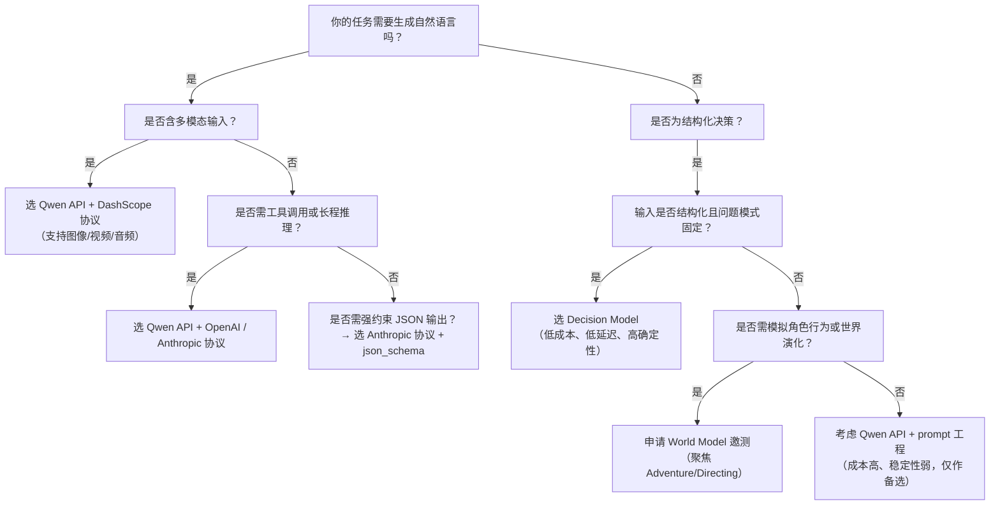

# Qwen大模型API、World Model与Decision Model对比

本文旨在帮助开发者清晰理解百炼平台上三类核心推理能力的定位差异、技术边界与适用场景，为实际项目中的模型选型与架构设计提供客观、可落地的技术参考。随着AI应用从通用对话向专业化、结构化、可编排方向演进，Qwen API 提供通用智能底座，World Model 聚焦叙事与交互建模，Decision Model 专注确定性决策输出——三者并非替代关系，而是分层互补的“AI能力栈”组件。

---

## 关键维度对比

| 维度 | Qwen大模型API | World Model | Decision Model |
|------|----------------|--------------|----------------|
| **核心定位** | 通用大语言模型服务接口，支持多模态、工具调用与复杂推理 | 面向叙事与交互场景的世界建模引擎（冒险生成、导演调度、角色行为模拟） | 专用于结构化决策任务的轻量级前向推理模型（非生成式） |
| **输入格式** | 多协议支持： • OpenAI：`messages` 数组（含 `text`/`image_url`/`video_url` 等） • Anthropic：`messages` + `tools` + `output_config` • DashScope：`input.messages`（支持本地路径、Base64、URL） | JSON 结构化请求体： • `world_seed`（string） • `scene_context`（object，≤8KB） • `max_steps`（integer） | TypeSafe System One 协议： • `state`（任意结构化数据，JSON序列化后送入） • `questions`（Object，键为 question ID，值定义问题类型与语义） |
| **输出格式** | 文本为主，支持流式响应： • OpenAI `/chat/completions`：标准 `choices[].message.content` • OpenAI `/responses`：含 `tool_calls`、`previous_response_id` 的增强响应 • Anthropic：`content` + `usage` + `thinking_trace`（可选） • DashScope：`output.text` 或 `output.multimodal` | **非流式、结构化 JSON**： • `output` 字段含生成的世界状态、事件链、角色动作等嵌套对象 • `trace_id` 用于追踪与调试 • 不返回原始文本流或 token 级别中间结果 | **纯结构化、零文本输出**： • `answers[question_id]` 包含：  – `choice`: `selected`, `probabilities`, `confidence`  – `noul`: `probability_yes`（0–1 float）  – `score`: `score`（期望值浮点数）、`probabilities`, `legend`, `confidence` |
| **支持模型** | 全系列 Qwen 模型（`qwen3.8-max`/`qwen3.7-plus`/`qwen3-vl-plus`/`qwen3.8-omni-flash` 等）及第三方模型（DeepSeek、GLM、Kimi）； • `Qwen-Audio` 仅支持 DashScope 协议 • Anthropic 协议不支持音视频输入 | 非公开模型名称，以功能模块抽象封装： • `Adventure`（世界观与任务生成） • `Directing`（多角色事件调度） • `Acting`（单角色行为模拟，邀测中） | 仅一个预览模型： • `decision-model-preview`（无版本别名，无变体） |
| **API 端点（示例，华北2地域）** | • OpenAI 兼容：`https://{WorkspaceId}.cn-beijing.maas.aliyuncs.com/compatible-mode/v1/chat/completions` • OpenAI Responses：`.../responses` • Anthropic：`https://{WorkspaceId}.cn-beijing.maas.aliyuncs.com/apps/anthropic/v1/messages` • DashScope：`https://{WorkspaceId}.cn-beijing.maas.aliyuncs.com/api/v1/text-generation/generation` | `POST https://{WorkspaceId}.cn-beijing.maas.aliyuncs.com/v1/world/adventure` `POST https://{WorkspaceId}.cn-beijing.maas.aliyuncs.com/v1/world/directing` `POST https://{WorkspaceId}.cn-beijing.maas.aliyuncs.com/v1/world/acting`（邀测） | `POST https://{WorkspaceId}.cn-beijing.maas.aliyuncs.com/compatible-mode/v1/systemone` |
| **认证方式** | `Authorization: Bearer <API_KEY>` 或 `x-api-key` | `Authorization: Bearer <access_token>`（需先调用 `/v1/auth/token` 获取） | `Authorization: Bearer $DASHSCOPE_API_KEY`（同 Qwen API Key） |
| **计费方式** | 按 **输入 token + 输出 token** 计费，不同模型单价不同；支持用量包与按量付费；DashScope 协议对多模态输入（图像/视频帧）有额外计费项 | 按 **请求次数 + `max_steps` 步数** 计费（邀测期暂未开放商用计费，以配额制为主） | 按 **单次请求** 计费（无论包含多少个问题），与 `state` 长度、问题数量无关；高吞吐场景下单位成本显著低于通用 LLM |
| **典型场景** | • 智能客服对话 • 多模态内容理解（图文/视频摘要） • Agent 工具调用（搜索、代码执行、文搜图） • 结构化 JSON 输出（需 Anthropic 协议 `json_schema`） | • 游戏动态世界生成 • 互动剧/虚拟人剧情编排 • 教育沙盒环境模拟（如历史事件推演） • 角色驱动的沉浸式体验（NPC 行为树） | • 工单自动分类与路由（如“转技术组/客服组/法务组”） • 内容安全审核（“涉政/涉黄/正常”三级判定） • 智能体决策路由（“调用知识库/调用计算器/终止流程”） • A/B 测试结果校验（“显著提升/无变化/下降”） |

---

## 各方案适用场景建议

### ✅ 推荐使用 Qwen大模型API 当：
- 需要**自由文本生成**（如回复用户、撰写文案、翻译、摘要）；
- 输入含**多模态内容**（图像、视频、音频）且需语义理解；
- 业务逻辑依赖**工具调用能力**（联网搜索、代码解释、文件解析）；
- 需要**长上下文对话管理**（通过 `previous_response_id` 或 Session 缓存）；
- 对输出格式灵活性要求高（支持流式、非结构化、带思考过程）。

> ⚠️ 注意：若仅需结构化 JSON 输出，优先选用 Anthropic 协议 `output_config.format=json_schema`，而非在 OpenAI 协议中用 [prompt](../guides/prompt.md) 强约束，后者稳定性与准确性更低。

### ✅ 推荐使用 World Model 当：
- 构建**强叙事性、状态演化型应用**（如文字冒险游戏、教育模拟器、剧本创作辅助）；
- 需要**可控的多角色协同与事件触发机制**（如“当玩家进入森林，50%概率触发精灵事件，30%概率遭遇陷阱”）；
- 场景具备明确的**世界状态变量与时间步演进逻辑**（`scene_context` + `max_steps`）；
- 可接受**非实时、非流式响应**，且能自行实现状态一致性校验与回滚。

> ⚠️ 注意：当前 `Acting` 模块处于邀测阶段，QPS 限流严格（1），不适用于高并发角色模拟；`Adventure` 与 `Directing` 模块虽已开放，但输出因果一致性需业务层兜底。

### ✅ 推荐使用 Decision Model 当：
- 任务本质是**确定性分类/判断/打分**，无需生成解释性文本；
- 对**延迟敏感、吞吐量高**（如每秒处理数千工单）；
- 需要**可解释的概率分布与置信度**（如“该投诉严重度为 2.3 分，置信度 0.92”）；
- 输入上下文结构清晰（JSON / dict / list），且问题定义稳定（可提前配置 `questions` schema）；
- 希望规避通用 LLM 的幻觉风险与 token 成本浪费（例如：判断“是否违规”只需 0.1ms，而非调用 Qwen 生成 200 字理由）。

> ⚠️ 注意：`Decision Model` 不支持自然语言提问，所有语义需通过 `instructions` 和 `criteria` 显式编码；其价值在于“精准、廉价、可预测”，而非“灵活、拟人、有创造力”。

---

## 技术选型决策树（面向开发者）

> 💡 **最佳实践提示**：  
> - 在同一系统中可**混合使用三者**：例如用 `Decision Model` 快速路由用户请求 → 若判定为“需深度解答”，再调用 `Qwen API` 生成回复；若判定为“进入游戏场景”，则交由 `World Model` 驱动后续交互。  
> - 所有服务均推荐使用**业务空间专属域名**（`{WorkspaceId}.cn-beijing.maas.aliyuncs.com`），避免旧域名性能波动。  
> - [安全与合规](../concepts/security.md)场景（如内容审核），建议采用 `Decision Model` + `Qwen API` 双校验：前者快速初筛，后者对高风险样本做细粒度归因分析。

---  
*最后更新：2024年10月*

## 被对比主题页

- [qwen api reference](../api/qwen-api-reference.md)
- [world model api reference](../api/world-model-api-reference.md)
- [decision model](../api/decision-model.md)

