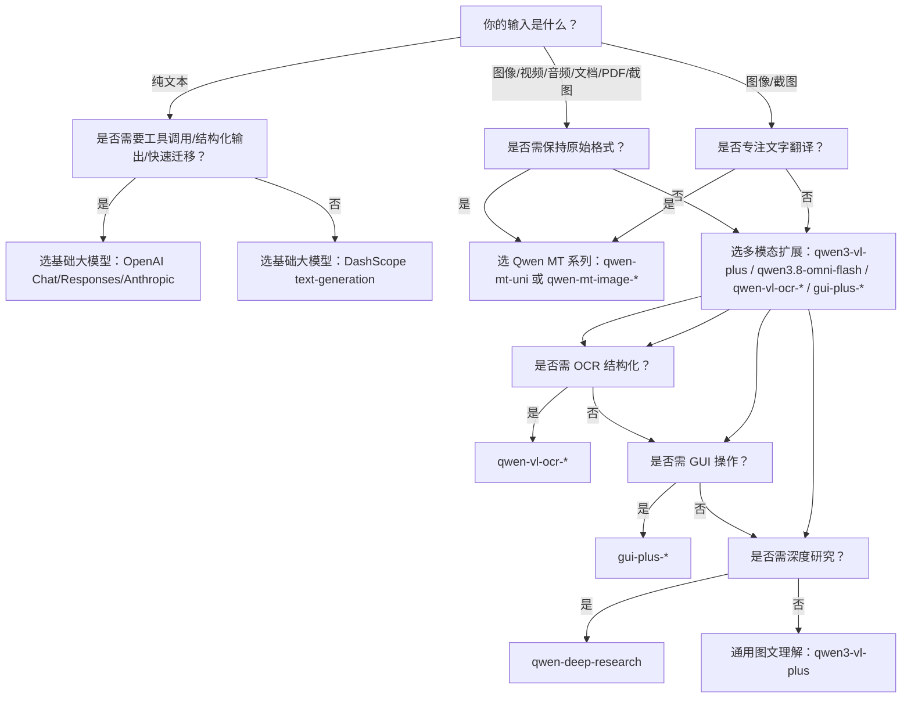

# 通义千问模型能力矩阵对比：基础大模型、翻译模型与多模态扩展

> **目的与背景**  
> 为帮助开发者在百炼平台上高效选型，本文系统对比三类核心能力模型：**通用基础大模型（Qwen Text）**、**专业化机器翻译模型（Qwen MT）** 和 **多模态扩展模型（Qwen VL / Omni / OCR / GUI 等）**。三者虽同属通义千问技术体系，但在设计目标、输入输出范式、协议支持、调用逻辑及适用场景上存在本质差异。本对比聚焦实际工程落地维度，避免概念泛化，旨在提供可操作的技术决策依据。

---

## 关键能力维度对比

| 维度 | 基础大模型（Qwen Text） | 翻译模型（Qwen MT） | 多模态扩展模型（Qwen VL / Omni / OCR / GUI 等） |
|------|------------------------|---------------------|-----------------------------------------------|
| **核心定位** | 通用语言理解与生成（LLM），支持对话、推理、代码、数学等泛任务 | 端到端高保真翻译服务，强调语义对齐、格式保持与领域适配 | 跨模态感知与理解（图像/视频/音频/文档/UI截图），支持识别、生成、操作等垂直任务 |
| **典型模型** | `qwen3.8-max`, `qwen3.7-plus`, `qwen-turbo`, `qwen-coder-next`, `qwen3-math` | `qwen-mt-plus`, `qwen-mt-uni`, `qwen-mt-image-2.0` | `qwen3-vl-plus`, `qwen3.8-omni-flash`, `qwen3.5-ocr`, `gui-plus-*`, `qwen-deep-research` |
| **输入格式** | 文本为主；支持图文混合（`messages` 中嵌入 `image_url`）；不支持原生视频/音频文件字段 | • `qwen-mt-plus`: 纯文本数组 • `qwen-mt-uni`: 文本数组 **或** 公网文件 URL（PDF/DOCX/JPG/MP3 等） • `qwen-mt-image-*`: 单张图像 URL（JPG/PNG/BMP/WEBP） | • 图像 URL / Base64 Data URL • 视频 URL（`qwen3.8-omni-flash` 支持 `video` 字段 + `max_frames`/`fps`） • 音频 URL（仅 `qwen3-audio`，**DashScope 协议专属**） • 截图+操作指令（`gui-plus-*`） • PDF/HTML 内容（`qwen-vl-ocr-*`） |
| **输出格式** | 纯文本流（`text`）；支持 JSON Schema 结构化输出（Anthropic 协议） | • `qwen-mt-plus`: JSON 格式译文数组 • `qwen-mt-uni`: 保持原始格式（如译后 PDF、带文字替换的 JPG、MP3 字幕文本） • `qwen-mt-image-*`: 替换文字后的图像二进制或 Base64 | • 文本（描述、OCR 结果、报告） • 结构化 JSON（如 OCR 表格、GUI 操作链） • 二进制图像（`qwen-mt-image-*`, `gui-plus-*` 输出合成图） • 异步任务 ID（需轮询 `/tasks/{id}` 获取结果） |
| **主流 API 协议支持** | ✅ OpenAI Chat Completions ✅ OpenAI Responses（含工具调用） ✅ Anthropic Messages ✅ DashScope 原生（`text-generation` / `multimodal-generation`） | ❌ 不支持 OpenAI Chat / Anthropic Messages ✅ 仅 DashScope 原生协议（`/api/v1/services/aigc/multimodal-generation/generation` 等） ⚠️ `qwen-mt-plus` 通过 OpenAI SDK 的 `chat.completions.create()` 伪装调用（实为 DashScope 后端路由） | ✅ DashScope 原生协议（主通道） ✅ OpenAI Chat（仅部分图文模型，如 `qwen3-vl-plus`） ❌ 不支持 OpenAI Responses / Anthropic Messages（除 `qwen-deep-research` 等极少数特例） |
| **API 端点示例** | `https://{WorkspaceId}.cn-beijing.maas.aliyuncs.com/compatible-mode/v1/chat/completions` `https://{WorkspaceId}.cn-beijing.maas.aliyuncs.com/apps/anthropic/v1/messages` | `https://{WorkspaceId}.cn-beijing.maas.aliyuncs.com/api/v1/services/aigc/multimodal-generation/generation`（同步） `https://{WorkspaceId}.cn-beijing.maas.aliyuncs.com/api/v1/tasks/{task_id}`（异步轮询） | `https://{WorkspaceId}.cn-beijing.maas.aliyuncs.com/api/v1/services/aigc/multimodal-generation/generation`（图文/视频） `https://{WorkspaceId}.cn-beijing.maas.aliyuncs.com/api/v1/services/aigc/image2image/image-synthesis`（图像翻译） `https://{WorkspaceId}.cn-beijing.maas.aliyuncs.com/api/v1/services/aigc/gui-generation/generation`（GUI） |
| **计费方式** | 按 **输入 Token + 输出 Token** 计费（单位：元/百万 Token），不同模型单价不同（如 `qwen3.8-max` 输入 25元/百万，输出 50元/百万） | 按 **请求次数 + 文件大小/页数/时长** 计费： • `qwen-mt-plus`: 按字符数 • `qwen-mt-uni`: 按文件页数或音频分钟数 • `qwen-mt-image-*`: 按图像张数 | 按 **请求次数 + 输入复杂度** 计费： • 图文模型：按输入 Token + 输出 Token（类似基础模型） • OCR/GUI/Deep Research：按请求次数 + 图像分辨率/视频帧数/研究深度分级计费（详见各模型文档） |
| **典型场景** | • 智能客服对话 • 代码生成与解释 • 数学/逻辑推理 • 内容创作与摘要 • 工具增强型 Agent（通过 Responses 或 Anthropic `tools`） | • 电商商品页批量翻译 • 法律合同双语对照生成 • 手机截图实时翻译（含排版还原） • PDF 技术文档本地化交付 • 音频会议字幕实时翻译 | • 发票/车票 OCR 结构化提取 • UI 截图→自动化操作脚本生成 • 教育课件图像题解析 • 视频关键帧理解与摘要 • 深度研究报告生成（联网+反问+验证） |

---

## 各方案适用场景建议

### ✅ 推荐选择「基础大模型」当：
- 任务本质是**语言理解与生成**，无强格式/模态约束；
- 已有 OpenAI/Anthropic 生态技术栈，追求**最小迁移成本**；
- 需要灵活的**多轮对话管理**、**上下文缓存**（Responses）或**结构化输出控制**（Anthropic JSON Schema）；
- 场景涉及**工具调用**（搜索、代码执行、网页抓取），且希望由模型自主决策（`tool_choice: "auto"`）；
- 对延迟敏感（毫秒级响应），且输入以文本为主。

> ⚠️ 注意：若需处理图像但无需保留原始布局，可用 `qwen3-vl-plus` 替代；若需处理视频/音频，必须切换至多模态扩展模型。

---

### ✅ 推荐选择「翻译模型」当：
- 核心诉求是**跨语言信息准确传递**，而非通用问答或推理；
- 输入源为**富格式内容**（PDF/Word/PPT/图像/音频），且要求**输出严格保持原始格式与排版**；
- 需要**术语强干预**（glossary）、**翻译记忆复用**（TM）、**领域风格引导**（domainHint）；
- 存在**中英文互译刚需**，且对图像内文字翻译精度与位置还原有硬性要求（如 `qwen-mt-image-2.0`）；
- 处理长文档或大文件，接受**异步工作流**（轮询任务状态）。

> ⚠️ 注意：`qwen-mt-plus` 仅适合纯文本轻量翻译；`qwen-mt-uni` 是文档级翻译首选；`qwen-mt-image-*` 是图像翻译唯一专业方案。

---

### ✅ 推荐选择「多模态扩展模型」当：
- 输入包含**非文本模态**（图像、视频、音频、UI截图、PDF页面），且需**跨模态语义理解**；
- 任务目标是**感知→识别→决策→执行**闭环（如 OCR → 提取字段 → 填写表单 → 点击提交）；
- 需要**像素级控制**（如 `max_pixels`, `max_frames`, `fps`, `vl_high_resolution_images`）；
- 场景高度垂直：法律文书审查（`farui-plus`）、意图识别（`tongyi-intent-detect-v3`）、GUI 自动化（`gui-plus-*`）、深度研究（`qwen-deep-research`）；
- 接受协议定制化（DashScope 原生）和更复杂的输入构造（如 `messages.content` 数组嵌套图文）。

> ⚠️ 注意：`qwen-deep-research` 仅支持华北2（北京）地域且仅限 Python SDK；`gui-plus-*` 和 `qwen-vl-ocr-*` 对图像 URL 可访问性要求极高；所有多模态模型均**不支持 OpenAI Responses 的自动 Session 缓存**，需自行管理上下文。

---

## 面向开发者的选型决策树

**关键提醒**：
- **域名统一性**：无论选择哪类模型，**务必使用业务空间专属域名**（`https://{WorkspaceId}.{region}.maas.aliyuncs.com`），旧域名已逐步淘汰。
- **认证一致性**：全部模型均使用 `DASHSCOPE_API_KEY`，无需额外密钥体系。
- **SDK 适配性**：优先使用最新版 DashScope Python SDK（v4.0+），其对多模态输入、异步任务、地域路由支持最完善；Node.js/Java SDK 对部分模型（如 `qwen-deep-research`）支持有限。
- **调试建议**：首次集成时，先用 `qwen3.8-max`（基础模型）和 `qwen-mt-plus`（翻译模型）验证环境；再逐步切入 `qwen3-vl-plus` 或 `qwen-mt-uni` 进行模态扩展验证。

---  
*最后更新：2024年10月*  
*本文档基于百炼平台 v4.2 API 规范编写，具体参数与行为请以各模型最新 API 参考文档为准。*

## 被对比主题页

- [qwen api reference](../api/qwen-api-reference.md)
- [qwen mt translation models](../api/qwen-mt-translation-models.md)
- [more models](../api/more-models.md)

