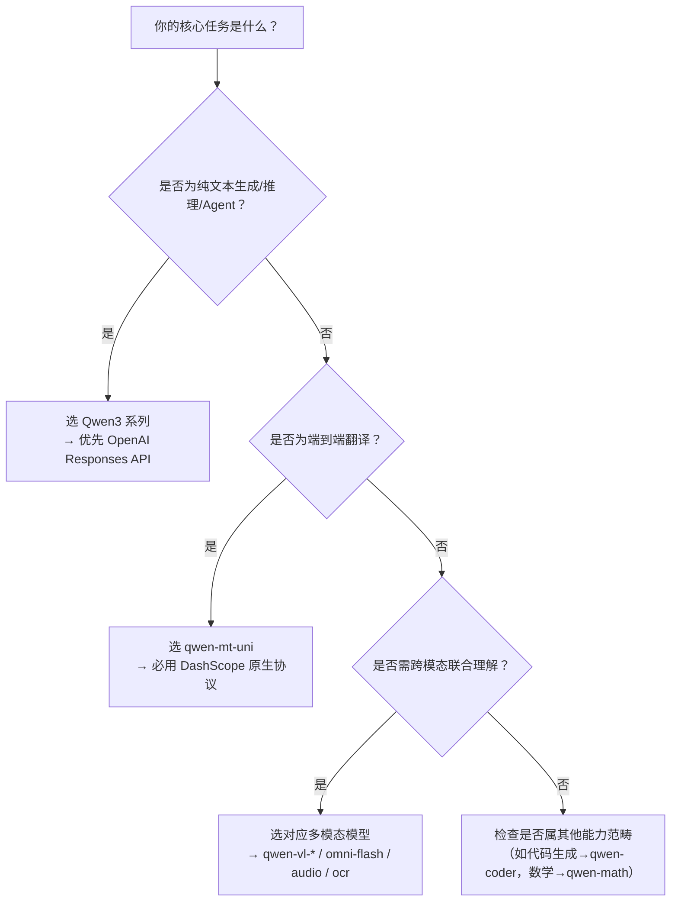

# Qwen系列模型能力对比（基础、MT翻译、多模态等）

## 背景与目的

随着Qwen系列模型在百炼平台持续演进，开发者面临日益丰富的模型选型与接口协议选择：既有面向通用文本生成的`qwen3.8-max`等大语言模型，也有专注端到端翻译的`qwen-mt-uni`，以及支持图像、音频、视频理解的多模态模型（如`qwen3.8-omni-flash`、`qwen-vl-plus`）。不同模型在输入格式、输出语义、调用协议、计费逻辑及适用场景上存在显著差异。

本文旨在为技术决策者与一线开发者提供**横向、可操作的能力对比视图**，聚焦三大核心能力维度——**基础语言理解与生成（LLM）**、**机器翻译（MT）**、**多模态理解与生成（Multimodal）**，明确各方案的技术边界、协议约束与工程适配要点，助力高效完成模型选型、API集成与系统架构设计。

---

## 关键能力维度对比表

| 维度 | 基础语言模型（Qwen3 系列） | 机器翻译模型（Qwen-MT-Uni） | 多模态模型（Qwen-VL / Omni / Audio） |
|------|-----------------------------|------------------------------|----------------------------------------|
| **典型代表模型** | `qwen3.8-max`, `qwen3.7-plus`, `qwen3.8-flash` | `qwen-mt-uni`（唯一可用模型） | `qwen3.8-omni-flash`, `qwen-vl-plus`, `qwen-vl-max`, `qwen-audio` |
| **输入格式** | • 文本字符串或结构化 `messages` 数组 • 支持 `input_image`/`input_file`/`input_audio`/`input_video`（仅 `omni-flash`） • `system`/`user`/`assistant` 角色严格生效（QwQ/QVQ除外） | • `source_texts`（字符串或数组） • 或 `fileUrl`（HTTPS公开URL，禁止中文） • 支持 PDF/DOCX/PPTX/XLSX/HTML/MD/TXT/IMG/AUDIO（≤100 MB） | • 图像：PNG/JPG/JPEG（`qwen-vl-*`） • 音频：MP3/WAV（`qwen-audio`, `omni-flash`） • 视频：MP4/MOV（`omni-flash`） • PDF解析：`qwen3.5-ocr`（最大100 MB，页数依任务类型而定） |
| **输出格式** | • 纯文本（`response.output_text`） • 流式 delta（`stream=true`） • 结构化 JSON（启用 `output_config.format.type="json_schema"`） • 工具调用结果（`tool_use`/`tool_result`） | • 同步：`output.Data.TranslatedTexts`（文本）或 `output.Data.TranslatedFileUrl`（文件） • 异步：通过 `task_id` 查询，成功时返回 `TranslatedFileUrl`（24小时有效） • 输出严格保形保格式（如 `.pdf` → `.pdf`） | • 文本描述/推理结论（`qwen-vl-*`） • 音频转录/摘要（`qwen-audio`） • OCR结构化文本（`qwen3.5-ocr`） • 不支持原生[流式输出](../concepts/streaming-output.md)（需自行分块处理） |
| **支持协议** | • OpenAI 兼容：`/compatible-mode/v1/responses`（推荐Agent）、`/compatible-mode/v1/chat/completions` • Anthropic 兼容：`/apps/anthropic/v1/messages` • DashScope 原生：`/api/v1/services/aigc/text-generation/generation`（纯文本）、`/multimodal-generation/generation`（多模态） | • **仅 DashScope 原生协议**： `/api/v1/services/aigc/multimodal-generation/generation` • 不兼容 OpenAI/Anthropic 协议 | • `qwen-audio`：**仅 DashScope 原生协议**（不支持 OpenAI 兼容） • `qwen-vl-*` / `omni-flash`：支持 DashScope 原生 + OpenAI 兼容（`input_items` 中嵌入 media） • `qwen3.5-ocr`：DashScope 原生专用接口 |
| **API 端点（示例）** | `https://{WorkspaceId}.cn-beijing.maas.aliyuncs.com/compatible-mode/v1/responses` | `https://{WorkspaceId}.cn-beijing.maas.aliyuncs.com/api/v1/services/aigc/multimodal-generation/generation` | • VL/Omni：同上 MT 端点（复用） • Audio：`/api/v1/services/aigc/audio-generation/generation` • OCR：`/api/v1/services/aigc/ocr/generation` |
| **计费方式** | • 按 `input_tokens` + `output_tokens` 计费 • [Token](../concepts/token.md) 细分统计（`usage.input_tokens_details`）：`text_tokens`, `image_tokens`, `audio_tokens` 等 • Session 缓存可降低重复上下文成本 | • **仅按 `input_tokens` 计费**（不含输出） • `usage.input_tokens_details` 明确区分：`document_tokens`, `image_tokens`, `audio_tokens`, `character_tokens` | • 同基础模型：按 `input_tokens` + `output_tokens` 计费 • 多模态 [Token](../concepts/token.md) 按模态独立计量（如 `image_tokens` = 图像分辨率/缩放因子换算） • `qwen-audio` 按音频时长+采样率折算为 tokens |
| **典型场景** | • 智能客服对话系统 • AI Agent（工具调用、联网搜索、代码执行） • 内容创作、摘要、改写、逻辑推理 • 结构化数据生成（JSON Schema 强约束） | • 全模态文档本地化（PDF报告→中文版） • 跨语言会议纪要生成（录音→译文+摘要） • 多语言电商图文自动翻译（商品图+文案） • 敏感词/术语可控的合规翻译 | • 图文理解（医疗报告图文分析） • 视频内容摘要（会议录像→关键结论） • 音频语义理解（客服通话情绪+意图识别） • PDF智能解析（合同条款提取+风险提示） |

---

## 适用场景建议（面向开发者的技术选型指南）

### ✅ 推荐选择 **基础语言模型（Qwen3 系列）** 当：
- 你的应用以**通用文本交互为核心**（如聊天机器人、知识问答、创意写作）；
- 需要**复杂 Agent 能力**：自主调用搜索、代码解释器、知识库、网页抓取等内置工具；
- 要求**强上下文管理**（多轮对话状态追踪、`previous_response_id` 回溯、Session 缓存）；
- 需要**结构化输出保障**（如 API 响应必须为合法 JSON，且字段类型/必填性严格校验）；
- 已有 OpenAI/Anthropic 技术栈，希望**最小改造迁移**（优先选对应兼容协议）。

> ⚠️ 注意：若涉及纯翻译任务，**不建议用 Qwen3 系列替代 `qwen-mt-uni`** ——后者在格式保全、术语控制、文档结构还原、多模态对齐等方面具备不可替代的专业性。

---

### ✅ 推荐选择 **Qwen-MT-Uni** 当：
- 核心需求是**端到端、高保真、格式无损的翻译**，而非“翻译后二次加工”；
- 输入源为**混合模态**（如带图表的PDF、含字幕的PPT、带OCR文字的扫描图）；
- 需要**领域定制与术语强控**（通过 `domainHint` 和 `glossary` 实现）；
- 处理**大文件或长音频**（>30页PDF、>10分钟录音），需异步任务调度与回调机制；
- 对**敏感词处理有硬性要求**（大小写敏感匹配、原文保留策略）。

> ⚠️ 注意：`qwen-mt-uni` **不支持 Chat Completions 类对话模式**，也不提供 `system` 提示词控制；其本质是“翻译即服务”，非通用 LLM。

---

### ✅ 推荐选择 **多模态模型（Qwen-VL / Omni / Audio / OCR）** 当：
- 任务本质依赖**跨模态对齐理解**：如“根据这张CT影像描述病灶位置”、“听这段语音判断客户是否投诉”；
- 需要**原生多模态输入支持**，且拒绝预处理（如不希望先调用 OCR 提取文字再喂给 LLM）；
- 追求**极致性能与控制粒度**：使用 DashScope 原生协议直接管理 `input_items`、`output_config`、`reasoning.effort`；
- 特定垂直需求明确：  
  &nbsp;&nbsp;▸ `qwen-audio`：仅处理语音，无需文本生成；  
  &nbsp;&nbsp;▸ `qwen3.5-ocr`：专注 PDF/扫描件结构化解析，非通用图文理解；  
  &nbsp;&nbsp;▸ `qwen3.8-omni-flash`：需同时处理文本+图像+音频+视频的统一底座。

> ⚠️ 注意：`qwen-audio` **完全不兼容 OpenAI 协议**；`qwen-vl-*` 在 OpenAI 兼容模式下仅支持 `input_image`，不支持 `input_audio`/`input_video`（需切 DashScope 原生）。

---

## 总结：技术选型决策树

> 💡 **最佳实践提示**：  
> - **协议优先级**：OpenAI 兼容 > Anthropic 兼容 > DashScope 原生（开发效率）；  
> - **性能优先级**：DashScope 原生 > OpenAI 兼容（延迟低 5–15%，[Token](../concepts/token.md) 成本略优）；  
> - **生产稳定性**：务必使用业务空间专属域名（`{WorkspaceId}.region.maas.aliyuncs.com`），禁用 `dashscope.aliyuncs.com`；  
> - **调试建议**：所有请求开启 `stream=false` + `debug=true`（若支持），查看 `usage` 与 `output_config` 实际生效值。

---  
*本文档依据百炼平台 2024 年 Q3 发布的 Qwen3 系列模型能力规范编写，覆盖 `qwen3.8` 及以上版本。模型能力持续迭代，请以控制台「模型市场」实时列表与最新 API 参考为准。*

## 被对比主题页

- [qwen api reference](../api/qwen-api-reference.md)
- [qwen mt translation models](../api/qwen-mt-translation-models.md)

