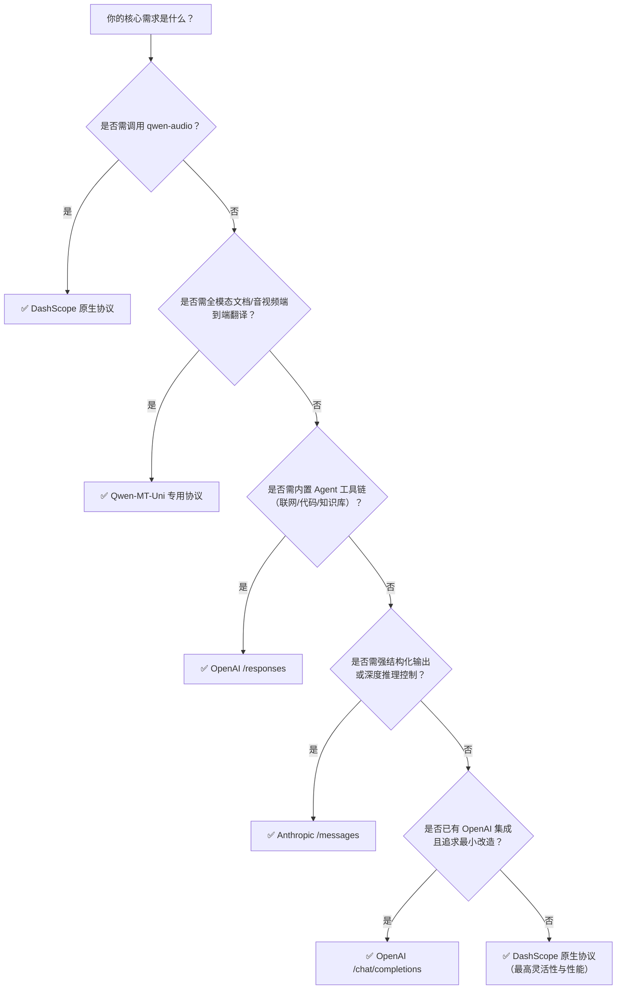

# Qwen系列模型能力对比

为帮助开发者在阿里云百炼平台上高效选型，本文系统对比 Qwen 系列主流模型调用方案的核心能力维度。随着 Qwen3 全新架构发布（含 `qwen3.8-max`、`qwen3.7-plus`、`qwen3-vl-plus`、`qwen3.8-omni-flash` 等通用大模型，以及 `qwen-audio`、`qwen-mt-uni` 等垂直领域专用模型），平台已构建**多协议、多模态、多范式**的统一服务能力。本对比聚焦实际工程落地关键指标——不单看模型参数或基准分数，而关注：**协议兼容性、输入/输出控制粒度、工具链集成深度、多模态支持边界、计费透明度与典型场景匹配度**，助力技术决策者快速定位最优路径。

---

## 关键能力维度对比

| 维度 | OpenAI 兼容协议（`/chat/completions`） | OpenAI 兼容协议（`/responses`） | Anthropic 兼容协议（`/messages`） | DashScope 原生协议（文本/多模态） | Qwen-MT-Uni 专用协议 |
|------|----------------------------------------|-----------------------------------|-------------------------------------|------------------------------------|------------------------|
| **输入格式** | `messages[]` 数组；`content` 支持 `text`/`image_url`/`video_url`（需公网可访问） | `input` 支持 `string` 或 `EasyInputMessage[]`；`content` 可直接嵌入 `input_audio`/`input_video`（二进制 Base64 或 URL） | `messages[]` + `system`；`content` 支持 `text`/`image`/`video`/`tool_use`；`video` 支持 `fps` 控制 | `input.messages[]`；`content` 支持 `text`/`image`/`video`；`video` 支持 `max_frames`（DashScope 特有精细抽帧） | `input.fileUrl`（HTTPS 公网 URL）或 `input.source_texts`（文本）；支持 PDF/DOCX/PPTX/XLSX/HTML/Markdown/TXT/JPG/PNG/MP3/WAV 等全模态文件 |
| **输出格式** | 标准 OpenAI `choices[].message.content`；流式响应支持 `delta` | 结构化 JSON：含 `output.response_id`、`output.tool_calls`、`output.final_answer`；支持 `previous_response_id` 多轮上下文自动续接 | `content[]` 数组，含 `text`/`image`/`tool_use`/`tool_result`；支持 `output_config.format=json_schema` 强约束输出 | 原生 `output.text` / `output.data`；多模态返回 `output.image_url`/`output.video_summary` 等字段；无隐式结构化包装 | 同步：`output.Data.TranslatedTexts`（文本）或 `output.Data.TranslatedFileUrl`（文件）；异步：通过 `/tasks/{task_id}` 查询，结果含 `TranslatedFileUrl` 与 `TranslatedTexts` |
| **支持模型** | `qwen3.8-max`、`qwen3-vl-plus`、`deepseek-v4-pro` 等通用模型（含第三方） | 聚焦 Qwen 商业版：`qwen3.8-max`、`qwen3.7-plus`、`qwen3.8-omni-flash`；第三方模型 Agent 能力受限 | 按能力分组：`qwen3.8-max`（强推理）、`qwen3.7-plus`（均衡）、`qwen3-vl-plus`（视觉）、`qwen3.8-omni-flash`（音视频）、`qwen-coder`（代码） | 全系支持，含 DashScope 特有模型：`qwen-audio`（仅此协议支持）、`qwen3.8-omni-flash`（高精度音视频理解）、`qwen3-vl-plus` | **唯一模型**：`qwen-mt-uni`（全模态翻译专用，不支持其他模型别名） |
| **API 端点** | `POST /compatible-mode/v1/chat/completions` | `POST /compatible-mode/v1/responses` | `POST /apps/anthropic/v1/messages` | 文本：`POST /api/v1/services/aigc/text-generation/generation` 多模态：`POST /api/v1/services/aigc/multimodal-generation/generation` | `POST /api/v1/services/aigc/multimodal-generation/generation`（同步/异步由请求头 `X-DashScope-Async` 控制） |
| **计费方式** | 按 `usage.prompt_tokens` + `usage.completion_tokens` 计费；多模态额外计 `image_tokens`/`video_tokens` | 同上，但 Agent 工具调用（如 `web_search`）按次单独计费（见 [计费说明](https://help.aliyun.com/zh/model-studio/pricing)） | 按 `usage.input_tokens` + `usage.output_tokens` 计费；`tool_use` 不额外计费，但工具执行本身可能产生子费用 | 按 `usage.input_tokens` + `usage.output_tokens` 计费；多模态拆分为 `image_tokens`/`document_tokens`/`audio_tokens`/`character_tokens`（精确到字符级） | **仅按输入计费**：`usage.input_tokens`；模态类型自动识别并分类计费（如 `document_tokens` for PDF, `audio_tokens` for MP3）；无输出 token 费用 |
| **典型场景** | 快速迁移现有 OpenAI 应用；轻量对话、摘要、简单代码生成 | 构建 AI Agent：需联网搜索、网页抓取、代码解释、知识库问答、文搜图等复合能力 | 需强结构化输出（JSON Schema）、复杂推理链（`thinking.effort`）、显式缓存控制（`cache_control`）的高确定性任务 | 高精度音视频理解（`qwen-audio`）、细粒度视频分析（`max_frames` 控制）、低延迟纯文本生成 | 全模态文档/音视频端到端翻译：PDF 报告双语交付、会议录音实时字幕+译文、PPT 演示稿多语言适配 |

---

## 各方案适用场景建议

### ✅ 推荐选择 OpenAI `/chat/completions`
- **适用团队**：已有成熟 OpenAI SDK 集成，追求最小改造成本上线。
- **典型用例**：客服对话机器人、内容初稿生成、基础代码补全、轻量图文摘要。
- **注意边界**：不支持 `qwen-audio`；音视频输入依赖公网 URL，无法直传二进制；无内置 Agent 工具链。

### ✅ 推荐选择 OpenAI `/responses`
- **适用团队**：需快速构建具备“感知-决策-执行”能力的 AI Agent，且接受百炼平台封装的工具生态。
- **典型用例**：智能办公助手（查邮件+搜网页+写周报）、教育答疑系统（解析题目+检索知识点+生成讲解）、跨境电商客服（理解用户截图+查产品库+生成回复）。
- **注意边界**：第三方模型（如 `deepseek-v4-pro`）无法调用内置工具；旧路径 `/api/v2/apps/protocols/compatible-mode/v1/responses` 已停用，必须使用新路径。

### ✅ 推荐选择 Anthropic `/messages`
- **适用团队**：对输出格式、推理过程、缓存行为有强管控需求，熟悉 Anthropic 生态。
- **典型用例**：金融合规报告生成（强制 JSON Schema 输出）、法律条款比对（深度思考 `effort=high`）、企业知识库问答（`cache_control=ephemeral` 防幻觉）。
- **注意边界**：不支持 `qwen-mt-uni`；`tool_use` 流程需自行管理 `tool_result` 回填，无百炼预置工具。

### ✅ 推荐选择 DashScope 原生协议
- **适用团队**：追求最高控制精度、需调用 `qwen-audio` 或进行视频帧级分析、或已深度集成 DashScope SDK。
- **典型用例**：语音质检系统（ASR+情感分析+违规词检测）、工业视频缺陷识别（抽关键帧+多图推理）、低延迟 API 网关（绕过兼容层开销）。
- **注意边界**：无开箱即用 Agent 工具；需通过 DashScope SDK 的 `ToolCall` 机制自行实现工具调用逻辑。

### ✅ 推荐选择 Qwen-MT-Uni 专用协议
- **适用团队**：业务核心诉求是**跨模态、高保真、格式无损**的翻译，而非通用生成。
- **典型用例**：跨国企业本地化平台（PDF 手册→多语言 PDF）、在线教育平台（课程视频→带时间轴双语字幕）、政府外事文档处理（扫描件→可编辑 Word 译文）。
- **注意边界**：**非通用大模型**，不可用于问答、创作、推理等任务；仅支持 `qwen-mt-uni` 单一模型；`.doc`/`.ppt` 等旧格式需先转 OOXML。

---

## 技术选型决策树（面向开发者）

```mermaid
graph TD
    A[你的核心需求是什么？] --> B{是否需调用 qwen-audio？}
    B -->|是| C[✅ DashScope 原生协议]
    B -->|否| D{是否需全模态文档/音视频端到端翻译？}
    D -->|是| E[✅ Qwen-MT-Uni 专用协议]
    D -->|否| F{是否需内置 Agent 工具链<br>（联网/代码/知识库）？}
    F -->|是| G[✅ OpenAI /responses]
    F -->|否| H{是否需强结构化输出<br>或深度推理控制？}
    H -->|是| I[✅ Anthropic /messages]
    H -->|否| J{是否已有 OpenAI 集成<br>且追求最小改造？}
    J -->|是| K[✅ OpenAI /chat/completions]
    J -->|否| L[✅ DashScope 原生协议<br>（最高灵活性与性能）]
```

> **重要提醒**：
> - **域名统一**：所有协议均使用业务空间专属域名 `https://{WorkspaceId}.cn-beijing.maas.aliyuncs.com`，请勿混用旧版公共域名。
> - **认证一致**：均通过 `Authorization: Bearer <API_KEY>` 或 `x-api-key` 认证，API Key 在百炼控制台“API 密钥管理”中获取。
> - **SDK 配置差异**：OpenAI SDK 需设 `base_url` 为兼容端点；Anthropic SDK 设 `base_url` 为 `/apps/anthropic`；DashScope SDK 设 `base_http_api_url` 为 `/api/v1`。
> - **多模态计费透明**：Qwen-MT-Uni 与 DashScope 原生协议均提供模态级 token 拆分（`image_tokens`, `document_tokens` 等），便于成本归因与优化。

如需进一步验证性能或压测吞吐，请参考 [百炼性能测试指南](../../raw/model-api-reference/performance-testing.md)。

## 被对比主题页

- [qwen api reference](../api/qwen-api-reference.md)
- [qwen mt translation models](../api/qwen-mt-translation-models.md)

