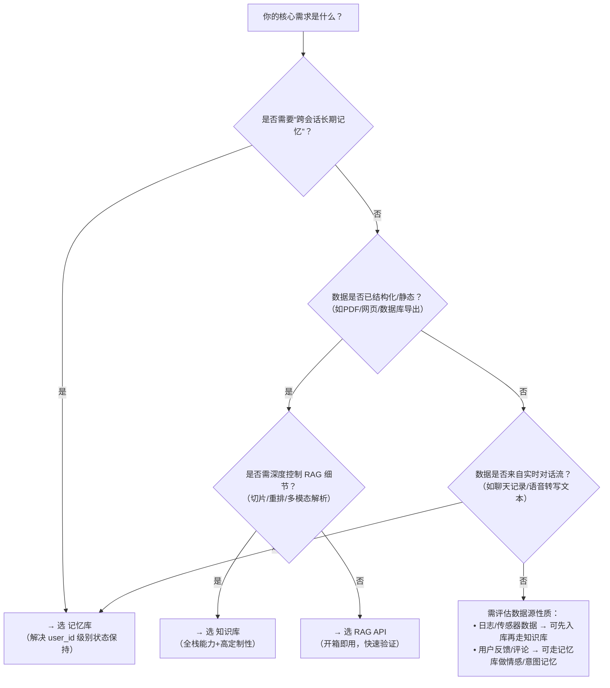

# RAG API、知识库与记忆库（Memory Library）对比

为帮助开发者清晰理解百炼平台中三类核心知识增强能力的定位差异，本文对 **RAG API**、**知识库（Knowledge Base）** 和 **记忆库（Memory Library）** 进行系统性对比。三者虽均服务于“将外部信息注入大模型推理过程”这一目标，但在设计目标、数据生命周期、适用粒度、集成方式及计费逻辑上存在本质区别。本对比面向实际工程选型场景，聚焦可落地的技术指标与决策依据，避免概念混淆。

---

## 关键维度对比

| 维度 | RAG API | 知识库（Knowledge Base） | 记忆库（Memory Library） |
|------|---------|---------------------------|---------------------------|
| **核心定位** | 封装完整的 RAG 流程的**应用级服务接口**，面向快速构建问答/摘要等业务功能 | 百炼平台的**RAG 基础设施层**，提供多模态数据接入、向量化、混合检索与问答服务的全栈能力 | 面向大模型对话的**[长期记忆](../concepts/long-term-memory.md)管理服务**，解决跨会话上下文丢失问题，实现个性化、连贯的智能体交互 |
| **输入格式** | `query`（自然语言文本，≤2048 字符） + `knowledge_base_id`（必填） + 可选 `top_k`/`stream`/`agent_id` | 多样化：原始文件（PDF/DOCX/图片/音视频）、OSS URL、飞书/钉钉/语雀链接；或结构化元数据（标签、自定义字段） | `messages`（对话历史数组，含 `role`/`content`） + `user_id`（必填） + 可选 `profile_schema`/`top_k`/`min_score`/`plan_version` |
| **输出格式** | JSON 格式生成结果（含 `answer`、`retrieved_chunks`、`usage` 等字段）；支持流式 SSE 响应（当 `stream=true`） | 分层输出： • 检索接口：返回原始切片（`chunk_id`, `content`, `score`, `metadata`） • 问答接口：返回 `answer` + `citations` + `retrieval_results` • Playground：可视化切片高亮与溯源 | JSON 格式记忆节点列表： • `SearchMemory`：返回 `memory_nodes`（含 `id`, `content`, `type`（fact/profile）, `score`, `source_messages`） • `GetUserProfile`：返回结构化用户画像对象 |
| **支持模型** | **不直接暴露模型选择**；模型由绑定的 `agent_id` 间接指定（如 `qwen3.6-plus`），`model` 字段已废弃 | **显式分层支持**： • 嵌入模型：`text-embedding-v4`（创建时选定，不可改） • 重排模型：`qwen3-rerank` / `qwen3-vl-rerank`（检索/问答中配置） • 生成模型：`qwen3.6-plus` 等（问答服务中绑定） • 解析模型：OCR、Qwen-VL、语音转写等（创建知识库时选配） | **隐式策略驱动**： • 事实记忆提取：基于 `plan_version`（`pro`/`lite`）调用不同 NLU 模型（Pro 启用 Rerank） • 用户画像提取：依赖预定义 schema + 内置结构化抽取模型 • *不开放 LLM 选型*，模型能力由平台统一优化 |
| **API 端点（典型）** | `POST /v1/knowledge`（问答主入口） `POST /v1/knowledge_bases`（知识库管理） | `POST /api/v1/indices/rag/index/retrieve`（底层检索） `POST /api/v1/indices/knowledge/search`（应用级检索） `POST /api/v2/apps/knowledge/chat`（流式问答） | `POST /api/v2/apps/memory/add`（写入） `POST /api/v2/apps/memory/memory_nodes/search`（检索） `GET /api/v2/apps/memory/profiles/{user_id}`（获取画像） |
| **计费方式** | **按调用次数计费**： • RAG 问答请求：¥0.002/次（含检索+生成） • 知识库管理操作（创建/同步等）：免费 • *知识库本身不单独计费，其资源消耗计入 RAG API 调用* | **按资源规格与使用量双轨计费**： • 知识库实例：标准版（¥0.03/小时）或旗舰版（¥0.2/RCU/小时，1 RCU ≈ 50 QPS） • 文档解析/向量化：按文档页数或时长计费（如 PDF 解析 ¥0.001/页） • *检索与问答调用本身不额外计费，计入知识库实例配额* | **按调用次数 + 存储分层计费**： • `AddMemory`：¥0.0005/次（Lite）或 ¥0.001/次（Pro） • `SearchMemory`：¥0.00002/次（Lite）或 ¥0.001/次（Pro） • 存储：10,000 条永久免费；超出后 ¥0.0001/条/月 • *2026年8月20日起正式计费，含3个月免费额度* |
| **数据生命周期** | **静态、批处理式**： • 数据需提前上传 → 同步解析 → 构建索引 → 才能被查询 • 更新需重新上传+同步，无实时增量更新机制 | **静态为主，支持定时同步**： • 支持 OSS/飞书等外部源定时拉取（副本式） • 同步规则不支持增量删除，仅新增/覆盖 • 切片与嵌入模型创建后不可修改 | **动态、事件驱动式**： • 自动从每轮对话 `messages` 中实时提取记忆 • 支持异步写入（`AddMemoryAsync`）与软删除 • 记忆可设置 TTL（如默认项目规则为 180 天） |
| **典型场景** | • 快速上线客服问答机器人 • 内部文档智能搜索（HR/IT 政策库） • 合同/财报摘要生成 | • 企业级知识中枢（整合 PDF/表格/音视频） • 多知识库混合检索（如“同时查产品文档+客服工单”） • 高精度技术文档问答（需重排+多模态解析） | • 智能客服中的用户偏好记忆（如“张三喜欢简体中文回复”） • 个人助理中的待办提醒（“每天9点喝水”） • 多轮销售对话中的客户画像持续沉淀 |

---

## 各方案适用场景建议

### ✅ 推荐使用 **RAG API** 当：
- 你追求**最快上线速度**，已有明确知识库（如已建好的 PDF 文档集），只需一个 API 实现问答；
- 场景对**模型可控性要求低**，接受平台默认的 Agent 流程封装；
- 业务规模适中，QPS 在默认限流（60 次/分钟）范围内，无需高并发定制；
- 不需要深度调优切片策略、重排模型或解析方式，满足通用精度即可。

> 💡 *典型用户：MVP 验证团队、中小型企业 IT 支持系统、内部工具开发者*

### ✅ 推荐使用 **知识库（Knowledge Base）** 当：
- 你需要**完全掌控 RAG 全链路**：从多源数据接入（OSS/飞书/音视频）、智能切片、嵌入模型选型、重排精调，到生成模型绑定；
- 场景涉及**复杂文档类型**（扫描件PDF、带图表Excel、会议录音），需 OCR/Qwen-VL/语音转写等专业解析；
- 要求**多知识库协同**（如按部门划分知识库）或**混合检索**（向量+关键词+标签过滤）；
- 业务有**高并发、低延迟**需求（如 SaaS 客服平台），需旗舰版 RCU 弹性扩容。

> 💡 *典型用户：大型企业知识中台、AI 原生应用厂商、对检索精度敏感的技术支持系统*

### ✅ 推荐使用 **记忆库（Memory Library）** 当：
- 你的应用是**多轮对话智能体**（如客服Bot、个人助理），需在不同会话间记住用户身份、偏好、承诺事项；
- 需要**自动化提取结构化用户画像**（职业/兴趣/设备偏好）并用于 Prompt 注入；
- 希望规避“上下文窗口限制”，让模型具备**跨天、跨周的对话连贯性**；
- 记忆内容具有**强时效性或个性化**（如“小王的咖啡订单未完成”），不适合放入静态知识库。

> 💡 *典型用户：对话式 AI 应用开发者、智能体（Agent）平台、个性化推荐助手*

---

## 技术选型参考（给开发者的决策树）

### ⚠️ 重要避坑提示：
- **不要混用目的**：记忆库 ≠ 知识库的轻量版。记忆库不支持文档上传、不提供 PDF 解析、不开放嵌入模型配置——它专为对话记忆而生。
- **知识库不是“存储桶”**：上传的文档会被解析、切片、向量化，原始文件不可直接读取；若需原始文件访问，请结合 OSS 使用。
- **RAG API 的 `agent_id` 是关键开关**：不传 `agent_id` 则走基础流程（无重排、无高级解析）；要启用知识库的全部能力，必须先创建对应 Agent 并绑定知识库。
- **计费边界清晰**：RAG API 按“问答请求”计费；知识库按“实例规格+解析用量”计费；记忆库按“Add/Search 调用次数+存储条数”计费——三者账单独立，可分别优化。

---  
*最后更新时间：2025年4月*  
*本文档依据百炼平台 2025 Q2 正式版 API 与控制台行为编写，具体以最新 [API 参考](https://help.aliyun.com/zh/bailian) 为准。*

## 被对比主题页

- [rag api](../api/rag-api.md)
- [knowledge base](../guides/knowledge-base.md)
- [memory library overview](../guides/memory-library-overview.md)

