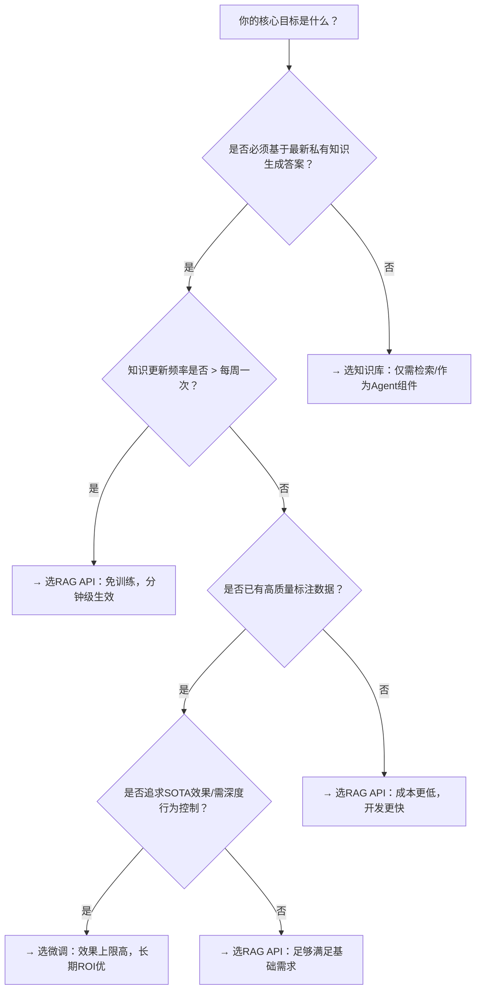

# RAG、微调与知识库三种 LLM 增强方案对比

在大模型应用落地过程中，如何让通用基座模型具备领域专业性、业务准确性与实时知识覆盖能力，是开发者面临的核心挑战。百炼平台提供三种主流增强路径：**RAG（[检索增强生成](../concepts/rag.md)）**、**微调（Fine-tuning）** 和 **知识库（Knowledge Base）**。尽管三者常被并列讨论，但其技术定位、适用边界与工程成本存在本质差异。本文旨在为开发者提供清晰、可操作的技术选型参考，帮助根据数据特征、效果目标、迭代节奏与资源约束，选择最匹配的增强方案。

> ⚠️ 重要说明：  
> - **“知识库”不是独立于 RAG 的平行方案，而是 RAG 架构中的核心基础设施**。本文将“知识库”单列为对比项，特指 *以知识库为唯一载体、仅通过检索/问答 API 调用、不涉及模型训练或定制* 的轻量级增强模式（即“纯知识库服务”）。  
> - “RAG API” 指百炼封装的端到端 `POST /v1/knowledge/query` 接口，其底层强依赖知识库，但屏蔽了切片、嵌入、重排等细节；  
> - “微调” 指对模型参数进行显式更新，产出专属模型实例，需部署后调用。

---

## 关键维度对比

| 维度 | RAG API | 微调（Fine-tuning） | 知识库（纯服务模式） |
|------|---------|----------------------|------------------------|
| **本质定位** | 检索+生成一体化的**服务化接口**，基于预置知识库与固定推理引擎实现问答闭环 | **模型定制化过程**，通过训练修改模型权重，产出新模型版本 | **结构化数据存储与检索底座**，提供向量化索引与多模态召回能力，本身不生成答案 |
| **输入格式** | 自然语言问题（`query`，≤2048 字符） + `knowledge_base_id` | 训练数据集（JSONL 格式，含 `messages` 或 `prompt/completion` 字段）、超参配置、模型标识 | 多源异构数据： • 文档类：PDF/Word/TXT/Markdown（≤150 MB） • 表格类：CSV/Excel/RDS 连接 • 多模态：图片（JPG/PNG）、音视频（MP4/WAV，≤512 MB） |
| **输出格式** | JSON 结构体： • `answer`（LLM 生成的答案） • `retrieved_chunks`（匹配的原始切片列表） • `usage`（token 消耗统计） | **无直接输出**；训练完成后生成模型 ID（如 `ft-qwen3-8b-20260520-abc123`），需另行调用 `/v1/chat/completions` 接口使用 | 两种服务模式： • **检索服务**：返回 `chunks` 列表（含内容、来源、相似度） • **问答服务**：返回 `answer` + `retrieved_chunks`（同 RAG API，但模型可自由切换） |
| **支持模型** | **仅限百炼内置 RAG 专用推理引擎**，不可替换；不开放自定义 LLM 后端 | **高度灵活**： • 文本：Qwen3/Qwen2.5/千问 Plus 全系列（SFT/CPT/DPO/RL/OPD） • 视觉：千问 VL（SFT） • 图像/视频：万相（SFT-LoRA） • 语音：CosyVoice（efficient_sft） • 决策：decision-model-preview（efficient_sft） | **解耦设计**： • 嵌入模型：默认 `text-embedding-v4`（创建后不可改） • 重排模型：`qwen3-rerank` / `qwen3-vl-rerank`（按需启用） • 生成模型：**完全自由** —— 可在控制台/API 中任意切换 Qwen 系列模型（如 `qwen3.6-plus`, `qwen3-vl`）及温度等参数 |
| **API 端点** | `POST /v1/knowledge/query`（统一问答入口） | 多阶段 API： • `/api/v1/files`（上传数据） • `/api/v1/fine-tunes`（创建训练任务） • `/api/v1/fine-tunes/{id}`（查询状态） • 训练完成后调用标准 `/v1/chat/completions`（指定 `model=ft-xxx`） | 分离式 API： • 检索：`POST /api/v1/indices/knowledge/search` • 问答：`POST /api/v2/apps/knowledge/chat` • 管理：`GET /api/v1/knowledge_bases` 等 |
| **计费方式** | **按调用量计费**： • 请求次数（QPS） • 生成 token 数（含 [prompt](../guides/prompt.md) + completion） • 重排调用额外计费 | **按训练资源消耗计费**： • **MTU（Model Training Unit）**：基于 GPU 类型、训练时长、模型规模综合计算 • 部署后推理：按标准模型 API 计费（`/v1/chat/completions`） | **按规格与用量混合计费**： • **标准版**：固定 1 QPS + 720 小时/月免费额度 • **旗舰版**：按 RCU（1 RCU ≈ 50 QPS）弹性伸缩，0.2 元/RCU/小时 • 检索/问答请求均计入 QPS |
| **典型场景** | • 快速上线客服问答机器人 • 法规/产品文档即时查询 • 需要严格引用原文的合规场景（因返回 `retrieved_chunks`） | • 金融研报摘要生成（需领域术语理解） • 医疗问诊助手（需价值观对齐与幻觉抑制） • 企业内部代码补全模型（需私有代码风格学习） | • 构建企业级文档搜索引擎（仅需召回，无需生成） • 多模态内容管理平台（图片/音视频语义检索） • Agent 的[长期记忆](../concepts/memory.md)模块（通过 `search` 接口注入上下文） |

---

## 适用场景建议

### ✅ 优先选择 **RAG API**
- **需求明确、时效性强**：业务知识频繁更新（如政策变动、产品迭代），要求“今天上传，明天可用”，无法等待数小时至数天的训练周期。
- **强调可解释性与可追溯性**：需向用户展示答案依据（如“该结论出自《2024版服务协议》第3.2条”），RAG API 原生返回 `retrieved_chunks`，天然满足审计要求。
- **资源受限、追求开箱即用**：团队无 ML 工程师，希望最小化配置（无需调参、无需数据清洗标注），通过控制台 5 分钟完成知识库创建与问答验证。
- **规避模型幻觉风险**：答案必须严格基于已有知识，禁止自由发挥——RAG 的“检索先行”机制从架构上约束了生成边界。

### ✅ 优先选择 **微调（Fine-tuning）**
- **效果要求极致**：通用模型在特定任务上准确率不足（如合同关键条款抽取 F1 < 0.7），需通过 SFT/CPT 显著提升性能。
- **需要深度行为定制**：要求模型遵循复杂指令（如“用销售话术重写，长度≤80字，包含emoji”）、拒绝敏感话题、或输出结构化 JSON。
- **高并发、低延迟生产环境**：已验证效果达标，需将定制模型部署为高性能服务（微调后模型推理延迟通常低于 RAG 的“检索+生成”链路）。
- **拥有高质量标注数据**：具备 ≥1k 条领域相关 instruction 数据，且能持续维护数据集迭代。

### ✅ 优先选择 **知识库（纯服务模式）**
- **核心诉求是“检索”而非“生成”**：例如内部 Wiki 搜索、法务案例库关键词匹配、音视频内容片段定位，答案由人工判断或下游系统处理。
- **需多模态统一检索**：同一知识库中同时管理 PDF 文档、会议录音转写文本、产品演示图，要求跨模态语义关联（如“查找所有提及‘电池续航’的图片和会议记录”）。
- **作为 Agent 架构的组件**：将知识库作为 Memory 或 Tool，由 Agent 自主决定何时调用 `search` 接口，并融合其他工具结果（非端到端问答）。
- **预算敏感且流量稳定**：选择旗舰版知识库可获得更高 QPS 弹性，单位请求成本显著低于高频调用 RAG API 或微调模型推理。

---

## 技术选型决策树（面向开发者）

### 📌 关键提醒
- **不要混淆“知识库”与“RAG”**：知识库是地基，RAG 是在地基上盖的房子。单独使用知识库（仅检索）适合搜索场景；搭配 RAG API 或自定义问答服务才构成完整问答能力。
- **微调 ≠ 万能解药**：若数据质量差、标注噪声大，微调可能放大错误；RAG 在数据噪声容忍度上更具鲁棒性。
- **组合使用是常态**：生产级应用常采用“微调模型 + RAG 增强”架构（如用微调后的 Qwen3 作为 RAG 的生成器），兼顾领域专精与知识新鲜度。
- **关注生命周期成本**：RAG API 按次计费，适合波动流量；微调一次性投入高但推理成本低；知识库旗舰版适合稳态高并发——请结合业务增长曲线评估。

---  
*最后更新：2026年5月20日*  
*文档依据：百炼平台 v2026.05 版本 API 与用户指南*

## 被对比主题页

- [rag api](../api/rag-api.md)
- [fine tuning](../guides/fine-tuning.md)
- [knowledge base](../guides/knowledge-base.md)

