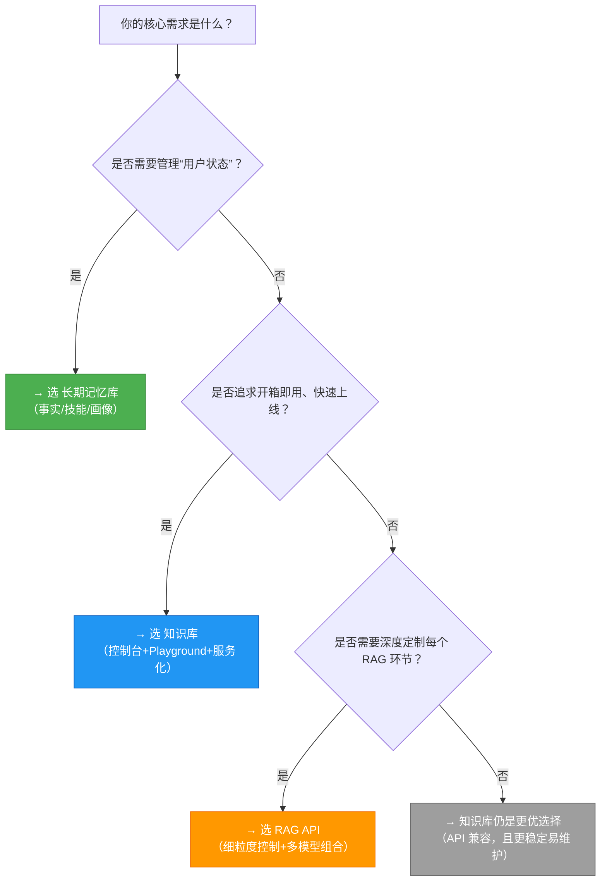

# RAG API、知识库与[长期记忆](../concepts/memory.md)库功能对比

本文档面向百炼平台开发者，旨在清晰区分 **RAG API**、**知识库（Knowledge Base）** 和 **[长期记忆](../concepts/memory.md)库（Long Term Memory）** 三大核心能力模块的定位、能力边界与适用场景。三者虽均涉及“私有知识管理”与“语义检索”，但在设计目标、数据模型、生命周期管理、集成方式及计费逻辑上存在本质差异。正确理解其差异是构建高可用、可演进 RAG 应用与智能体系统的关键前提。

---

## 关键维度对比

| 维度 | RAG API | 知识库（Knowledge Base） | [长期记忆](../concepts/memory.md)库（Long Term Memory） |
|------|---------|---------------------------|------------------------------|
| **本质定位** | **面向开发者的底层能力接口集合**：提供知识库全生命周期管理（创建/导入/更新/删除）、文档切片、向量索引、检索与问答服务的细粒度控制能力。强调可编程性与定制自由度。 | **面向应用的标准化服务载体**：以“知识库实例”为单位封装数据接入、向量化、检索与问答能力，通过控制台+API+Playground 提供开箱即用的服务化体验。强调易用性与生产就绪性。 | **面向用户状态建模的记忆中枢**：结构化存储和管理**动态演化的用户事实（Observation/Skill）与静态画像（Profile）**，支持语义搜索与跨会话上下文复用。强调状态感知与个性化。 |
| **输入格式** | 支持多源异构输入： • 文件 ID 列表（`docIds`） • OSS/飞书/钉钉等授权链接 • 数据库连接配置（MySQL/PostgreSQL） • 原始文本/HTML/Markdown/图片/音视频二进制流（需配合解析器） | 同 RAG API，但通过统一 UI/API 封装： • 拖拽上传文件（PDF/DOCX/XLSX/PNG/JPG/MP4 等） • 可视化配置数据源（OSS Bucket、数据库连接串、语雀空间等） • 支持批量导入与增量同步 | 结构化 JSON 输入为主： • `messages[]`（含 `text` + `image_url`）作为记忆内容源 • `profile_schema` ID 触发画像抽取 • `skill_name`/`skill_description` 显式定义技能 • 不直接接受原始文件，依赖内容解析与语义抽取 |
| **输出格式** | • 检索接口（`/retrieve`）：返回原始切片（`chunk_id`, `content`, `score`, `source`） • 问答接口（`/chat`）：流式 SSE 响应，含 `answer`, `references`, `thoughts`（Agentic 模式） • 管理接口（`/list`）：标准分页 JSON（`data`, `next_token`） | • 检索服务：同 RAG API 输出结构，但经统一服务层封装，支持多库联合与权重配置 • 问答服务：增强版自然语言回答，内置拒答、防泄漏、引用标注等策略 • Playground 输出：带高亮引用、溯源链接、调试元信息（召回切片、rerank 分数） | • `GET /memory_nodes`：精确匹配结果（`id`, `type`, `content`, `created_at`, `project_ids`） • `POST /search`：语义相似度搜索结果（`node_id`, `score`, `content`, `type`, `metadata`） • `GET /user_profile`：结构化 JSON 用户画像（按 schema 字段组织） • `GET /events/{id}`：异步任务状态与抽取结果（`skills`, `profile_fields`） |
| **支持模型** | • **Embedding**：`text-embedding-v4`, `qwen3-vl-embedding`（显式指定） • **Rerank**：`qwen3-rerank`, `qwen3-vl-rerank`（可 per-kb 配置） • **LLM（问答）**：`qwen3.7-plus`, `qwen3.6-plus`（由 `agent_config.agent_model` 控制） | • **Embedding**：默认 `text-embedding-v4`（创建后不可改） • **Rerank**：`qwen3-rerank`（文本）/ `qwen3-vl-rerank`（多模态），可动态启用 • **LLM（问答）**：`qwen3.6-plus` 等，支持 `temperature`, `enable_thinking` 等参数 | • **抽取模型**：内置专用模型（未公开名称），用于：   - Observation/Skill 识别与结构化   - Profile Schema 字段值抽取（支持多轮上下文） • **搜索模型**：基于统一 embedding 向量空间（不暴露具体模型名），支持 `min_score` 过滤（`pro` 版本） |
| **API 端点（典型）** | • 管理：`/api/v1/indices/rag/index/create_v2`, `/api/v1/indices/rag/index/job/create` • 检索：`/api/v1/indices/knowledge/search`, `/api/v1/indices/rag/index/retrieve` • 问答：`/api/v2/apps/knowledge/chat` | • 控制台服务调用：`/api/v1/indices/knowledge/search`, `/api/v2/apps/knowledge/chat`（与 RAG API 兼容） • CLI 封装：`bl knowledge search`, `bl knowledge chat` • Playground 调试：控制台内嵌 HTTP 请求 | • 写入：`POST /add`, `POST /add-async` • 检索：`GET /memory_nodes`, `POST /memory_nodes/search` • 画像：`POST /profile_schemas`, `GET /profile_schemas/{id}/user_profile` • 异步：`GET /events/{event_id}` |
| **计费方式** | • **按调用次数计费**：   - 知识库创建/更新/删除：按次   - 文档导入/切片：按文档页数或 token 数   - 检索（`/retrieve`）：按 QPS + 调用量   - 问答（`/chat`）：按 token（输入+输出）计费 • 所有费用归属业务空间（Workspace） | • **按知识库实例 + 使用量混合计费**：   - 知识库实例：按月/按小时（取决于部署模式）   - 检索/问答调用：同 RAG API（token/QPS）   - 向量化计算：按文档体积与切片数计费 • 控制台服务发布即产生实例费用 | • **按记忆操作与搜索调用计费**：   - `add`/`add-async`：按事件数（含抽取复杂度）   - `search`：按 `top_k` 与 `min_score` 计算资源消耗   - `GetUserProfile`：按次 • **分版本计费**：`Lite`（基础功能）与 `Pro`（支持 `min_score`, 多项目, 高级抽取） • 商业化起始时间：2026-08-20 10:00（CST） |
| **典型场景** | • 构建自定义 RAG 流水线（如：预处理 → 自定义切片 → 多模型 rerank → LLM 聚合） • 需要精细控制每个环节（如：替换 embedding 模型、跳过 rerank、自定义召回逻辑） • 与非百炼生态框架（如 LangChain 自研组件、LlamaIndex）深度集成 | • 快速上线企业知识问答机器人（HR政策/IT手册/产品文档） • 多源数据统一检索（OSS文档 + 数据库表格 + 钉钉会议纪要） • 低代码平台（Dify/Coze）对接百炼知识服务 • 需要 Playground 快速验证与 A/B 测试参数效果 | • 智能体（Agent）的长期状态管理：   - 记录用户习惯（“用户常在周五下午订会议室”）   - 存储可复用技能（“帮用户生成周报 PPT”）   - 构建用户画像（职位、技术栈、偏好风格） • 跨会话个性化推荐与响应（如：根据历史技能自动调用对应工具） |

---

## 各方案适用场景建议

### ✅ 推荐使用 **RAG API**
- 你正在构建一个**高度定制化、对性能与精度有极致要求**的 RAG 系统；
- 你需要**替换或组合多个 embedding/rerank/LLM 模型**（例如：用 `text-embedding-v3` + `qwen3-vl-rerank` + `qwen3.7-plus`）；
- 你的数据源非常规（如：自定义协议的内部系统、加密文档流），需要**绕过标准导入流程，直接注入切片**；
- 你已具备成熟的 DevOps 能力，需通过 CI/CD 自动化知识库构建与灰度发布；
- 你正在将百炼能力**嵌入到自有 Agent 框架中**，且需要完全掌控请求链路（如：自定义重试、熔断、日志埋点）。

### ✅ 推荐使用 **知识库（Knowledge Base）**
- 你希望**在 1 小时内完成一个可对外服务的知识问答应用**（如：客服知识库、内部 Wiki 助手）；
- 你的数据主要来自**标准文件（PDF/Word/Excel）或主流协作平台（钉钉/飞书/OSS）**；
- 你需要**可视化调试、A/B 参数对比、多知识库联合检索**等运营友好能力；
- 你使用 **Dify/Coze/LangChain 等低代码/框架平台**，追求“配置即服务”；
- 你关注**服务稳定性与 SLA**，希望平台自动处理索引重建、故障转移、容量伸缩。

### ✅ 推荐使用 **长期记忆库（Long Term Memory）**
- 你正在开发一个**具备长期记忆能力的智能体（Agent）**，需记住用户偏好、历史行为、技能习惯；
- 你需要**自动化从对话中提取结构化事实**（如：“用户下周要去上海出差” → `observation` 类型记忆）；
- 你希望为用户提供**千人千面的交互体验**（如：根据画像自动切换回答语气、推荐相关技能）；
- 你的应用涉及**多项目/多租户隔离**（如：SaaS 平台为不同客户维护独立记忆空间）；
- 你需要**跨会话复用技能**（如：用户第一次教 Agent “如何导出财务报表”，后续可直接调用该技能）。

---

## 技术选型决策树（面向开发者）

> **重要提醒**：
> - **不要混淆“知识库实例”与“长期记忆库”**：前者存储**静态、共享、领域知识**（如公司制度）；后者存储**动态、私有、用户专属状态**（如用户个人日程）。二者可协同使用（例如：Agent 用长期记忆判断“用户想查报销政策”，再调用知识库检索具体条款）。
> - **RAG API 是知识库的底层实现**：控制台创建的知识库，其背后即调用 RAG API 完成索引构建与服务发布。因此，知识库是 RAG API 的“产品化封装”，而非并列替代方案。
> - **长期记忆库不替代知识库**：它不支持文档解析、表格 NL2SQL、音视频转写等知识库特有能力；也不提供“知识检索服务”这类

## 被对比主题页

- [rag api](../api/rag-api.md)
- [knowledge base](../guides/knowledge-base.md)
- [long term memory new](../api/long-term-memory-new.md)

