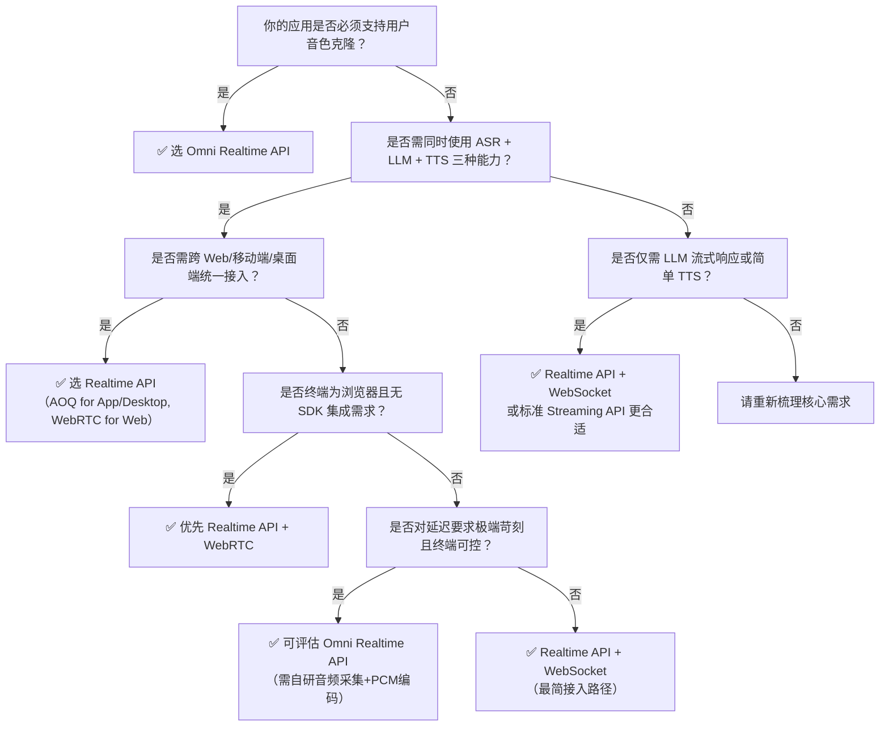

# 实时API方案对比：Omni Realtime API vs Realtime API

本文旨在帮助开发者快速理解百炼平台两类核心实时交互接口的定位差异、能力边界与技术约束，为语音驱动型应用（如智能客服、会议助手、虚拟人、实时翻译等）提供清晰、可落地的技术选型依据。Omni Realtime API 与 Realtime API 均面向低延迟流式交互场景，但设计目标、协议架构、模型支持和适用终端存在本质区别：前者是**单模型、全栈一体化、强实时性**的专用通道；后者是**多模型、多协议、高灵活性**的通用实时能力平台。正确区分二者，可避免接入成本误判、功能不可用或性能不达标等问题。

## 关键维度对比

| 维度 | Omni Realtime API | Realtime API |
|------|-------------------|--------------|
| **核心定位** | 专为端到端超低延迟[多模态](../concepts/multimodal.md)对话优化的**单一模型专用通道**（`qwen-omni-realtime`），强调 ASR→LLM→TTS 全链路流式协同与音色克隆能力 | 面向企业级多场景的**统一实时能力平台**，支持多模型、多协议（AOQ/WebRTC/WebSocket）、[多模态](../concepts/multimodal.md)组合，强调协议适配性与部署灵活性 |
| **输入格式** | 严格限定：PCM16 小端、16 kHz 采样率、单声道音频二进制帧；文本输入通过 `input.text` 事件（非主流） | 支持 PCM 音频（各协议均要求 `"pcm"`）；文本输入通过 `input.text` 事件；**不接受 WAV/MP3 等封装格式**；AOQ/WebRTC 对音频采集链路有额外设备层约束 |
| **输出格式** | 流式结构化事件：`output.text.delta`（文本片段）、`output.audio.delta`（PCM16 音频片段）、`output.audio.done`（合成完成）；支持中间识别结果（`enable_interim_results`） | 同样输出 `text.delta` 和 `audio.delta` 事件；但**WebRTC 协议下不输出 `audio.delta` 或 `text.delta` 的原始流事件**，需通过 WebRTC DataChannel 或 MediaStream 处理；AOQ/WebSocket 支持完整事件语义 |
| **支持模型** | 仅支持 `qwen-omni-realtime`（v1.0+），**不兼容 `qwen-audio`、`qwen-vl` 或任何 `qwen3.5-*` 系列模型** | 支持多模型： • 全模态对话：`qwen3.5-omni-plus-realtime`、`qwen3.5-omni-flash-realtime` • 实时翻译：`qwen3.5-livetranslate-flash-realtime` • ASR：`Qwen-Audio-3.0-ASR-Flash-Streaming`、`Fun-ASR-Realtime`（**AOQ/WebSocket 支持，WebRTC 不支持**） • TTS：`CosyVoice`、`qwen-audio-3.0-tts-flash`（**AOQ/WebSocket 支持，WebRTC 不支持**） |
| **API 端点与协议** | **仅 WebSocket**： `wss://dashscope.aliyuncs.com/realtime/qwen-omni-realtime/v1?api_key=...` 强制双向流，无 HTTP/SSE 回退选项 | **三协议可选**： • AOQ（基于 QUIC 的媒体传输协议）：需服务端 `/api/v1/allocate` 分配临时凭证 • WebRTC：SDP 协商建连，适合浏览器/轻客户端 • WebSocket：类 Omni 接口风格，但模型更丰富 通过请求头 `x-dashscope-rtc-transport: moq/webrtc/websocket` 指定 |
| **计费方式** | 按**会话时长（秒）计费**，以实际 WebSocket 连接持续时间为准（含静默期）；180 秒/会话上限，超时需重连并重新计费 | 按**模型调用粒度计费**： • ASR/TTS：按音频时长（秒） • LLM：按 token 数量（输入+输出） • 翻译/[多模态](../concepts/multimodal.md)套件：按请求次数或时长混合计费 **不同协议不改变计费模型，仅影响传输效率与资源消耗** |
| **典型场景** | • 虚拟人实时对话（需音色克隆+唇动同步） • 金融/政务热线客服（端到端 < 800ms P95 延迟要求） • AR/VR 设备本地语音交互（强依赖 PCM 直传与低开销） | • 跨平台会议助手（Web 端用 WebRTC，App 端用 AOQ） • 多语言实时字幕系统（ASR + 翻译 + TTS 组合） • 智能硬件 SDK 集成（Linux/嵌入式设备使用 AOQ） • 渐进式 Web 应用（PWA）中浏览器原生 WebRTC 接入 |
| **音色克隆支持** | ✅ 原生支持，通过 `voice_id` 参数启用；需提前上传参考音频注册音色 | ❌ **不支持**；Realtime API 的 TTS 模型仅提供预置音色（如 `"Ethan"`），无用户自定义音色克隆能力 |
| **连接生命周期管理** | 单次会话最长 180 秒；超时自动断连；需客户端主动重连并重建会话；无服务端会话保持机制 | 会话有效期由服务端分配（如 AOQ `sidExpiresInSecs=7200`）；支持长连接保活；SDK 内置自动重连与状态迁移（如 `Failed` → `Disconnected`） |
| **客户端 SDK 支持** | 提供 Python / Java 官方 SDK，高度封装 WebSocket 交互与事件解析；**无前端（Web/iOS/Android）SDK** | 提供全平台 SDK： • AOQ：Android/iOS/HarmonyOS/Windows/macOS/Electron/Linux（注意：Linux 版无音频设备控制能力） • WebRTC：JavaScript SDK（浏览器环境） • WebSocket：通用 HTTP/WebSocket 客户端即可接入 |

## 各方案的适用场景建议

### ✅ 选择 Omni Realtime API 当且仅当：
- 业务场景**强依赖音色克隆能力**（如品牌虚拟人、个性化客服语音）；
- 终端具备稳定 WebSocket 连接能力（如桌面 App、IoT 设备、后台服务），且**无需浏览器原生支持**；
- 对端到端延迟有极致要求（P95 < 800ms），且愿意接受单模型限制与严格音频格式约束（16kHz PCM16）；
- 架构团队具备 WebSocket 连接管理、心跳保活、异常重连等底层能力，或可直接复用官方 Python/Java SDK。

### ✅ 选择 Realtime API 当且仅当：
- 需要**灵活组合不同模型能力**（例如：先用 ASR 识别，再调用 LLM 推理，最后用 TTS 合成）；
- 面向**多终端统一接入**：Web 端用 WebRTC、移动端用 AOQ、PC 端用 AOQ 或 WebSocket；
- 需要**实时语音翻译、多语种支持或复杂多模态套件**（如 `multimodal-dialog`）；
- 客户端环境受限（如 Linux 嵌入式设备、无麦克风权限的浏览器），需利用 AOQ Relay 中转或 WebRTC NAT 穿透能力；
- 希望规避音色克隆的合规与数据管理成本，使用平台预置高质量音色即可。

### ⚠️ 明确不推荐的误用场景：
- 在 Web 页面中强行使用 Omni Realtime API（需自行实现 WebSocket 音频采集与 PCM 编码，无浏览器音频 API 封装，开发成本极高）；
- 在 Realtime API 的 WebRTC 连接中尝试调用 ASR 或 TTS 模型（协议层明确不支持，将返回错误）；
- 期望在 Omni Realtime API 中使用 `qwen3.5-omni-plus-realtime` 等新模型（模型不兼容，会返回 400）；
- 将 Realtime API 的 AOQ SDK 直接用于需要音色克隆的虚拟人项目（功能缺失，无法满足需求）。

## 技术选型决策树（面向开发者）

> **最后提醒**：  
> - **安全第一**：API Key **严禁硬编码于前端代码或客户端二进制中**。Realtime API 的 AOQ/WebRTC 均要求服务端代理鉴权；Omni Realtime API 的 WebSocket 握手虽携带 `api_key`，也应通过后端网关转发并做访问控制。  
> - **测试先行**：务必在真实网络环境（尤其弱网、高丢包）下验证连接成功率、首字延迟（TTFT）与端到端延迟（TTS）。Omni 的 16kHz 强制要求与 Realtime 的 WebRTC SDP 协商失败是高频问题根源。  
> - **文档同步**：所有协议细节、参数变更、模型下线通知均以 `/raw/model-api-reference/` 下的最新 Markdown 文档为准，旧版示例代码可能存在过时配置（如 Omni 的 `sample_rate` 默认值陷阱）。  

—— 百炼平台技术文档组｜2024 年 Q3

## 被对比主题页

- [omni realtime api](../api/omni-realtime-api.md)
- [realtime api user guide](../api/realtime-api-user-guide.md)

