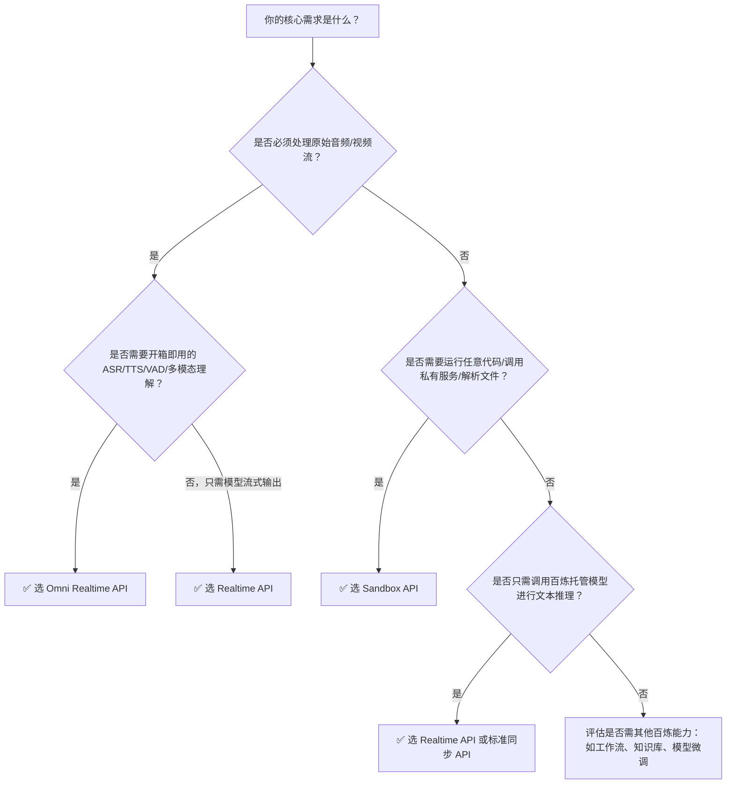

# 实时推理API、沙箱API与Omni Realtime API对比

为帮助开发者在百炼平台中快速识别并选用最适合业务需求的实时交互能力接口，本文对三类核心实时服务接口——**实时推理API（Realtime API）**、**沙箱API（Sandbox API）** 与 **Omni Realtime API** 进行系统性对比。三者虽均面向“实时”场景，但在设计目标、技术范式、能力边界与适用层级上存在本质差异：  
- **Realtime API** 是轻量级、低延迟的**模型原生流式调用通道**，聚焦于端到端语音/文本/视频流的实时理解与生成；  
- **Sandbox API** 是基础设施级的**可编程执行环境管理接口**，不直接提供模型能力，而是为代码执行、工具链集成、Agent 数据面提供隔离、可控、可扩展的运行沙箱；  
- **Omni Realtime API** 是面向多模态语音交互场景的**全栈式实时会话引擎**，深度融合 ASR/TTS/VAD/LLM/工具调用，以会话（session）为单位抽象交互生命周期，支持 WebRTC 原生浏览器接入。

本对比面向一线开发者，强调技术选型的可操作性，涵盖协议、输入输出、模型支持、计费逻辑等关键维度，并给出明确的场景建议。

## 关键维度对比

| 维度 | 实时推理API（Realtime API） | 沙箱API（Sandbox API） | Omni Realtime API |
|------|-----------------------------|-------------------------|--------------------|
| **核心定位** | 模型层流式推理接口（WebSocket 原生） | 基础设施层沙箱环境管理接口（RESTful + E2B 兼容） | 多模态实时会话引擎（AOQ/WebSocket/WebRTC 三协议支持） |
| **通信协议** | WebSocket（`wss://dashscope.aliyuncs.com/realtime/v1/chat`） | RESTful HTTP（`https://{workspace_id}.cn-beijing.maas.aliyuncs.com/api/v1/agentstudio/sandbox`） | AOQ（推荐）、WebSocket、WebRTC（浏览器直连） |
| **输入格式** | 结构化 `input` 消息： • 文本：`{"role":"user","content":"..."}` • 音频：PCM 分片（base64，16kHz 单声道 int16） • 视频：帧流（需 `qwen-video-realtime-v1`） | 无直接模型输入；通过 `POST /sandboxes/{id}/connect` 获取 `domain` 后，使用 E2B 协议向沙箱内进程发送 stdin/stdout 数据（如 Python 代码、HTTP 请求） | 客户端事件驱动： • `input_audio`（PCM/WAV，8k–48k 采样率） • `conversation.item.created`（文本消息） • `session.update`（配置变更） |
| **输出格式** | 流式 `output` 消息： • `delta` 字段增量 token • `stop` / `interrupted` 事件 • `function_call` 结构体（含 `name`, `arguments`） | 无模型输出；沙箱运行结果通过 E2B 协议返回 stdout/stderr/文件读取响应（JSON 或原始二进制）；状态变更通过 REST 响应返回（如 `GET /sandboxes/{id}` 返回实例状态） | 异步事件流： • `conversation.item.created`（含 `text`, `audio`, `function_call`） • `input_audio_buffer.committed`（ASR 提交确认） • `conversation.item.input_audio_transcription.delta`（实时转写流） • `speech_started`/`speech_stopped`（VAD 事件） |
| **支持模型** | • `qwen-text-realtime-v1`（纯文本流式对话） • `qwen-audio-realtime-v1`（音频流 ASR+LLM） • `qwen-video-realtime-v1`（音视频联合理解） | **不提供模型**；提供运行模型的沙箱环境（如 `code-interpreter-v1` 模板可部署自定义推理服务） | • `qwen3.8-omni-flash-realtime`（推荐，支持 semantic VAD/MCP/compact 视频） • `qwen3.5-omni-plus-realtime` / `qwen3.5-omni-flash-realtime`（主力通用） • `qwen3-omni-flash-realtime`（基础版） |
| **API 端点** | `wss://dashscope.aliyuncs.com/realtime/v1/chat?apiKey=<key>`（地域强绑定） | `https://{workspace_id}.cn-beijing.maas.aliyuncs.com/api/v1/agentstudio/sandbox`（仅 `cn-beijing`） | • AOQ: `wss://dashscope.aliyuncs.com/aoq/v1/chat?apiKey=<key>` • WebSocket: `wss://dashscope.aliyuncs.com/omni-realtime/v1/chat?apiKey=<key>` • WebRTC: 通过 `session.create` 获取信令服务器地址 |
| **计费方式** | 按 **实际消耗 token 数** 计费（输入 + 输出），音频/视频流按等效文本 token 折算；免费额度按月重置；企业版支持配额管控 | 按 **沙箱实例运行时长 × 资源规格** 计费（如 2C4G × 秒）；模版构建不计费；空闲暂停不计费；支持按需与预留资源包 | 按 **会话时长 + 输出 token + 输出音频时长** 组合计费： • 会话建立与保活：按秒计费 • 文本输出：按 token 计费 • 音频输出：按秒计费（WAV/PCM） • ASR 输入：按音频秒数折算 token 计费 |
| **典型场景** | • 低延迟语音助手（端侧麦克风→云端流式响应） • 实时会议字幕+摘要 • 游戏内 NPC 对话（需毫秒级响应） | • Agent 执行 Python 工具链（如 Pandas 数据分析、Selenium 浏览器操作） • 安全沙箱中运行用户上传代码 • 构建可插拔的函数计算数据面（如调用私有 API、数据库） | • 智能客服（电话/网页语音接入，支持打断、静音检测、TTS 回复） • 语音控制智能家居（多轮语义理解+设备调用） • 实时双语会议翻译（ASR+LLM+TTS 全链路） |
| **会话状态管理** | 支持 `session_id` 复用，服务端保持上下文（最长 300 秒连接生命周期） | 无内置会话概念；状态由沙箱实例生命周期（`running`/`paused`/`released`）和用户代码逻辑共同维护 | 以 `session` 为核心抽象，支持 `session.update` 动态调整参数；`idle_timeout_ms` 控制静默超时；会话可跨连接恢复（需客户端维护 session ID） |
| **客户端控制能力** | • `interrupt` 事件主动中断生成 • `pause`/`resume`（需 SDK 支持） • 自定义 `max_output_tokens` | • `pause`/`resume`/`delete` 实例 • `autoPause` 设置到期行为 • `network.allowOut` 控制外网访问 | • `speech_started`/`speech_stopped` 反馈 VAD 状态 • `turn_detection.type` 切换声学/语义 VAD • `enable_search` 动态启用联网搜索（与 tools 互斥） |
| **SDK 支持** | 官方 AOQ SDK（v2.3.0+）强烈推荐；封装重连、心跳、分片、错误恢复 | 兼容 E2B 官方 SDK（需配置 `api_key` 占位符）；百炼提供 Python/Java SDK 封装模版/实例管理 | 官方 Python/Java SDK（含 AOQ/WebSocket 封装）；WebRTC 场景需配合 `@qwen/omni-realtime-web` 前端库 |

## 各方案适用场景建议

### ✅ 推荐选择 **实时推理API（Realtime API）** 当：
- 你的应用需要**最简路径接入百炼原生模型流式能力**，且对端到端延迟极度敏感（目标 < 500ms）；
- 输入是标准音频流（16kHz PCM）或纯文本流，无需复杂预处理或后处理逻辑；
- 场景聚焦于**单次会话内的模型推理闭环**（如语音转文字+回答），不涉及外部代码执行或工具链编排；
- 已有 WebSocket 客户端能力，或愿意采用 AOQ SDK 快速集成；
- **避免选用**：需运行 Python 脚本、调用私有 API、解析 PDF/Excel 等非模型任务；需长期会话（>5 分钟）或跨连接状态持久化。

### ✅ 推荐选择 **沙箱API（Sandbox API）** 当：
- 你需要**完全可控、隔离、可编程的执行环境**来运行任意代码（Python/Node.js/Shell）；
- 核心诉求是 **Agent 的“行动层”（Action Layer）**，例如：调用内部数据库、执行 Selenium 自动化、运行自定义 ML 模型、解析二进制文件；
- 模型能力由你自行部署（如 FastAPI 封装的 Qwen-VL），沙箱作为其运行载体；
- 需要精细的资源控制（CPU/内存/网络策略）和生命周期管理（自动暂停、超时释放）；
- **避免选用**：仅需调用百炼托管模型；对延迟要求极高（沙箱启动冷启动约 3–10 秒）；需原生音频流式传输（需额外在沙箱内实现 WebSocket/RTMP 代理）。

### ✅ 推荐选择 **Omni Realtime API** 当：
- 你的产品是**面向终端用户的语音交互产品**（如智能音箱 App、网页客服、呼叫中心），需开箱即用的 ASR+LLM+TTS+VAD 全栈能力；
- 要求**自然的人机对话体验**：支持语音打断、静音检测、多轮上下文、音色定制、双语输出；
- 需要 **WebRTC 浏览器直连**（免客户端安装），或深度集成 AOQ 协议实现极致低延迟；
- 愿意接受更高抽象层级（以 `session` 为中心），换取更少的底层协议细节处理；
- **避免选用**：仅需文本对话（Realtime API 更轻量）；需运行沙箱级代码（此时应组合 Omni + Sandbox：Omni 处理语音，调用 Sandbox 执行工具）；预算严格受限且无语音刚需（Omni 计费维度更多）。

## 技术选型决策树（面向开发者）

> **重要提示**：三者并非互斥，而是互补。生产级 Agent 架构常组合使用：  
> **Omni Realtime API**（语音入口 + 对话管理） → **调用工具** → **Sandbox API**（执行 Python 数据分析） → **返回结果** → **Omni 输出 TTS**。  
> 此类混合架构需注意：Omni 的 `tools` 参数需指向沙箱暴露的 HTTP Endpoint，而非直接嵌入代码。

---  
*最后更新：2024年10月*  
*文档依据：百炼平台 v2024.Q3 公开文档集*

## 被对比主题页

- [realtime api user guide](../api/realtime-api-user-guide.md)
- [sandbox api](../api/sandbox-api.md)
- [omni realtime api](../api/omni-realtime-api.md)

