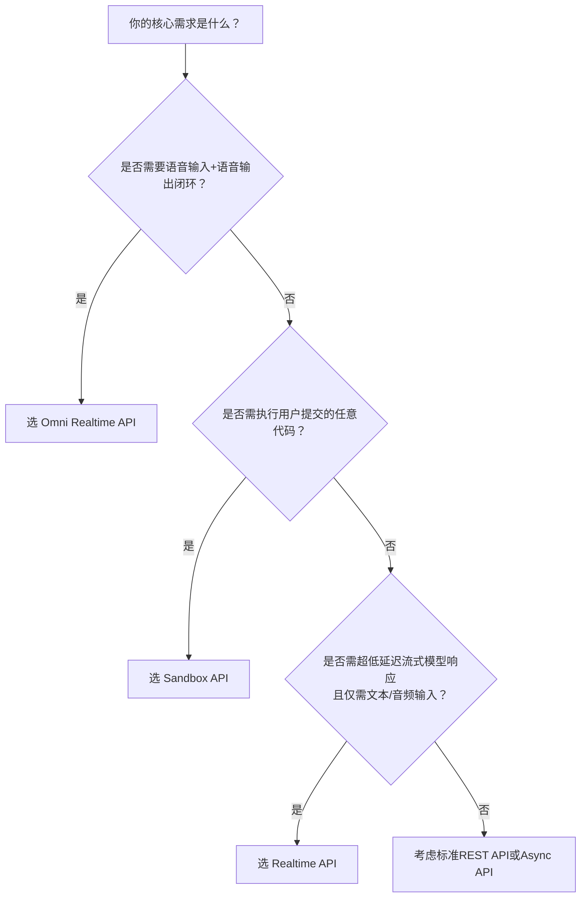

# 实时API、沙箱环境与Omni实时API对比

本文档面向百炼平台开发者，旨在清晰区分三种核心能力接口：**Realtime API**（基础流式推理）、**Sandbox API**（安全代码执行沙箱）和 **Omni Realtime API**（全栈多模态语音交互）。三者定位迥异，不存在功能重叠或替代关系，选型错误将导致架构失配、开发返工或体验降级。本对比聚焦技术本质差异，帮助开发者依据场景需求、协议约束、模型能力与运维成本做出精准决策。

## 关键维度对比

| 维度 | Realtime API | Sandbox API | Omni Realtime API |
|------|--------------|-------------|-------------------|
| **核心定位** | 低延迟模型推理接口（文本/音频/图像流式理解） | 安全隔离的用户代码执行环境（非模型推理专用） | 端到端多模态语音交互系统（理解+生成+合成+VAD一体化） |
| **通信协议** | WebSocket（强制长连接） | HTTP REST（同步请求-响应） | WebSocket / QUIC / WebRTC（支持原生音视频传输） |
| **输入格式** | `init`消息（JSON）+ `input`消息（`audio_chunk`二进制或`text`字符串） | `code`（Base64编码源码）或 `template_id`（预置镜像ID） | `session.update`（JSON配置） + `input_audio_buffer.append`（原始PCM帧） + 文本指令 |
| **输出格式** | 流式`output`事件（含`delta`、`tool_calls`、`finish_reason`等字段） | 同步JSON响应（含`stdout`、`stderr`、`exit_code`、`execution_time_ms`） | 事件驱动流（`conversation.item.created`、`input_audio_buffer.speech_started`、`output_audio` Base64等） |
| **支持模型** | `qwen-audio-realtime-v1`、`qwen2.5-7b-instruct-realtime-v1`、`qwen-vl-realtime-v1`（仅3个专用实时模型） | **不直接支持模型**；需用户在沙箱内自行加载（如PyTorch/TensorFlow），依赖模板预装框架 | `qwen3.8-omni-flash-realtime`、`qwen3.5-omni-flash-realtime`等5+个Qwen-Omni系列专用模型（含VAD、TTS、工具调用深度集成） |
| **API端点** | `wss://dashscope.aliyuncs.com/realtime/v1/chat?apiKey=...` | `POST https://dashscope.aliyuncs.com/v1/sandboxes`（及配套状态/输出/删除端点） | `wss://dashscope.aliyuncs.com/omni/v1/realtime?apiKey=...`（或QUIC/WebRTC专用地址） |
| **计费方式** | 按**实际消耗Token数**计费（输入+输出），音频按采样率/时长折算Token；会话超时（300秒）后停止计费 | 按**实例运行时长（秒）×资源配置**计费（CPU/内存），与代码逻辑复杂度无关；超时自动销毁并停止计费 | 按**会话时长（秒）+ 输出Token + 输出音频时长（秒）** 组合计费；VAD检测、工具调用、搜索均计入消耗 |
| **典型场景** | - 语音转写+实时摘要 - 文本对话中动态调用工具（如查天气） - 图文混合内容的即时分析（如拍照问图） | - 用户提交Python脚本验证数据清洗逻辑 - 执行Shell命令解析日志文件 - 在隔离环境中加载轻量模型做特征预处理 | - 全双工语音助手（边说边听边答） - 智能客服电话坐席实时辅助（VAD检测客户停顿、自动生成应答+语音播报） - 多模态会议纪要（语音输入+PPT截图理解+结构化输出+语音播报） |
| **会话状态管理** | 支持`session_id`维持上下文，但**不支持跨会话恢复**；中断后需新建会话 | **无会话概念**；每次调用为独立无状态执行，资源启动即销毁 | 强会话生命周期管理（`session.created` → `session.updated` → `session.ended`）；支持`interrupt`、`cancel`、`pause`等精细控制 |
| **音视频能力** | 音频：仅**单向输入**（流式上传），不支持语音合成输出；图像：仅静态图输入 | 不支持音视频处理（网络外连受限，无音频设备抽象） | **全链路音视频支持**：双向音频I/O（多通道PCM）、可配置TTS音色/采样率/格式、语义VAD、端到端延迟<300ms（实测） |
| **工具调用能力** | 支持标准Function Calling（`tools` + `tool_choice`） | 需用户代码自行实现HTTP调用逻辑，平台不提供工具注册/路由能力 | 同时支持Function Calling与MCP协议；`tools`与`enable_search`互斥，模型自主决策触发时机 |

## 各方案适用场景建议

### ✅ 选择 Realtime API 当：
- 你已有成熟的前端音频采集链路（如Web Audio API），只需将PCM/Opus流送入模型做**实时理解**（非合成）；
- 场景以**文本交互为主**，偶有图片/音频输入需求，且对端到端延迟要求严苛（<1s）；
- 需要轻量级工具调用（如调用内部API获取订单状态），但无需语音播报反馈；
- 架构已基于WebSocket构建，希望最小化协议迁移成本。

> ⚠️ 注意：不适用于需要语音播报、多轮语音打断、语义级静音检测的场景。

### ✅ 选择 Sandbox API 当：
- 你需要**安全执行不可信用户代码**（如低代码平台中的自定义函数）；
- 模型推理前需进行**定制化数据预处理**（如PDF解析、OCR后结构化、加密解密），且该逻辑无法用百炼内置节点表达；
- 运行环境需**严格隔离**（如金融合规场景），且执行时间短（<5分钟）、资源消耗可控；
- 你拥有容器运维能力，或愿意复用平台提供的Python/Bash模板。

> ⚠️ 注意：不适用于任何模型推理主路径；沙箱内加载大模型将严重超时或OOM。

### ✅ 选择 Omni Realtime API 当：
- 你的产品是**语音优先交互系统**（智能硬件、呼叫中心、车载语音），需开箱即用的VAD、TTS、全双工流控；
- 要求**端到端体验闭环**：用户说话→模型理解→调用工具→生成文本+语音→实时播放，全程无感知切换；
- 需要**高级语音控制能力**：如语义VAD（区分思考停顿与结束）、多声道会议分离、动态调整合成音色；
- 接受更高接入复杂度，换取开箱即用的多模态交互能力，避免自研VAD/TTS/流控模块。

> ⚠️ 注意：若仅需文本生成，此方案过度设计且成本显著更高；不兼容传统REST调用习惯。

## 技术选型决策树（面向开发者）

```mermaid
graph TD
    A[你的核心需求是什么？] --> B{是否需要语音输入+语音输出闭环？}
    B -->|是| C[选 Omni Realtime API]
    B -->|否| D{是否需执行用户提交的任意代码？}
    D -->|是| E[选 Sandbox API]
    D -->|否| F{是否需超低延迟流式模型响应<br>且仅需文本/音频输入？}
    F -->|是| G[选 Realtime API]
    F -->|否| H[考虑标准REST API或Async API]
```

**关键提醒**：
- **不要混用协议**：Realtime API 与 Omni Realtime API 均使用 WebSocket，但消息格式、事件语义、认证方式完全不兼容，SDK 不能通用。
- **模型不可互通**：`qwen2.5-7b-instruct-realtime-v1` 无法在 Omni 接口调用；`qwen3.5-omni-flash-realtime` 无法在 Realtime 接口调用。
- **计费敏感场景必测Token**：Omni API 的音频输入Token计算复杂（多通道×2），Realtime API 的音频编码校验严格（仅PCM/Opus，禁MP3/WAV），务必在POC阶段实测计费量级。
- **生产环境强推SDK**：三者均提供官方AOQ/Python/Java SDK，封装了重连、心跳、分片、buffer管理等易错逻辑，**禁止手写底层WebSocket/HTTP客户端**。

---  
*最后更新：2024年10月*  
*文档版本：v2.3.1*

## 被对比主题页

- [realtime api user guide](../api/realtime-api-user-guide.md)
- [sandbox api](../api/sandbox-api.md)
- [omni realtime api](../api/omni-realtime-api.md)

