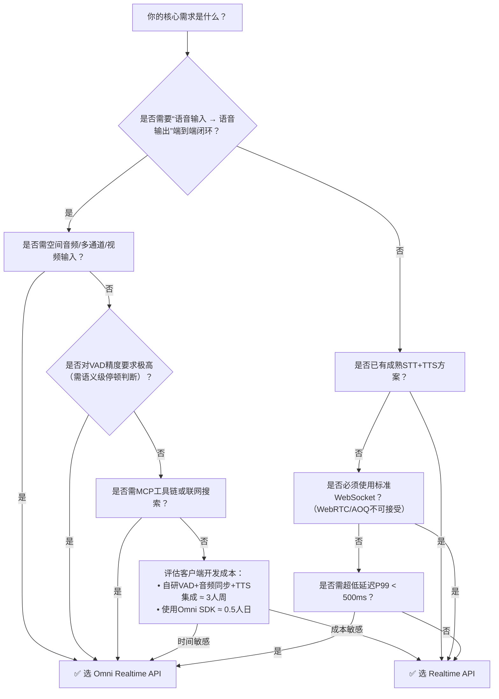

# 实时API方案对比：Omni Realtime API vs Realtime API User Guide

本文档面向百炼平台开发者，旨在清晰对比两类核心实时推理能力接口——**Omni Realtime API** 与 **Realtime API User Guide（标准 Realtime API）**，帮助技术团队基于场景需求、协议约束、模型能力及工程成本做出精准选型。二者虽同属低延迟流式交互体系，但在设计目标、协议抽象层级、多模态支持深度及适用边界上存在本质差异：Omni Realtime API 是面向终端交互产品的**全栈式实时智能体协议**，而标准 Realtime API 是面向模型能力解耦的**轻量级实时模型接入规范**。

---

## 关键维度对比

| 维度 | Omni Realtime API | Realtime API User Guide |
|------|-------------------|--------------------------|
| **定位与目标** | 面向终端产品（如语音助手、会议系统）的**端到端实时智能体协议**，内置VAD、音色合成、会话状态机等交互原语 | 面向AI工程师的**模型能力直连接口**，聚焦低延迟流式调用，由客户端承担更多交互逻辑（如VAD、TTS集成） |
| **输入格式** | 支持多模态混合输入： • 音频：PCM/WAV（8k/16k/24k/48k Hz，单/双/四通道） • 视频：帧级输入（仅 `qwen3.8-omni-flash-realtime`） • 文本：`input_text` 事件或 `conversation.item.input` | 按模型类型隔离输入： • `qwen-audio-realtime-v1`：仅 PCM/Opus 音频流 • `qwen-video-realtime-v1`：H.264 视频帧 + PCM 音频流 • `qwen-chat-realtime-v1`：纯文本流 **不支持跨模态混合输入** |
| **输出格式** | 原生支持**文本+音频联合输出**： • `response.text.delta`（流式文本） • `response.audio.delta`（原始 PCM/WAV 音频流片段） • 可配置采样率（最高 48kHz）、格式（`pcm`/`wav`）、音色（`Tina`/`Cherry`） | 输出模态与模型强绑定： • `qwen-audio-realtime-v1`：ASR文本 + LLM响应文本（无合成语音） • `qwen-video-realtime-v1`：视频理解结果文本 • `qwen-chat-realtime-v1`：纯文本流 **不提供内置TTS音频输出** |
| **支持模型** | 专属 Omni 系列模型： `qwen3.5-omni-flash-realtime` `qwen3.5-omni-plus-realtime` `qwen3.8-omni-flash-realtime`（含空间音频、MCP工具、视频输入） `qwen3-omni-flash-realtime` / `qwen-omni-turbo-realtime`（参数受限） | 通用 Realtime 模型族： `qwen-audio-realtime-v1`（ASR+LLM） `qwen-video-realtime-v1`（音视频联合理解） `qwen-chat-realtime-v1`（纯文本对话） **不支持 Omni 系列模型** |
| **传输协议** | **三协议可选**： • WebSocket（推荐，全功能支持） • WebRTC（端到端加密、NAT穿透优化） • AOQ（阿里自研轻量协议，适用于IoT设备） | **仅 WebSocket**： `wss://dashscope.aliyuncs.com/realtime/v1/{model}` （HTTP/2 双向流为2025 Q1规划中，当前不可用） |
| **核心交互能力** | ✅ 内置实时语音活动检测（`server_vad` / `semantic_vad`） ✅ 自动 `speech_started`/`speech_stopped` 事件驱动 ✅ 工具调用双轨支持（Function Calling + MCP） ✅ 联网搜索（`enable_search`，部分模型） ✅ 多声道音频Token精确计算 | ✅ 客户端主动中断（`/interrupt` 事件） ✅ 会话状态保持（`session_id` 复用） ✅ System [prompt](../guides/prompt.md) 动态注入 ❌ 无内置VAD，需客户端实现音频切分 ❌ 无工具调用能力（`qwen-chat-realtime-v1` 除外，但无MCP） ❌ 不支持联网搜索 |
| **API 端点** | 统一端点（协议无关）： `wss://dashscope.aliyuncs.com/omni-realtime/v1`（WebSocket） `webrtc://...`（WebRTC） `aoq://...`（AOQ） | 模型专属端点： `wss://dashscope.aliyuncs.com/realtime/v1/qwen-audio-realtime-v1` `wss://dashscope.aliyuncs.com/realtime/v1/qwen-video-realtime-v1` `wss://dashscope.aliyuncs.com/realtime/v1/qwen-chat-realtime-v1` |
| **计费方式** | 按 **实际消耗 Token 数** 计费： • 输入 Token：音频按声道数加权计算（2/4声道 = 单声道×2），视频帧按分辨率折算 • 输出 Token：文本 Token + 音频时长折算 Token（固定系数） • 所有调用计入「Omni 实时推理」配额 | 按 **模型调用次数 + 输入数据量** 计费： • 音频/视频流按秒计费（基础单价） • 文本输入按字符数折算 • 所有调用计入「实时推理」通用配额（与 Omni 分离） |
| **典型场景** | • 全链路语音助手（听-思-说闭环） • 智能会议系统（实时转录+发言人分离+语音播报纪要） • 多模态客服机器人（客户视频+语音+文字联合理解） • 空间音频交互应用（如AR语音导航） | • 实时语音转写（ASR）+ 后续文本LLM处理 • 视频内容实时分析（如直播违规识别） • 文本聊天机器人（需自行集成TTS/STT） • 边缘设备轻量推理（因协议简单，SDK体积小） |

---

## 适用场景建议

### ✅ 选择 Omni Realtime API 当：
- 你需要**开箱即用的“语音输入→模型思考→语音输出”完整闭环**，且对端到端延迟（P95 < 800ms）有严苛要求；
- 产品需支持**空间音频、多通道会议音频、视频帧输入**等高级多模态能力；
- 团队希望**降低客户端复杂度**：无需自研VAD、无需集成第三方TTS、无需管理音频编解码与同步；
- 场景涉及**语义级交互控制**（如 `semantic_vad` 判断用户是否说完）、**MCP工具链集成**（如调用企业知识库、CRM系统）；
- 项目处于快速验证期，需官方 Python/Java SDK 提供连接管理、事件解析、重试容错等生产级封装。

### ✅ 选择 Realtime API User Guide 当：
- 你已有成熟的 STT/TTS/视频解码模块，只需**将大模型能力嵌入现有音视频流水线**；
- 场景为**单模态强需求**（如纯ASR高精度转写、视频关键帧分析），无需跨模态联合建模；
- 对**协议兼容性要求高**（如必须使用标准 WebSocket，不接受WebRTC/AOQ）；
- 需要**细粒度控制模型行为**（如动态切换 system [prompt](../guides/prompt.md)、频繁中断/恢复会话）；
- 项目部署在资源受限环境（如低端IoT设备），需最小化SDK依赖，且能接受手动实现VAD与音频缓冲。

> ⚠️ 注意：二者**不可混用**。Omni Realtime API 的模型无法通过 Realtime API 端点调用，反之亦然。配额、计费、监控指标均独立计量。

---

## 技术选型决策树（面向开发者）

> 💡 **一句话总结**：  
> **Omni Realtime API 是“交钥匙”实时智能体协议；Realtime API 是“乐高积木”式模型能力接口。前者省力，后者灵活。**

---  
*最后更新：2025年4月*

## 被对比主题页

- [omni realtime api](../api/omni-realtime-api.md)
- [realtime api user guide](../api/realtime-api-user-guide.md)

