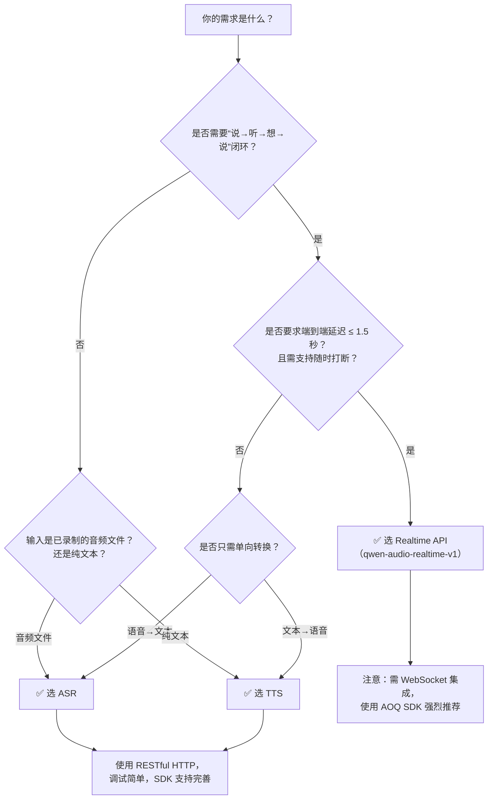

# 语音合成、语音识别与实时语音交互对比

本文旨在帮助开发者清晰区分百炼平台中三类核心语音能力——**语音合成（TTS）**、**语音识别（ASR）** 和 **实时语音交互（Realtime Voice Interaction）** 的技术定位、能力边界与适用场景。随着智能语音应用向低延迟、多轮闭环、端到端体验演进，准确理解三者在架构设计、接口协议、模型行为及工程约束上的差异，是构建稳定、高效、可扩展语音产品的关键前提。本文基于当前（2024 Q3）百炼平台正式发布的 API 规范与 SDK 行为，提供客观、可落地的技术选型参考。

## 关键维度对比

| 维度 | 语音合成（TTS） | 语音识别（ASR） | 实时语音交互（Realtime Voice Interaction） |
|------|----------------|------------------|---------------------------------------------|
| **核心功能** | 将文本转换为自然语音音频流 | 将语音音频转换为结构化文本（含标点、语义分段） | 端到端低延迟语音对话闭环：VAD检测 → ASR转写 → LLM理解与推理 → TTS合成 → 流式音频返回 |
| **输入格式** | `text` 字符串（JSON 中 `input.text`），支持最多 5000 字符；可选 `voice_type`、`language` 等参数 | 支持 `audio_url`（远程 HTTPS 链接）或 `audio_bytes`（Base64 编码的 PCM/WAV/FLAC 二进制）；单次请求最大 120 分钟音频 | **仅支持 WebSocket 流式二进制音频帧**：PCM 小端浮点（`f32le`）、单声道、16kHz；需按 20–40ms 帧长持续推送；不接受文件或 URL |
| **输出格式** | 非流式：返回 `output.audio_url`（直连可下载的 WAV/MP3）； 流式（`stream=true`）：SSE 响应，逐 chunk 返回 Base64 编码音频片段 | 非流式：返回 `output.text`（带标点、段落）及 `output.segments`（时间戳对齐）； 流式：SSE 响应，逐句/逐词返回 `text.delta` 和 `segment` 事件 | **纯流式双向事件驱动**：通过 WebSocket 持续接收 `response.text.delta`（文本增量）、`response.audio.delta`（音频 PCM 浮点数组）、`vad.speech_start/end`、`interrupt.ack` 等事件；无完整 JSON 响应体 |
| **支持模型（典型）** | `qwen2-audio-tts-16k`、`qwen2-audio-tts-zh` 等（按音色/语种细分） | `qwen2-audio-asr-zh`、`qwen2-audio-asr-en`、`qwen2-audio-asr-mix`（中英混合）等 | `qwen-audio-realtime-v1`（专用实时音频模型）； ⚠️ 注意：`omni realtime api` 中的 `qwen2-audio-7b` 属于多模态实时推理通道，能力侧重 ASR+LLM 联合理解，**不包含内置 TTS 合成能力**，需额外调用 TTS 接口 |
| **API 端点** | `POST https://dashscope.aliyuncs.com/api/v1/audio/tts`（RESTful） | `POST https://dashscope.aliyuncs.com/api/v1/audio/asr`（RESTful） | `wss://dashscope.aliyuncs.com/realtime/v1/qwen-audio-realtime-v1`（WebSocket） ⚠️ `omni realtime api` 使用独立端点 `wss://.../omni/realtime?model=qwen2-audio-7b`，但**不提供语音合成输出** |
| **计费方式** | 按 **合成音频时长（秒）** 计费（如：1秒音频 = 1 [Token](../concepts/token.md)）；免费额度按月重置 | 按 **识别音频时长（秒）** 计费；长语音（>60s）按实际秒数计费，无额外分段费用 | 按 **会话时长（秒）** 计费（从连接建立到关闭）； ⚠️ 单次会话最长 300 秒，超时需重建连接并重新计费；空闲 60 秒自动断连 |
| **典型场景** | 有声读物生成、客服语音播报、AI 教师朗读、无障碍信息播报 | 会议纪要转写、语音消息转文字、语音搜索、字幕自动生成 | 智能车载语音助手、实时双语会议同传、AI 陪练对话、语音控制智能家居（需即时反馈） |
| **延迟特征** | 首包延迟（TTFB）约 300–800ms（取决于文本长度与网络）；整体合成耗时与音频时长正相关 | 非流式：整体延迟 = 上传 + 处理 + 下载，通常 1–5 秒； 流式：首句延迟约 1.2–2.5 秒，后续增量低至 200ms | **端到端 P95 延迟 ≤ 1200ms**（含 VAD、ASR、LLM、TTS 全链路）；支持客户端主动 `/interrupt` 事件实现毫秒级响应中断 |
| **状态与上下文** | 无状态：每次请求完全独立；不维护会话历史 | 无状态：单次请求处理独立音频；`session_id` 参数在 ASR 接口中**不生效** | 强状态依赖：通过 `session_id` 复用上下文；支持 `system prompt` 注入、工具调用、多轮记忆（受模型窗口限制） |
| **部署与地域限制** | 全地域可用（`cn-shanghai`、`cn-beijing` 等） | 全地域可用 | `realtime api`：全地域可用； `/audio/voice-conversation`（旧版语音对话）：**仅限 `cn-shanghai`**； `omni realtime api`：全地域可用，但模型能力不含 TTS |

## 各方案适用场景建议

### ✅ 选择语音合成（TTS）
- 需批量生成高质量播报语音（如每日新闻语音版、课程讲解音频）；
- 对延迟不敏感，但对音色自然度、情感表达、多语种支持要求高；
- 已有文本内容，只需“配音”，无需语音输入或实时交互；
- 集成到离线播放器、IoT 设备固件等对网络稳定性要求高的环境（可预合成后缓存）。

### ✅ 选择语音识别（ASR）
- 处理录制好的会议录音、客服通话、教学视频等**离线音频文件**；
- 需要高精度转写结果（含标点、说话人分离、关键词高亮）；
- 作为 ETL 流水线一环，将语音数据沉淀为结构化文本用于分析或检索；
- 与自研 NLU 或业务系统深度集成，需完全掌控识别后处理逻辑。

### ✅ 选择实时语音交互（Realtime Voice Interaction）
- 构建**真·对话式产品**：用户说一句，系统立刻听、想、说，形成自然对话节奏；
- 要求**亚秒级响应**与**流式中断能力**（如用户说“等等”，系统立即停嘴）；
- 需要端到端闭环，避免自行拼接 ASR + LLM + TTS 带来的延迟叠加、状态错位、错误传播风险；
- 开发资源有限，希望复用平台封装的 VAD、静音检测、音频缓冲、心跳保活等底层能力。

### ⚠️ 不推荐混用的典型误区
- ❌ 用 ASR 流式 + 自研 TTS 模拟实时对话 → 易出现“听一半就开说”、VAD 误触发、音频卡顿等问题，端到端延迟难控；
- ❌ 在 `omni realtime api` 中期望获得合成语音 → 该接口仅输出文本/语义结果，**无音频生成能力**，必须额外调用 TTS；
- ❌ 用非实时 TTS 接口支撑车载唤醒响应 → 首包延迟超 500ms 将显著降低用户体验，应选用 `realtime api` 的 `response.audio.delta` 流式音频。

## 面向开发者的选型决策树

> **最后建议**：  
> - 新项目优先评估 `realtime api` —— 它代表百炼语音能力的演进方向，已收敛 VAD/TTS/ASR/LLM 四层耦合问题；  
> - 若仅需单点能力（如仅播报或仅转写），TTS 与 ASR 接口成熟稳定、文档完备、接入成本最低；  
> - 避免跨通道组合（如 ASR + Omni Realtime + TTS），不仅增加复杂度，更因采样率/编码/时序不一致导致兼容性故障频发；  
> - 所有语音类 API 均要求音频为**单声道、16kHz**，请在客户端完成预处理（降噪、重采样、声道归一），勿依赖服务端转换。

## 被对比主题页

- [audio api references](../api/audio-api-references.md)
- [omni realtime api](../api/omni-realtime-api.md)
- [realtime api user guide](../api/realtime-api-user-guide.md)

