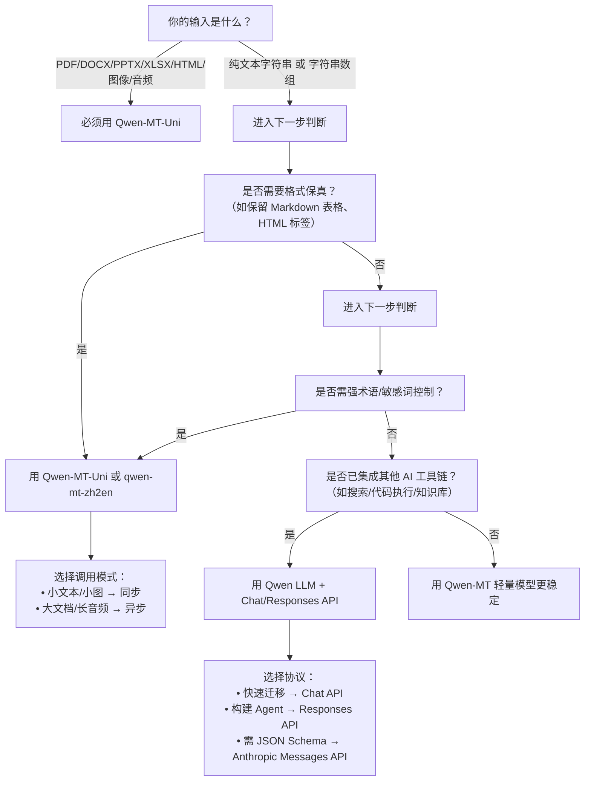

# 专用翻译模型与通用大语言模型对比

为帮助开发者在百炼平台上高效选型，本文系统对比**专用翻译模型（Qwen-MT 系列）**与**通用大语言模型（Qwen 系列 LLM）**在机器翻译任务中的能力边界、技术特性与工程适配性。随着[多模态](../concepts/multimodal.md)文档翻译、实时对话本地化、术语一致性管控等需求日益增长，盲目使用通用 LLM 进行翻译可能导致格式错乱、语种识别失败、术语偏差、成本不可控等问题。本对比聚焦真实生产场景下的关键差异，不泛谈理论性能，而以可落地的 API 行为、约束条件与最佳实践为依据。

## 关键维度对比

| 维度 | 专用翻译模型（Qwen-MT） | 通用大语言模型（Qwen LLM） |
|------|--------------------------|----------------------------|
| **输入格式** | ✅ 原生支持[多模态](../concepts/multimodal.md)：纯文本（`string`/`string[]`）、PDF/DOCX/PPTX/XLSX/HTML/Markdown/TXT、JPG/PNG、MP3/WAV ✅ 自动模态识别 + 内容结构保真抽取（如 PDF 表格、图像文字区域） | ⚠️ 仅支持文本输入（`messages` 或 `input` 字符串） ❌ 不支持直接传入二进制文件或 URL；需用户自行 OCR/解析/分段后喂入，丢失原始格式与上下文结构 |
| **输出格式** | ✅ 严格保持输入格式：输入 PDF → 输出 PDF；输入 JPG → 输出 JPG；输入字符串数组 → 输出同形状字符串数组 ✅ 支持跨模态格式转换（如 PDF→HTML、JPG→TXT） | ❌ 仅返回纯文本（`content` 字段） ⚠️ 若需生成 PDF/HTML，需额外调用渲染服务或自行实现排版逻辑，无法保证格式还原 |
| **支持模型** | • `qwen-mt-uni`（全模态统一翻译模型，当前唯一生产可用模型） • `qwen-mt-zh2en` / `qwen-mt-en2ja` 等轻量级文本翻译模型（见 `more-models.md`） | • `qwen3.8-max`、`qwen3.7-plus`、`qwen-vl-plus`、`qwen-omni` 等全系列文本/[多模态](../concepts/multimodal.md) LLM • **不包含**专为翻译优化的模型变体；所有翻译行为均为通用推理涌现能力 |
| **API 端点** | • 同步：`POST /api/v1/services/aigc/multimodal-generation/generation`（`qwen-mt-uni`） • 异步：同上 + `X-DashScope-Async: enable` 头 • 轻量文本：`POST /v1/models/qwen-mt-zh2en/invoke` | • OpenAI 兼容：`/compatible-mode/v1/chat/completions`（Chat API） • Anthropic 兼容：`/apps/anthropic/v1/messages`（Messages API） • DashScope 原生：`/api/v1/services/aigc/text-generation/generation`（文本）或 `/multimodal-generation/generation`（多模态，但**不支持文档/音频翻译**） |
| **计费方式** | • 按**实际处理内容规模**计费：  – 文本：按字符数（UTF-8 编码）  – 文档/图像/音频：按页数、分辨率、时长等维度折算为标准单位 • 明确区分同步/异步调用单价（异步含任务队列与存储成本） | • 统一按**输入 + 输出 token 总数**计费（1 token ≈ 0.75 中文字符或 1 英文单词） • 多模态输入（如图像）按像素数折算为等效 token，成本显著高于纯文本 • **无格式保真附加费，但因需人工预处理+后处理，隐性成本高** |
| **典型场景** | • 企业级文档本地化（合同/PPT/财报 PDF 批量翻译） • 客服工单图片/语音转译（含敏感词保留、术语强制） • 多语言知识库建设（自动抽取 HTML/Markdown 并翻译） • 需要 `domainHint`（领域提示）、`glossary`（术语表）、`sensitives`（敏感词白名单）强管控的合规场景 | • 简单短句即时翻译（如聊天窗口内“Hello”→“你好”） • 翻译结果需嵌入复杂 Agent 流程（如“翻译后搜索相关法规”） • 需结合联网搜索、代码执行等工具链的混合任务 • 小规模、低格式要求、高灵活性优先的 PoC 快速验证 |
| **核心能力保障** | • ✅ 自动语言识别（ALI），支持手动覆盖 • ✅ 格式感知翻译（保留标题层级、列表缩进、表格对齐） • ✅ 图像中主体区域跳过（`config.imageSegment`） • ✅ 敏感词原样保留、术语表精准控制、英文领域提示引导风格 | • ❌ 无 ALI，需用户显式指定 `source_lang` • ❌ 无格式理解能力，易破坏 Markdown 表格、HTML 标签、PDF 页眉页脚 • ❌ 无法跳过图像 Logo/水印文字，OCR 后翻译易出错 • ❌ 术语控制依赖 [prompt](../guides/prompt.md) 工程（如 system [prompt](../guides/prompt.md) 注入词表），稳定性差、无校验机制 |
| **调用确定性** | • ✅ 确定性解码（`temperature=0` 固定生效） • ✅ 同步响应含 `usage` 字段，精确反馈字符/页数消耗 • ✅ [异步任务](../concepts/asynchronous-task.md)状态机清晰（`SUCCEEDED`/`FAILED`/`PROCESSING`），业务成功需检查 `output.Success` | • ⚠️ `temperature` 可调但非强制为 0；相同 [prompt](../guides/prompt.md) 可能产生不同译文 • ⚠️ token 计数受模型内部 tokenizer 影响，与用户预期存在偏差 • ⚠️ 无专用状态字段，错误需解析 `message` 或 `error.code`，归因困难 |

## 各方案的适用场景建议

### ✅ 优先选用专用翻译模型（Qwen-MT）当：
- 输入源为**非纯文本**：PDF 报告、带图表的 PPT、扫描件 JPG、客服录音 MP3；
- 输出需**严格格式还原**：法律合同必须保持条款编号与签字栏位置；电商商品页需维持 HTML 结构与 CSS 类名；
- 存在**强合规要求**：金融/医疗文档需跳过 Logo 文字、保留“GDPR”“HIPAA”等原文术语、按客户术语表翻译“cloud”为“云服务”而非“云”；
- 处理**批量高吞吐任务**：日均千份文档翻译，需异步队列、失败重试、进度追踪；
- 开发团队**缺乏 NLP 工程能力**：不愿/不能自行实现 OCR、PDF 解析、HTML 清洗、译文后处理等 pipeline。

### ✅ 优先选用通用大语言模型（Qwen LLM）当：
- 场景为**轻量级、交互式、上下文耦合翻译**：如在多轮对话 Agent 中，将用户上一句提问翻译成英文后调用国际知识库；
- 需要**翻译与其他 AI 能力深度协同**：例如“将这段日文技术文档翻译成中文 → 提取其中的 API 参数 → 生成 Python 调用示例”；
- 项目处于**早期验证阶段**，需快速用最小成本验证翻译效果，且输入/输出均为简单字符串；
- 已有成熟预处理流水线（如自建 PDF 解析服务 + 图像 OCR 服务），仅需一个“高质量文本到文本”翻译黑盒。

### ⚠️ 明确不推荐的组合：
- 用通用 LLM 直接翻译 PDF 文件（未解析）→ 必然失败或返回乱码；
- 用 `qwen-mt-uni` 处理需要联网搜索补充背景知识的翻译任务（如古籍中生僻典故）→ 该模型无工具调用能力；
- 在高并发实时对话场景中，对每条消息都调用 `qwen-mt-uni` 异步接口 → 延迟不可接受，应改用 `qwen-mt-zh2en` 同步轻量模型。

## 面向开发者的技术选型参考

作为开发者，请按以下决策树进行选型：

**关键实施提醒：**
- **不要混用模型标识**：`qwen-mt-uni` 只能调用 `/multimodal-generation/generation` 端点；`qwen3.8-max` 不能用于 `/v1/models/qwen-mt-zh2en/invoke`。
- **URL 安全是硬约束**：`qwen-mt-uni` 的 `fileUrl` 必须为 HTTPS 且路径无中文，否则直接 `400`；通用 LLM 无此限制。
- **错误处理策略不同**：Qwen-MT [异步任务](../concepts/asynchronous-task.md)需主动轮询并检查 `output.Success`；通用 LLM 错误通常在 HTTP 响应体中直接返回 `error.message`。
- **成本监控建议**：对 `qwen-mt-uni`，重点关注 `usage.input_chars` 和 `usage.output_pages`；对通用 LLM，监控 `usage.prompt_tokens` + `usage.completion_tokens`，并注意多模态输入的像素 token 折算。

选择专用模型不是放弃灵活性，而是将翻译这一高确定性、强规则性的子任务交给专业引擎，让通用大模型专注其真正优势——推理、规划与创作。百炼平台的设计哲学正是“专用模型做专事，通用模型管统筹”，合理分层，方得高效。

## 被对比主题页

- [qwen mt translation models](../api/qwen-mt-translation-models.md)
- [qwen api reference](../api/qwen-api-reference.md)
- [more models](../api/more-models.md)

