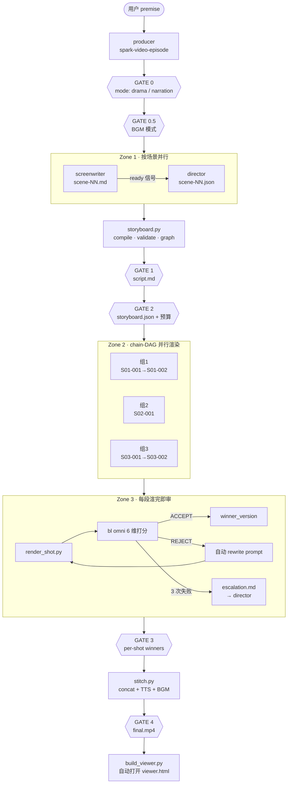
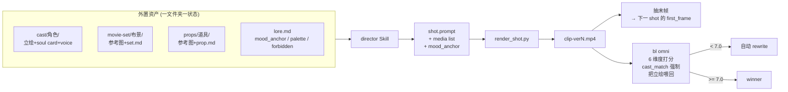
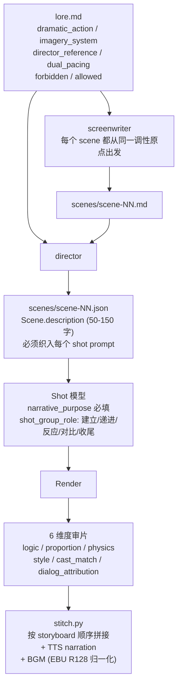
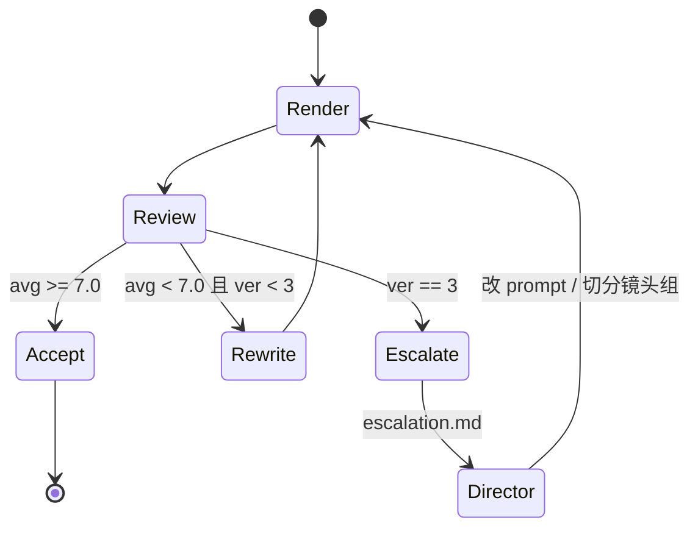
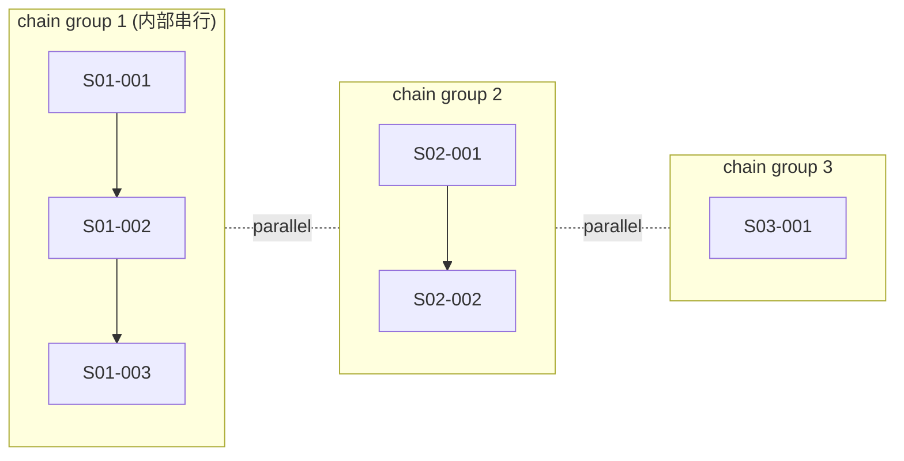

Spark-Video 把"做一集 AI 短片"拆成 6 个相互独立的 Skill 与一组确定性脚本，串成一条 **剧本 → 分镜 → 渲染 → 审片 → 拼接** 的流水线。它要解决所有"长视频 AIGC"项目都绕不开的两个硬骨头：

1. **跨镜头一致性**——人脸、布景、道具、画风不能每个 clip 漂一遍。
2. **整体叙事统一**——20+ 个独立生成的 8s 片段，要拼出一条逻辑通顺、主旨集中的故事线。

项目入口：[SKILL.md](https://github.com/JohnKeating1997/spark-video/blob/main/SKILL.md) · [`lib/`](https://github.com/JohnKeating1997/spark-video/tree/main/lib) · [`scripts/`](https://github.com/JohnKeating1997/spark-video/tree/main/scripts) · [`references/`](https://github.com/JohnKeating1997/spark-video/tree/main/references)

## 3.1 它首先是一个 "Skill"，不是一个独立 CLI

Spark-Video 的全部产品形态就是一堆 `SKILL.md` + 确定性脚本：

```
videoGen/
├── SKILL.md                                ← 路由器 / 根 Skill
├── references/
│   ├── spark-video-episode/SKILL.md        ← producer (一键制片)
│   ├── spark-video-screenwriter/SKILL.md   ← 编剧
│   ├── spark-video-director/SKILL.md       ← 分镜师
│   ├── spark-video-cast/SKILL.md           ← 美术（cast/set/prop）
│   ├── spark-video-vfx-review/SKILL.md     ← 渲前静态质量门
│   └── spark-video-clip-review/SKILL.md    ← 渲后质检 + 重渲状态机
├── scripts/   ← 纯函数式脚本：render_shot.py · storyboard.py · stitch.py …
└── lib/       ← 数据模型 (Pydantic) + 工程基础设施
```

这种形态带来三个直接收益：

### 3.1.1 框架无关，可被任何主流 Agent 框架直接加载

`SKILL.md` 是纯文本 Markdown + 一段 YAML front-matter，没有任何运行时绑定。任何遵循"读 prompt → 调工具"协议的 Agent 都可以接入：

- **Claude Code** / **Claude Agent SDK**——原生 Skill 支持。
- **AgentScope**——把每个 `SKILL.md` 当作 system prompt 段，scripts 当作 tool 注册。
- **LangGraph / AutoGen / 自研 Agent**——同上，Skill 是 prompt，scripts 是 shell tool。
- **Cursor / Continue 等 IDE 助手**——直接把 `references/*/SKILL.md` 喂进上下文即可。

因为没有运行时绑定，**升级 Agent 框架不需要改这个项目；换底模也不需要**。

### 3.1.2 Agent 拥有自主性，不是固定脚本流水线

`SKILL.md` 描述的是 **判断标准与契约**，而不是死板的步骤序列。例如 [spark-video-clip-review/SKILL.md](https://github.com/JohnKeating1997/spark-video/blob/main/references/spark-video-clip-review/SKILL.md) 写的是：

```
while ver <= max_retry:
    render → review → if ACCEPT done · elif retry: rewrite prompt · else escalate
```

具体每一次 rewrite **怎么改 prompt**、escalate 时**给导演什么反馈**、镜头组里**哪个 shot 是真问题**——这些都由 Agent 在运行时根据 `bl omni` 返回的具体 critique 自己决定。它会：

- 读 `reviews/<shot>-verN.json` 的 critique 文本，识别问题类型（face drift / dialog mismatch / physics）。
- 调 `bl text chat` 重写 prompt（不是模板替换，是基于失败原因的针对性改写）。
- 在 3 次 rewrite 仍失败时，写 `reviews/escalation-<id>.md` 给导演 Skill——这份 escalation 文档不是模板，是 Agent 总结当前失败模式后写出来的诊断报告。
- 当多个 shot 同时失败时，自主决定是 **逐个重渲** 还是 **回到导演重新切分镜头组**。

这种"判断力前置到 Agent"的设计，让流水线能处理无穷多种模型失败模式，而不是只能处理工程师预先枚举过的那几种。

### 3.1.3 全程可对话修改，成片之后还能继续聊

整条流水线共有 4+2 道用户确认闸（见下文 §3.2）。在每一道闸：

- 用户可以用自然语言说 *"S03 节奏太慢，把对白砍掉一半"* —— Agent 自动定位 `scenes/scene-03.md` 并调编剧 Skill 重写。
- 用户可以说 *"郭芙蓉这一集穿婚纱"* —— Agent 在 episode 层 fork 一份 `cast/郭芙蓉/`，重新生成立绘并触发受影响 shots 的重渲。
- 在 GATE 4 拿到 final.mp4 后，仍然可以 *"S05-002 那一段表情不对，换一版"* —— Agent 只重渲那一个 shot，再增量 stitch。

这一切都不需要重跑整个流程——Agent 通过读取 `shots_state.json` 和现有 artifacts 知道**已经做过什么、可以增量做什么**。

## 3.2 流水线全景：6 个角色 + 4 道质量闸



四个"用户确认闸"分别卡在 **剧本、分镜、渲染结果、最终成片** 四个不可逆的成本节点。设计哲学：**让 LLM/视频模型不可控的部分越早暴露给人越好**，避免在 GATE 3 才发现 GATE 1 的故事就走偏了。

| Gate | 卡的什么 |
|---|---|
| GATE 0 | mode (drama 短剧 / narration 旁白解说) |
| GATE 0.5 | BGM 模式（off / global / scene） |
| GATE 1 | `script.md` —— 故事过关才进分镜 |
| GATE 2 | `storyboard.json` + 预算 —— 分镜/成本过关才开渲 |
| GATE 3 | per-shot winners —— 每段都过关才拼接 |
| GATE 4 | `final.mp4` —— 成片审核 |

`shots_state.json` 是整条流水线的 **single source of truth**——只有 [`scripts/render_shot.py`](https://github.com/JohnKeating1997/spark-video/blob/main/scripts/render_shot.py) 用 `flock` 串行写入，其它脚本只读。这一约束让并行渲染时不会出现"两个进程同时 append attempt 互相覆盖"的竞态。

## 3.3 视频片段之间的一致性是如何被保证的

视频大模型本身是 **无记忆的**——每个 shot 都是独立请求。Spark-Video 用 **"参考图 + 锚词 + 末帧续接 + 渲后审片"** 四层冗余对抗模型漂移。



### 3.3.1 三大支柱：Cast / Movie-Set / Prop —— "一个文件夹 = 一种视觉状态"

这是项目最硬的一条约定，写死在 [references/spark-video-cast/SKILL.md](https://github.com/JohnKeating1997/spark-video/blob/main/references/spark-video-cast/SKILL.md)：

| 支柱 | 锁定的东西 | 文件夹模式 | 状态切分 |
|---|---|---|---|
| **Cast** (角色) | 脸/发型/服装/体态 | `cast/<name>/` | 整集换装 → 派生 `陆辰-汉服` |
| **Movie-Set** (布景) | 位置/灯光/陈设 | `movie-set/<name>/` | 白天/夜晚 → `客栈-白天` / `客栈-夜晚` |
| **Prop** (关键道具) | 标志性物件 | `props/<name>/` | 完整/起皱/撕碎 → 三个不同文件夹 |

铁律是：**"video 模型把参考图当文字理解，把两种状态混在一个文件夹里只会产出一种'糊掉的平均'"**。

每个文件夹是一份 **soul card**（`cast.md` / `set.md` / `prop.md`，由 [`lib/soul.py`](https://github.com/JohnKeating1997/spark-video/blob/main/lib/soul.py) 解析）+ N 张参考图 + 可选语音样本：

```
cast/郭芙蓉/
├── 郭芙蓉.md      ← soul card：年龄/口头禅/视觉锚点/do-don't
├── 郭芙蓉.png     ← 立绘
└── 郭芙蓉.mp3     ← r2v 用的 reference_voice
```

> 真实样例见 [cast/郭芙蓉.md](https://github.com/JohnKeating1997/spark-video/blob/main/cast/%E9%83%AD%E8%8A%99%E8%93%89.md)：里面写死了 `voice_style`、`catchphrases`、`mannerisms` 等"会随台词反复出现"的特征——这些是给 **LLM 看的**（写剧本/分镜时调用），不是给视频模型看的。

### 3.3.2 立绘锁外貌，prompt 只写动作

[SKILL.md](https://github.com/JohnKeating1997/spark-video/blob/main/SKILL.md) 顶部的铁律之一：

> 角色服装/发型/妆容**不写在 prompt 里**，靠立绘锁定；prompt 只写动作 + 表情，首次出场加年龄（如 "28 岁的陆辰"）

如果 prompt 里写"穿白衬衫"而立绘里穿黑卫衣，视频模型会在两者之间**自由插值**——结果就是 shot 1 灰色 T 恤、shot 2 白衬衫、shot 3 黑卫衣的画面漂移。**让立绘成为外貌的唯一权威**，才能切断这条漂移路径。

### 3.3.3 多张同人立绘 → 自动拼 grid，不跨角色混合

[`lib/cast.py`](https://github.com/JohnKeating1997/spark-video/blob/main/lib/cast.py) 的 `_build_grid` 函数：当一个角色文件夹里有 ≥2 张立绘时，把它们拼成一张 grid PNG 喂给 r2v（Wan 和 HappyHorse 都支持多面板参考）。

```python
# lib/cast.py:207-235
def _build_grid(images: list[Path], out: Path, *, max_side: int = 1280) -> Path:
    """Compose N (>=2) portraits *of the same character* into a grid PNG."""
    if len(images) < 2:
        raise ValueError("_build_grid expects 2+ images of the same character.")
```

**grid 永远在同一角色文件夹内建，从不跨角色混合**——避免模型把两个角色的特征糊到一起。

### 3.3.4 两层 cast 体系：项目级共享 + 集级覆写

```
projects/<p>/cast/<name>/          ← 项目主演（跨集共享）
projects/<p>/<ep>/cast/<name>/     ← 本集独有 NPC 或换装覆写
```

[`lib/cast.py`](https://github.com/JohnKeating1997/spark-video/blob/main/lib/cast.py) 的 `_merge` 函数实现两层叠加：同名角色在两层时，**集级图片被 prepended**（被模型优先引用），soul 卡也以集级为准。这让"郭芙蓉这一集穿婚纱"不必动跨集共享的主演资料，只要在本集 cast 目录建一个 `郭芙蓉/` fork 即可——用户对话一句话即可触发。

### 3.3.5 风格锚词（mood_anchor）：每条 prompt 末尾必带的"画风胶水"

[`lib/lore.py`](https://github.com/JohnKeating1997/spark-video/blob/main/lib/lore.py) 定义的 `LoreFront` 里，`mood_anchor` 是一条 < 60 字的风格短句，**导演 Skill 会把它拼到每一条 shot prompt 末尾**：

```yaml
# projects/<p>/lore.md front-matter
mood_anchor: "明朝架空, 喜剧光线, 暖色调, 略夸张的肢体语言"
visual_style: "暖色调, 喜剧光线"
palette: [warm-amber, faded-red, ink-black]
forbidden: [真实历史人物姓名, 血腥镜头]
```

每个 shot 实际发送的 prompt = `场景描述 + 动作 + 情绪 + mood_anchor`。这条短句保证了"整集 N 个 shot 的色温/画风一致"——哪怕单 shot 细节漂移，整体的"调"不会乱。

### 3.3.6 末帧续接：shot 之间的物理连续性

每个 shot 渲完后，[`scripts/render_shot.py`](https://github.com/JohnKeating1997/spark-video/blob/main/scripts/render_shot.py) 用 ffmpeg 抽出最后一帧：

```python
def _extract_last_frame(video_path: Path, frame_path: Path) -> bool:
    subprocess.run(
        ["ffmpeg", "-y", "-sseof", "-1", "-i", str(video_path),
         "-update", "1", "-frames:v", "1", "-q:v", "2", str(frame_path)],
        ...
    )
```

如果下一个 shot 的 `use_prev_last_frame_as_first=true`，渲染器就把这张末帧当 first_frame 喂给视频模型（i2v / Wan2.7 链路）。这让"郭芙蓉伸出去那只手"在下一个 shot 里还停在同一个位置。

### 3.3.7 r2v 渲染时 media 列表的固定顺序

```
--media 角色立绘1.png    ← cast.json
        角色立绘2.png
        movie-set.png    ← scene.set_id 解析出的布景图
        prop1.png        ← shot.props[] 拼上来的道具图
--voice 角色.mp3
```

这条 "cast → set → prop" 的固定顺序是 [references/spark-video-director/SKILL.md](https://github.com/JohnKeating1997/spark-video/blob/main/references/spark-video-director/SKILL.md) 的约定，确保模型对"主体—环境—物件"的优先级理解是稳定的。

### 3.3.8 渲染后 cast_match 维度独立打分

最关键的兜底：[`rubric.md`](https://github.com/JohnKeating1997/spark-video/blob/main/references/spark-video-clip-review/rubric.md) 让 `bl omni` 用 6 维度打分，其中 `cast_match` 维度**强制把立绘原图作为 `--image` 一起喂给评审模型**：

```bash
./scripts/bl omni \
  --system "$(cat references/spark-video-clip-review/rubric.md)" \
  --video clips/S01-002-ver1.mp4 \
  --image cast/陆辰/portrait1.png \
  --image cast/钱夫人/portrait1.png
```

评分 < 7.0 直接 REJECT，触发自动 rewrite 重渲；3 次过不了就 escalate 给导演重写 prompt。**人脸漂移在这里被强制截断，不会带入拼接环节。**

## 3.4 视频整体的逻辑通顺与主旨统一

一致性解决的是"看上去像同一部片"，逻辑统一解决的是"看下来像同一个故事"。Spark-Video 在 4 个层级施加约束：



### 3.4.1 lore.md：项目级的"世界圣经"，定调先于剧本

[`lib/lore.py`](https://github.com/JohnKeating1997/spark-video/blob/main/lib/lore.py) 的 `LoreFront` 把"什么是一致的"翻译成可被 LLM 消费的结构化字段：

| 字段 | 作用 |
|---|---|
| `dramatic_action` | 一句话核心戏剧动作 = "故事引擎" |
| `imagery_system.motifs` | 视觉母题（搓动的围裙、翻飞的红盖头），导演必须让短片里**至少落地 2 次** |
| `director_reference` | 导演风格融合，如"宁浩式群像喜剧节奏 + 张艺谋色彩饱和度" |
| `dual_pacing.external/internal` | 外部情节节奏 + 内部情感节奏的双轨 |
| `forbidden` / `allowed` | 内容红线/明确允许 |

`render_for_prompt(lore)` 把这些字段渲染成一段紧凑文本，**screenwriter 和 director Skill 在写任何字之前必须先读这段**。这意味着 8 个并行写作的 scene 都从同一个"调性原点"出发，不会出现"S01 是喜剧风、S04 突然变悬疑"的撕裂。

### 3.4.2 Scene 概念：每个 shot 强制继承所在场景的环境描述

[`lib/storyboard.py`](https://github.com/JohnKeating1997/spark-video/blob/main/lib/storyboard.py) 的 `Scene` 模型：

```python
class Scene(BaseModel):
    """A logical scene — one location + time + situation.
    Every shot in a scene inherits its environment description, ensuring
    visual consistency even though the video model has no memory.
    """
    description: str   # 50-150 字, 必须被织入该场景每一个 shot 的 prompt
    characters_present: list[str]
    props_present: list[str]    # validate 时会警告 shot 引用了未声明的 prop
    set_id: str | None          # 解析为 movie-set 文件夹的参考图
    seed: int | None            # 同 scene 共享 seed (continuity Rule 4)
```

`Scene.description` 被 woven 进同场景每个 shot 的 prompt——这是给"模型无记忆"打的补丁：每次请求都要重新告诉它"我们还在这家客栈、还是黄昏、桌上还有那盏油灯"。

### 3.4.3 narrative_purpose：每个 shot 必填的"叙事目的"

[`lib/storyboard.py`](https://github.com/JohnKeating1997/spark-video/blob/main/lib/storyboard.py) 的 `Shot.narrative_purpose` 字段——山音方法论引入的硬约束：

> "山音铁律：每个 shot 必填具体叙事目的。要具体到视听手段, 例如 '用低角度仰拍 + 缓慢推近放大钱夫人的优越感'，不写'展现冲突'等空话。"

`Storyboard.lint()` 会扫所有 shot：缺失 / 过于空泛（"展现冲突"、"推进剧情"、TBD）的 narrative_purpose 都会被标记。这把"为什么需要这一个镜头"逼到导演必须想清楚——避免"为了凑时长插一段意义不明的空镜"。

### 3.4.4 镜头组（shot_group）：5 种叙事角色

```python
shot_group_role: Literal["建立", "递进", "反应", "对比", "收尾"]
```

让同组镜头声明它在叙事单元内承担什么角色（蒙太奇组 / 因果组 / 对比组）。这给"渲染失败时局部重做"提供了语义边界——不是机械地按 shot id 重渲一条，而是按"叙事单元"重新设计。

### 3.4.5 6 维度审片机制：自动闭环 + 兜底升级

[`rubric.md`](https://github.com/JohnKeating1997/spark-video/blob/main/references/spark-video-clip-review/rubric.md) 定义的 6 个评分维度，每一条都对准一种"会破坏逻辑/主旨"的失败模式：

| 维度 | 拦截什么 |
|---|---|
| `logic` | 动作 / 剪辑 / 镜头与 narrative_purpose 的匹配度 |
| `proportion` | 人物比例 / 透视错位 |
| `physics` | 重力 / 布料 / 流体的违和 |
| `style` | mood_anchor / palette / forbidden 一致性 |
| `cast_match` | 脸 / 发 / 服装 与立绘是否一致 |
| `dialog_attribution` | A 的台词不能被 B 的嘴说出来 |

审片状态机：



`shots_state.json` 记录每次 attempt 的版本、得分、错因；只有"通过"的 winner 才被拷贝成 `clips/<shot>.mp4`，进入下一道闸门。

### 3.4.6 chain-DAG 并行渲染但不破坏因果链

[`lib/render_graph.py`](https://github.com/JohnKeating1997/spark-video/blob/main/lib/render_graph.py) 的 `compute_chain_groups()` 利用 `use_prev_last_frame_as_first` 标志把 storyboard 切成 chain groups：



- **组内串行**：保证 first_frame ← prev_last_frame 的物理连续性。
- **组间并行**：让独立场景同时渲染，把"10 集 × 20 shots × 3 min/shot"的串行 1 小时压缩到约 10 分钟。

**因果连续性靠 chain；并发吞吐靠 DAG**——同一套数据结构同时承担两件事。

### 3.4.7 stitch.py：最终成片的"叙事流"组装

[`scripts/stitch.py`](https://github.com/JohnKeating1997/spark-video/blob/main/scripts/stitch.py) 不止是 ffmpeg concat。它按 storyboard.json 顺序：

1. 定位每个 shot 的 winner 版本。
2. 对 `role=narration` 的 shot：调 `bl speech synthesize` 合成 TTS → 剥离原音 → mux 新音轨。
3. concat（可选 crossfade）。
4. 若 `storyboard.bgm` 配置了 BGM，按 EBU R128 标准化音量混入背景音乐（per-scene 或 global 模式）。

这一层让 "**叙事的声轨**（旁白 / 对白 / BGM）"在拼接时按 storyboard 的设计落地。

## 3.5 成片之后：自动打开的可视化 viewer

最后一步是惊喜——拼接完成后，[`scripts/build_viewer.py`](https://github.com/JohnKeating1997/spark-video/blob/main/scripts/build_viewer.py) 会生成一个 **完全自包含的单文件 `viewer.html`** 并自动在浏览器中打开（macOS 默认行为，可用 `--no-open` 关闭）：

```python
# scripts/build_viewer.py:627-630
if not no_open and platform.system() == "Darwin":
    subprocess.run(["open", str(out)], check=False)
```

这个页面不是简单的成片预览，而是 **整集制作过程的完整可追溯档案**。布局采用左侧导航 + 右侧分区主体：


每个区块的价值：

| Section | 显示内容 | 为什么有用 |
|---|---|---|
| **Final cut** | 最终拼接的 mp4，内嵌播放 | 直接看成片 |
| **Premise / Lore / Direction** | 一开始的输入与导演定调 | 看"为什么这部片是这个样子" |
| **Script / Scenes** | 编剧产出 + 场景结构化 JSON | 对照剧本与镜头实现 |
| **Cast / Sets / Props** | 三大支柱的所有立绘 + soul card | 一眼看到一致性靠的"地基" |
| **Shots** | 每个 shot 的**所有 attempt 版本**（不只是 winner）+ 6 维度评分 + critique | 看模型在哪几次失败、为什么、最后怎么过的 |
| **Model calls** | `logs/model_calls.jsonl` 全量展开 | 任何一条 prompt 都可回溯，做 prompt engineering 的金矿 |

所有媒体都通过相对路径引用，**没有拷贝、没有重复存储**——一个目录就是一份完整、可分享、可归档的"制作工程"。

页面本身是纯静态的，可以直接：

- 用浏览器本地打开；
- 上传到任意 web 服务器变成可分享链接；
- 打包整个 episode 目录发给协作者，对方解压即可看完整制作过程。

更重要的是——**用户在 viewer 里看到任何不满意的地方，回到对话窗口跟 Agent 说一句就能修**。比如：

- "S03-002 的版本 2 反而比 winner 好，换成那个"——Agent 直接 `render_shot.py --accept-version 2 --shot S03-002`，再重新 stitch。
- "字幕音量太小"——Agent 调 `stitch.py` 的 BGM volume 参数重新混音。
- "我想看看 lore 改成悬疑风格会怎样"——Agent 改 `lore.md` 的 `mood_anchor` 和 `palette`，重渲受影响 shots（受影响范围由 storyboard 推算）。

## 3.6 回到设计哲学

整套架构可以用一句话概括：

> **"AI 模型的不确定性是常量，工程化的约束才是变量。"**

Spark-Video 没有试图让某个视频大模型"变得更一致"。它做的是：

- **把一切可锚定的东西外置成文件**（lore、cast、set、prop、soul card），让一致性来自 **资产**，而不是 **运气**。
- **把每个 LLM/视频模型调用做到 prompt 级别可复现、可审计**（`./scripts/bl` 包装器全量记录到 `logs/model_calls.jsonl`），让失败可以被研究、被改进。
- **把不确定性集中在最小可重试单元**（单个 shot 的 N 次 attempt），让审片机制把它消化掉。
- **把人的判断保留在最不可逆的 4+2 道闸门**，把人的对话能力扩展到全流程的任何节点。
- **把整套能力打包成 Skill 而非 SaaS**，让任何 Agent 框架都可以接入，让用户的对话能驱动一切修改。

最后那条 `final/<project>-<episode>.mp4` 之所以看上去像同一个剧组拍出来的：是因为 **lore.mood_anchor + cast 立绘 + set 参考图 + scene.description + narrative_purpose + cast_match 评审** 这 6 道约束，在每个 shot 上反复施加了 6 次"你必须长这样、必须是这件事、必须有这个调"的压力。模型的自由度被压缩到了只剩下"如何具体把这一刻演出来"——而那一点自由度，恰好是它最擅长的事。

## 3.7 展望

### 3.7.1 当前实现的几个明显改进方向

这套流水线已经能稳定产出 3–10 分钟的成片，但仍有不少地方值得迭代：

- **跨镜头的全局一致性检查缺位**。今天的 `bl omni` 审片只看单个 shot 自身的 6 维度，不会发现"S02 的茶杯是青瓷、S05 突然变白瓷"或"S01 黄昏色温、S03 突然中午光线"。需要一个 **episode-level reviewer**，把整集所有 winner clip 抽帧组成时间线，检查母题落地次数、连续性物件、色温曲线、情绪节奏与 `dual_pacing` 的契合度。
- **auto-rewrite 还不够"对症"**。现在重写 prompt 用的是普通 `bl text chat`，本质上是"把 critique 给 LLM 让它改"，没有失败模式分类。可以建一个 **critique → rewrite strategy** 的映射表（face drift → 加更多 cast 参考图 / 降 candidates、physics 失败 → 加 negative_prompt、台词错位 → 换 cast 出场顺序），让重写策略针对性更强。
- **评审模型本身的偏差未被校准**。`qwen3.5-omni-plus` 自己也会漂——同一段视频今天打 7.2 明天打 6.8。可以引入 **多模型 ensemble**（qwen-omni + gemini + GPT-4V 任取两个）+ 阈值投票，或者每个项目跑一次 calibration set 校准 reviewer 的偏差。
- **角色声音的一致性**。drama 模式下用的是 r2v 的 reference_voice，但视频模型的 lip-sync 和音色稳定性远不如 narration 模式的 TTS。未来要么把 narration 模式的 TTS 路径推广到 drama 模式（先合成台词 → 视频做对口型），要么等 r2v 模型的语音一致性追上来。
- **viewer.html 还是只读**。今天它是个看板，下一步应该加 **inline 操作**——直接在某个 shot 上点 "用 version 2 替代 winner"、"重渲这一段"、"修改这条 prompt"，HTTP POST 触发 `render_shot.py` 或 `stitch.py`，省去回对话窗口的来回。
- **分布式渲染**。chain-DAG 的并行目前只在单机内做，组间并行受单机 GPU/带宽限制；上限是 `SPARK_VIDEO_MAX_CONCURRENCY=4`。如果有多机集群，应该让 producer 把 chain group 分发到多机，每机一个 group。
- **成本估算的精度**。`storyboard.py estimate` 目前是按 shot 数 × 平均单价的粗估，没有把 retry 概率算进去。审片历史里其实有数据——可以基于历史 retry 率给出 P50/P90 成本区间。

### 3.7.2 和 Sora Storyboard 的根本差异

Sora Storyboard（OpenAI 的）和 Spark-Video 长得很像，都让你把"一个长片"拆成多个有序的"卡片/镜头"再去生成，但两者解决问题的路径几乎相反：

| 维度 | Sora Storyboard | Spark-Video |
|---|---|---|
| **一致性来自哪里** | 单一大模型的**内部跨帧记忆** + timeline 上的 prompt 渐变 | 外置资产（立绘 / 布景图 / mood_anchor）+ 末帧续接 + 渲后审片 |
| **每段长度** | 可以一次性出 20s+，timeline 把长视频切成"提示锚点" | 受制于当下 r2v 模型上限（8–15s），所以 shot 多、依赖工程拼接 |
| **失败重试粒度** | 一次重生成整段长视频，成本高 | 单个 shot 重试，最小爆炸半径 |
| **修改路径** | 调 timeline 上的卡片描述 → 重生成（变动可能波及全片） | 改对应 scene/shot 文件 → 只重渲受影响 shot |
| **可审计性** | timeline 在产品里，prompt 历史是黑盒 | 全部以文件形式落地（`model_calls.jsonl` / `shots_state.json` / `viewer.html`），git diff 可见 |
| **创作者控制力** | 高层意图为主，细节由模型决定 | 细到 cast 立绘、shot 时长、narrative_purpose、镜头组角色 |
| **协作扩展性** | 绑定 Sora 平台 | Skill + 文件系统，Claude/AgentScope/LangGraph 等都能接 |

**关键不同**：Sora 押的是"**模型够强就不需要工程**"，Spark-Video 押的是"**模型多强都需要工程，因为创作是结构性问题**"。Sora 内置的连续性更强，但失败时的 debug 路径几乎是黑盒——你只能改 prompt 再赌一次；Spark-Video 的连续性来自显式约束，每一次失败都能精确定位到"是 cast 立绘的问题"、"是 mood_anchor 漂了"还是"是 scene.description 没写清楚"。

### 3.7.3 当生成时长变长，这个工具如何与时俱进

随着 r2v 模型从今天的 8–15s 走向 30s、60s 甚至 5min，"单 shot 漂移"这个问题本身会被模型的内部记忆缓解掉。会不会让 Spark-Video 变成历史？我们的判断是相反的——**时长变长反而把它的核心价值放大了**，但每一层抽象的内涵会发生位移：

| 今天的抽象 | 当 shot 变长后 | 价值变化 |
|---|---|---|
| Shot（8–15s 镜头）| → **Scene/Beat**（30s–几分钟的叙事单元） | shot 概念被吞并进 scene；chain-DAG 变成 scene-DAG |
| chain group（末帧续接的镜头组） | → **Act/Sequence**（场景之间的叙事跨越） | 末帧续接降级为兜底，跨场景剪辑由叙事结构决定 |
| 6 维度 per-shot 审片 | → **per-scene + episode-level 双层审片** | 单段越长，错一次的代价越大，审片粒度必须更细 |
| 4+2 道闸门 | → **更密集的闸门 + 部分自动闸门** | 渲一段更贵了，必须给人更多干预机会 |
| Skill 拆分（编剧/导演/审片） | → **新增"剪辑师"Skill**（pacing/transition/montage） | 单段长不等于剪辑省了，反而需要更专业的节奏判断 |

具体演化方向：

- **当单段渲染变贵**（5min 长视频可能要 10 美元 + 几十分钟）：4+2 道闸门会从"用户确认"升级为"用户确认 + AI 预审"——`spark-video-vfx-review` 这种渲前静态门会越来越重要，**先用便宜的 LLM 把所有可预测的失败拦截掉**，再把昂贵的生成留给真正必要的部分。
- **当 shot 内部一致性由模型保障**：今天的 cast/set/prop 三大支柱不会消失，而是**作用范围放大**——从"喂给每个 shot"变成"喂给每个 scene"，且 scene 内可以省去末帧续接和过度的环境描述重复。
- **当 prompt 可以一次驱动几分钟视频**：`narrative_purpose` 和 `shot_group_role` 这类**结构化叙事字段**会变得更重要，因为模型需要更长的"剧本"才能撑起一个长 shot——结构化字段就是给模型读的 micro-screenplay。
- **chain-DAG 升级为 scene-DAG**：今天 chain group 切分依据是 `use_prev_last_frame_as_first`（物理连续性），未来切分依据会变成"叙事单元是否独立"。但 [`lib/render_graph.py`](https://github.com/JohnKeating1997/spark-video/blob/main/lib/render_graph.py) 的数据结构本身不用变，只是 group 内部串行的语义从"末帧续接"变成"剧情连续"。
- **Provider 抽象的回报变大**：[`scripts/providers/`](https://github.com/JohnKeating1997/spark-video/tree/main/scripts/providers) 的插件式架构今天看起来只是支持 bl 和 wan27 的小聪明，但当 Sora API、Veo、Kling、可灵 2、Runway Gen-4 都开放后，**provider 抽象会成为这个工具最值钱的一层**——同一份 storyboard.json 可以在不同模型上跑出不同成片，让用户挑。Spark-Video 已经天然准备好做这件事。
- **viewer.html 演化为创作 IDE**：今天它是只读看板，未来它就是"长视频生成时代的 Premiere/达芬奇平替"——所有素材、所有版本、所有 prompt、所有 review 评分都在一个页面里，编辑器内直接触发重渲与混音。

更深的判断：**视频模型的能力上限会逼近一个"无限片场"，但创作永远是有限工程问题**。一部 10 分钟的短片需要的不是"能生成 10 分钟的模型"，而是"对 lore 的清晰构思、对 scene 的精准切分、对失败的快速识别、对版本的从容比较"。这些都是工程问题，不是模型问题。Spark-Video 押的是这条线，所以无论底层模型怎么进化，它要做的事都不会变——**把人的创作意图翻译成模型可执行的结构化约束，并把模型的不确定性消化在工程闭环里**。
